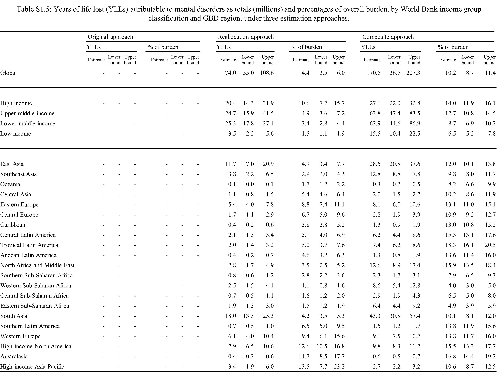
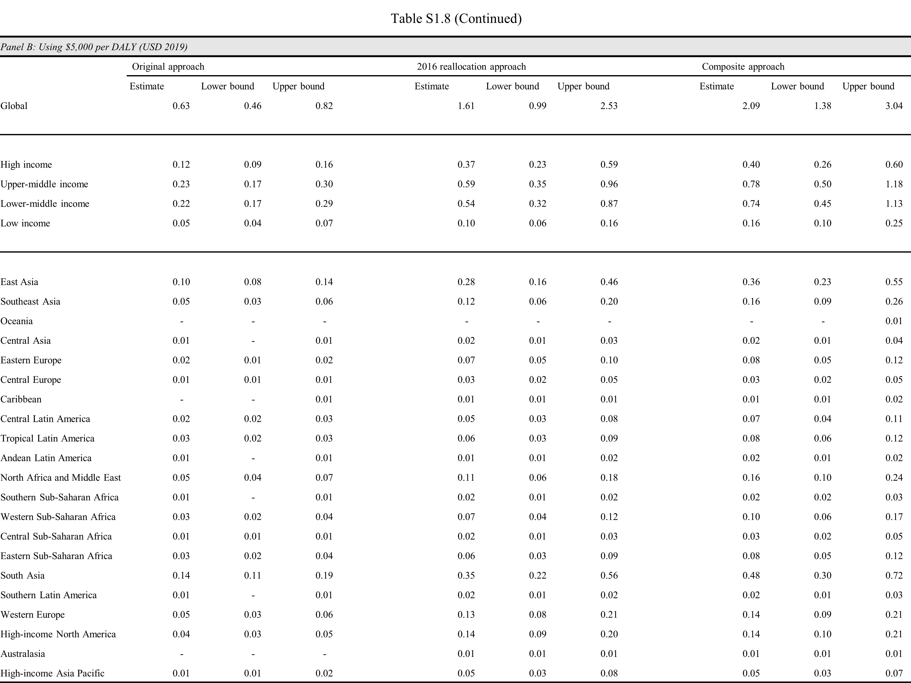
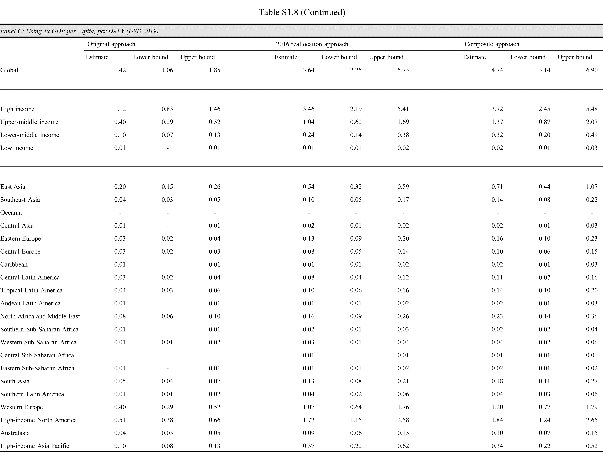
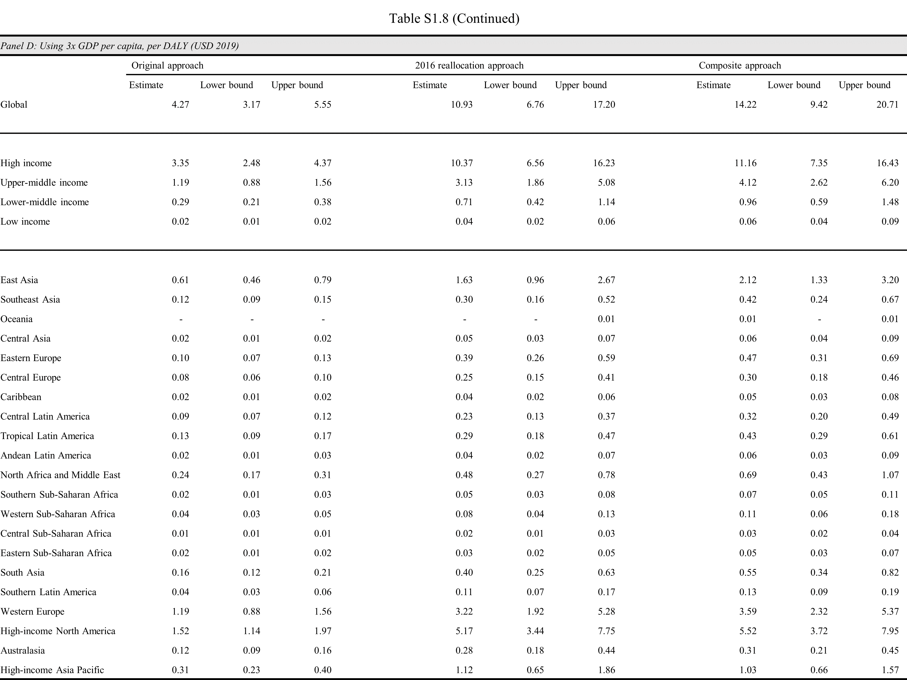
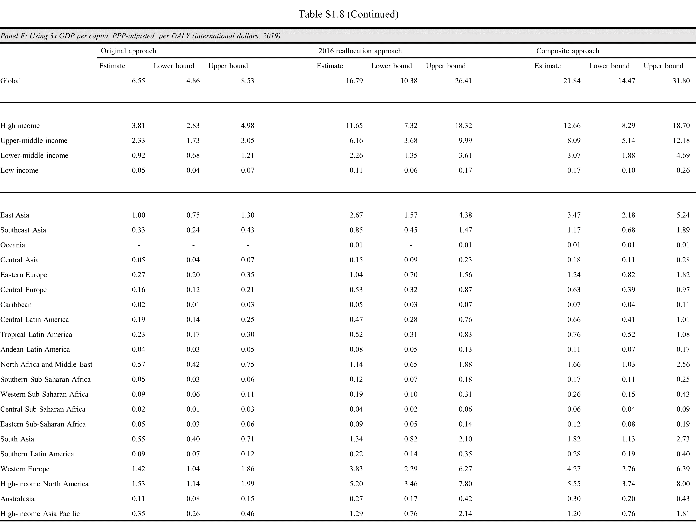

\begin{centering}

\addcontentsline{lot}{table}{Table S1.1: The global economic burden of mental disorders, by year and approach, calculated by Bloom and colleagues and adjusted to 2019 USD using gross domestic product deflator adjustment. Estimates are in trillions.}

```{r table_s_1_1, echo = FALSE, include = TRUE, out.width = '100%'}


```

\newpage

\addcontentsline{lot}{table}{Table S1.2: The economic value of mental disorder losses, using VSL approach, by year and monetary value assigned to one DALY. Authors’ calculations based on Bloom and colleagues and adjusted to 2019 USD using gross domestic product deflator adjustment. Estimates are in trillions.}

```{r table_s_1_2, echo = FALSE, include = TRUE, out.width = '100%'}


```

\newpage

\addcontentsline{lot}{table}{Table S1.3: Hierarchical classification of mental disorders in the Global Burden of Disease (GBD) 2019 study.}

```{r table_s_1_3, echo = FALSE, include = TRUE, out.height = '97%'}


```
\blandscape

\addcontentsline{lot}{table}{Table S1.4: Years lived with disability (YLDs) attributable to mental disorders as totals (millions) and percentages of overall burden, by World Bank income group classification and GBD region, under three estimation approaches.}

```{r table_s_1_4, echo = FALSE, include = TRUE, out.height = '97%'}


```

\newpage

\addcontentsline{lot}{table}{Table S1.5: Years of life lost (YLLs) attributable to mental disorders as totals (millions) and percentages of overall burden, by World Bank income group classification and GBD region, under three estimation approaches.}

```{r table_s_1_5, echo = FALSE, include = TRUE, out.height = '97%'}



```

\newpage


\addcontentsline{lot}{table}{Table S1.6: Deaths attributable to mental disorders as totals (millions) and percentages of overall burden, by World Bank income classification and GBD region, under three estimation approaches.}

```{r table_s_1_6, echo = FALSE, include = TRUE, out.height = '97%'}


```

\elandscape

\newpage


\addcontentsline{lot}{table}{Table S1.7: The global economic burden associated with premature mortality and morbidity from mental disorders, by estimation approach and value per DALY, using alternative valuations.}

```{r table_s_1_7, echo = FALSE, include = TRUE, out.width = '100%'}


```
\newpage

\blandscape

\addcontentsline{lot}{table}{Table S1.8: The economic burden associated with premature mortality and morbidity from mental disorders, by estimation approach and value per DALY, using alternative valuations and by World Bank income classification and GBD region.}

```{r table_s_1_8, echo = FALSE, include = TRUE, out.height = '97%'}

knitr::include_graphics("table_s_1_8a.png")







```


\elandscape

\end{centering}
