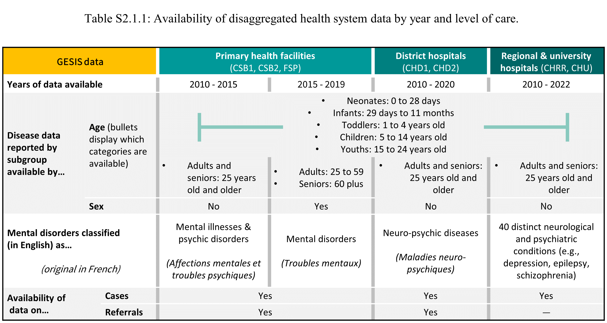

```{r parameters-and-data_s2, warning = FALSE, message = FALSE, echo = FALSE, include = FALSE}


## Saving start time (to help time the code)
start <- proc.time()
start <- as.numeric(start["elapsed"])


csb_10to15 <- read.csv(paste(data_mh_csb, 'Affections mentales et troubles psychiques GESIS CSB 2010-2015.csv',
                             sep = "/"), 
                       header=TRUE) %>%
  mutate(across(.cols=where(is.integer), .fns=as.numeric)) %>%
  mutate_all(~replace(., is.na(.), 0)) %>%
  rename(year = cAnnee,
         month = Periode,
         region = Region,
         district = District,
         commune = commune,
         clinic_name = FS,
         disease = cDesc,
         '0-to-28-days' = X0.à.28j,
         '29-days-to-11-months' = X29j.à.11.m,
         '1-to-4-years' = X1.à.4.ans,
         '5-to-14-years' = X5.à.14.ans,
         '15-to-24-years' = X15.à.24.ans,
         '25-years-plus' = X25.et.plus,
         total = total,     
         referalls = Référés) %>%
  mutate(sex = "both",
         year = as.character(year),
         month = as.integer(factor(month, levels = month.name)),
         date = as.yearmon(paste(year, month), "%Y %m")) %>%
  relocate(date, .after = month) %>%
  pivot_longer(cols = '0-to-28-days':referalls, names_to = "subgroup", values_to = "count")

csb_15to16 <- read.csv(paste(data_mh_csb, 'troubles mentaux GESIS CSB 2015-2016.csv',
                             sep = "/"), 
                       header=TRUE)

csb_17<- read.csv(paste(data_mh_csb, 'troubles mentaux GESIS CSB 2017.csv',
                             sep = "/"), 
                       header=TRUE)

csb_18 <- read.csv(paste(data_mh_csb, 'troubles mentaux GESIS CSB 2018.csv',
                         sep = "/"), 
                   header=TRUE)

csb_19 <- read.csv(paste(data_mh_csb, 'troubles mentaux GESIS CSB 2019.csv',
                         sep = "/"), 
                   header=TRUE)

csb_15to19 <- rbind(csb_15to16,csb_17, csb_18, csb_19) %>%
  mutate(across(.cols=where(is.integer), .fns=as.numeric)) %>%
  mutate_all(~replace(., is.na(.), 0)) %>%
  mutate(total_male = X0.à.28j_Masculin + 
           X29j.à.11.m_Masculin + 
           X1.à.4.ans_Masculin + 
           X5.à.14.ans_Masculin + 
           X15.à.24.ans_Masculin +
           X25.à.59.ans_Masculin +
           X60.ans.et.plus_Masculin,
         
         total_female = X0.à.28j_Feminin + 
           X29j.à.11.m_Feminin + 
           X1.à.4.ans_Feminin + 
           X5.à.14.ans_Feminin + 
           X15.à.24.ans_Feminin +
           X25.à.59.ans_Feminin +
           X60.ans.et.plus_Feminin) %>% 
  
  rename(year = cAnnee,
         month = Periode,
         region = Region,
         district = District,
         commune = Commune,
         clinic_name = FS,
         disease = cDesc,
         '0-to-28-days_male' =  X0.à.28j_Masculin,
         '0-to-28-days_female' =  X0.à.28j_Feminin,  
         '29-days-to-11-months_male' = X29j.à.11.m_Masculin,
         '29-days-to-11-months_female' = X29j.à.11.m_Feminin,
         '1-to-4-years_male' = X1.à.4.ans_Masculin,
         '1-to-4-years_female' = X1.à.4.ans_Feminin,
         '5-to-14-years_male' = X5.à.14.ans_Masculin,
         '5-to-14-years_female' = X5.à.14.ans_Feminin,
         '15-to-24-years_male' =X15.à.24.ans_Masculin,
         '15-to-24-years_female' = X15.à.24.ans_Feminin,
         '25-to-59-years_male' = X25.à.59.ans_Masculin,
         '25-to-59-years_female' = X25.à.59.ans_Feminin,
         '60-years-plus_male' = X60.ans.et.plus_Masculin,
         '60-years-plus_female' = X60.ans.et.plus_Feminin,
         referalls_male = Référés_Masculin,
         referalls_female = Référés__Feminin) %>% 
  mutate(year = as.character(year),
         month = as.integer(factor(month, levels = month.name)),
         date = as.yearmon(paste(year, month), "%Y %m")) %>%
  relocate(date, .after = month) %>%
  pivot_longer(cols = '0-to-28-days_male':total_female,
               names_to = c("subgroup","sex"), 
               names_sep = "_",
               values_to = "count") %>%
  group_by(date, clinic_name, disease, subgroup) %>%
  mutate(both = sum(count)) %>%
  pivot_wider(names_from = sex, values_from = count) %>%
  pivot_longer(cols = c(both, male, female),
               names_to = "sex",
               values_to = "count") %>%
  ungroup() 

csb_data <- rbind(csb_10to15, csb_15to19)
rm(csb_10to15, csb_15to19, csb_15to16,csb_17, csb_18, csb_19)


## CHD 
chd_data <- read.csv(paste(data_mh_chd, 'Maladies neuro-psychiques CHD.csv',
                             sep = "/"), 
                       header=TRUE) %>%
  mutate_all(~replace(., is.na(.), 0)) %>%
  mutate(total = X0.à.28j +
           X29j.à.11.m +
           X1.à.4.ans +
           X5.à.14.ans +
           X15.à.24.ans +
           X25.et.plus,
         commune = "NA") %>%
  rename(year = cAnnee,
         month = Periode,
         region = Region,
         district = District,
         clinic_name = FS,
         disease = cDesc,
         '0-to-28-days' = X0.à.28j,
         '29-days-to-11-months' = X29j.à.11.m,
         '1-to-4-years' = X1.à.4.ans,
         '5-to-14-years' = X5.à.14.ans,
         '15-to-24-years' = X15.à.24.ans,
         '25-years-plus' = X25.et.plus,
         referalls = Référés) %>%
  mutate(sex = "both",
         year = as.character(year),
         month = as.integer(factor(month, levels = month.name)),
         date = as.yearmon(paste(year, month), "%Y %m")) %>%
  relocate(date, .after = month) %>%
  relocate(commune, .after = district) %>%
  pivot_longer(cols = '0-to-28-days':total, names_to = "subgroup", values_to = "count")


## CHU and CHRR

chu_files <- as.vector(list.files(data_mh_chu_chrr))
chu_data <- data.frame(matrix(ncol = 12, nrow = 0))

for (x in chu_files) {
  
chu_data_r <- read.csv(paste(data_mh_chu_chrr, x,
                           sep = "/"), 
                     header=TRUE) 

chu_data <- rbind(chu_data, chu_data_r)

rm(chu_data_r)

}
chu_data <- chu_data %>%
  mutate(across(.cols=where(is.integer), .fns=as.numeric)) %>%
  mutate_all(~replace(., is.na(.), 0)) %>%
  mutate(district = "NA",
         commune = "NA") %>%
  rename(year = cAnnee,
         month = Periode,
         region = Region,
         clinic_name = FS,
         disease = cDesc,
         '0-to-28-days' = X0.à.28j,
         '29-days-to-11-months' = X29j.à.11.m,
         '1-to-4-years' = X1.à.4.ans,
         '5-to-14-years' = X5.à.14.ans,
         '15-to-24-years' = X15.à.24.ans,
         '25-years-plus' = X25.et.plus,
         total = total) %>%
  mutate(sex = "both",
         year = as.character(year),
         month = as.integer(factor(month, levels = month.name)),
         date = as.yearmon(paste(year, month), "%Y %m")) %>%
  relocate(date, .after = month) %>%
  relocate(district, .after = region) %>%
  relocate(commune, .after = district) %>%
  pivot_longer(cols = '0-to-28-days':total, names_to = "subgroup", values_to = "count")

data_mh <- rbind(csb_data, chd_data, chu_data) %>% ## Join all data
  mutate(region = str_to_title(region), ## Capitalizing region names
         clinic_name = str_squish(clinic_name))


mh_english_disease <- read_excel(
  paste(datapath_reference, "disease_names_crosswalk.xlsx", sep = "/"))

```

\paragraph*{Overview of health system data}

\addcontentsline{toc}{paragraph}{Overview of health system data}

The health facility data used in our study was obtained from Madagascar's *Gestion du Système d'Information Sanitaire* (GESIS), a Microsoft Access electronic health management information systems database. 

While primary, district-level, and regional referral facilities in Madagascar all report monthly case counts of mental disorders in GESIS, case definitions vary across facilities of different levels. Disaggregated data by specific condition (e.g., depression, schizophrenia, etc.) are only reported among regional referral hospitals and university hospitals; for all other facilities, cases are reported in aggregate (e.g., "Neuro-psychic diseases" for district hospitals).

Disaggregated data is available by age; among adults, however, disaggregated data for adults ages 25 to 59 and adults 60 years and older has only been reported by primary health facilities since 2015. For all other years and all other facilities, these age categories are not separately reported. Similarly, data by sex is only reported for primary health facilities since 2015. Referrals are reported by primary health facilities and district hospitals.

A summary of the GESIS data availability is provided in Table S2.1.

\begin{raggedright}

\addcontentsline{lot}{table}{Table S2.1: Availability of disaggregated health system data by year and level of care.}

```{r table_s_2_1, echo = FALSE, include = TRUE, out.width = '100%'}



```
\end{raggedright}

\vspace{24 pt}

After compiling the GESIS data, we translated the case definitions from French to English. The translations are provided in Table S2.2.

\begin{spacing}{1}

\addcontentsline{lot}{table}{Table S2.2: Mental health disorders reported in GESIS, in French and English.}

```{r  table_s_2_2, warning = FALSE, message = FALSE, echo = FALSE, include = TRUE}

mh_english_disease %>% unique() %>%
  arrange(disease) %>%
  relocate(disease, .before=disease_english) %>%
    mutate(disease = gsub(" and ", " & ", disease),
           disease =  StrTrunc(disease, maxlen = 40, ellipsis = "...", wbound = TRUE),
           disease_english = gsub(" and ", " & ", disease_english),
   disease_english = case_when(
       str_detect(disease_english, "Bouffées délirantes aiguës") ~
                   "Short-lived psychosis",
   TRUE ~ disease_english),
      disease_english = gsub("of diseases classified elsewhere", "(d.c.e.)", disease_english),
      disease_english = gsub("in diseases classified elsewhere", "(d.c.e.)", disease_english),
   disease_english = gsub(" nervous system", " N.S.", disease_english)) %>%
  rename(English = disease_english, French = disease) %>%
  gt() %>%
  tab_footnote(
    footnote = "d.c.e.: in or among diseases classified elsewhere. N.S.: nervous system",
    locations = cells_column_labels(
      columns = English
    )
  ) %>%
  tab_style(locations = cells_column_labels(),
            style     = list(cell_text(weight = "bold", size = 9))) %>%
    tab_header(
    title ="Table S2.2: Mental health disorders reported in GESIS, in French and English")

```


```{r  function_table_s2, warning = FALSE, message = FALSE, echo = FALSE, include = FALSE}


reporting_table <- function(data, title_option){
  
data %>% filter(sex == "both" & subgroup == "total") %>% 
    group_by(disease, year) %>%
    # mutate(count = sum(count)) %>% 
    # filter(count != 0 & count != 14 & count != 7 & count != 21 & count != 28 & count != 35 & count != 42  & count != 49  & count != 56  & count != 63  & count != 70) %>% 
    # ungroup() %>%
    # select(clinic_name, disease, year, ) %>%
    # unique() %>%
    # mutate(n = 1) %>% 
    # group_by(year, disease) %>%  
    mutate(sum = sum(count)) %>%  
    select(sum, year, disease) %>% 
    ungroup() %>%
    unique() %>% 
  left_join(mh_english_disease, by = "disease") %>%
  mutate(disease = paste0(disease_english, " (", 
                          StrTrunc(disease, maxlen = 25, ellipsis = "...", wbound = TRUE),")")) %>%
      select(year, disease, sum) %>%
    rename(Year = year, Total = sum) %>%
  mutate(disease = gsub(" and ", " & ", disease),
         disease = case_when(
           
             str_detect(disease, "Bouffées délirantes aiguës") ~
                         "Short-lived psychosis (Bouffées délirantes aiguës)",
   TRUE ~ disease)) %>%  
           
  rename(Disease = disease) %>%
  arrange(Year, Disease) %>%
  pivot_wider(names_from = Year, values_from = Total) %>%
  gt(groupname_col = "Disease") %>%
    tab_style(locations = cells_column_labels(),
            style     = list(cell_text(weight = "bold", size = 9))) %>%
    tab_header(
    title = title_option) %>%
  tab_options(table.font.names = "Source Sans Pro") %>%
  fmt(
    rows = everything(),
    fns = function(x) ifelse(is.na(x), "—", prettyNum(x, big.mark = ",")))
}

n_chu <- chu_data %>% select(disease) %>% unique() %>% nrow


```

\end{spacing}

\vspace{24 pt}

We then conducted exploratory data analysis to gauge data availability by condition, year, and facility level, which are reported in Tables S2.3-5. These tables show yearly cumulative cases of mental and neurological disorders, by facility level.

Among primary health facilities, we observed that the case definition for mental disorders changed during 2015, alongside the changes in GESIS that enabled disaggregated reporting by sex and greater disaggregation for data by age.

Among district hospitals, reporting of mental disorders has been consistent between 2010 and 2020.

Reporting of mental disorders is most detailed among regional referral hospitals (CHRRs) and university hospitals (CHUs), with case counts reported for `r  prettyNum(n_chu, big.mark = ",", scientific = FALSE)` unique conditions.

\newpage

\begin{spacing}{1}

\addcontentsline{lot}{table}{Table S2.3: Yearly cumulative cases of mental and neurological disorders reported at primary facilities.}


```{r  reporting_tables1a, warning = FALSE, message = FALSE, echo = FALSE, include = TRUE}

reporting_table(csb_data, "Table S2.3: Yearly cumulative cases of mental and neurological disorders reported at primary facilities")

```

\addcontentsline{lot}{table}{Table S2.4: Yearly cumulative cases of mental and neurological disorders reported at district hospitals.}

```{r  reporting_tables1b, warning = FALSE, message = FALSE, echo = FALSE, include = TRUE}

reporting_table(chd_data, "Table S2.4: Yearly cumulative cases of mental and neurological disorders reported at district hospitals")

```

\newpage

\addcontentsline{lot}{table}{Table S2.5: Yearly cumulative cases of mental and neurological disorders reported at regional hospitals.}

```{r  reporting_tables2, warning = FALSE, message = FALSE, echo = FALSE, include = TRUE}

reporting_table(chu_data, "Table S2.5: Yearly cumulative cases of mental and neurological disorders reported at regional hospitals")

```

\end{spacing}


```{r  adding_english_disease_names, warning = FALSE, message = FALSE, echo = FALSE, include = FALSE}

data_mh <- data_mh %>% 
      
  ## Add English translations for diseases, drop French disease names
  left_join(., mh_english_disease, by = "disease") %>%
  select(!c(disease)) %>%
  rename(disease = disease_english) %>%
  relocate(disease, .after = clinic_name) %>%
  
  ## Ensure that the remaining rows are unique
  unique() 
  

```

```{r  functions_for_disease_names_and_cleaning, warning = FALSE, message = FALSE, echo = FALSE, include = FALSE}


capwords <- function(s, strict = FALSE) {
  cap <- function(s) paste(toupper(substring(s, 1, 1)),
                           {s <- substring(s, 2); if(strict) tolower(s) else s},
                           sep = "", collapse = " " )
  sapply(strsplit(s, split = " "), cap, USE.NAMES = !is.null(names(s)))
}

clean_clinic_type <- function(data){
  data %>%
    mutate(clinic_type = case_when(
      str_detect(clinic_name, "CBS1") ~ "CSB1",
      str_detect(clinic_name, "Centre de santé de base 2 ") ~ "CSB2",
      str_detect(clinic_name, "Centre de Santé de Base de Deuxième Niveau ") ~ "CSB2",
      str_detect(clinic_name, "Centre de Santé de Base de Niveau 2 ") ~ "CSB2",
      str_detect(clinic_name, "Centre de Santé de Base de niveau II ") ~ "CSB2",
      str_detect(clinic_name, "Centre De Santé De Base De Niveau II") ~ "CSB2",
      str_detect(clinic_name, "Centre de Santé de Base I ") ~ "CSB1",
      str_detect(clinic_name, "Centre de Santé de Base II ") ~ "CSB2",
      str_detect(clinic_name, "Centre de Santé de Base Niveau 1 ") ~ "CSB1",
      str_detect(clinic_name, "Centre de Santé de Base Niveau 2 ") ~ "CSB2",
      str_detect(clinic_name, "Centre de Santé de Base Niveau I ")~ "CSB1",
      str_detect(clinic_name, "Centre de Santé de Base Niveau II")~ "CSB2",
      str_detect(clinic_name, "Centre du Santé de Base I ") ~ "CSB1",
      str_detect(clinic_name, "Centre Hospitalier de District ") ~ "CHD",
      str_detect(clinic_name, "Centre Hospitalier De Référence De District ") ~ "CHD",
      str_detect(clinic_name, "Centre Hospitalier de Référence Régional ") ~ "CHRR",
      str_detect(clinic_name, "Centre Hospitalier de Référence Régional de ") ~ "CHRR",
      str_detect(clinic_name, "Centre Hospitalier Régional De Référence ") ~ "CHRR",
      str_detect(clinic_name, "Centre Hosptalier de Référence du District du ") ~ "CHD",
      str_detect(clinic_name, "Centre sante de base niveau II ") ~ "CSB2",
      str_detect(clinic_name, "CHD 1") ~ "CHD1",
      str_detect(clinic_name, "CHD 2") ~ "CHD2",
      str_detect(clinic_name, "CHD1") ~ "CHD1",
      str_detect(clinic_name, "CHD2") ~ "CHD2",
      str_detect(clinic_name, "CHRD 1") ~ "CHD1",
      str_detect(clinic_name, "CHRD 2") ~ "CHD2",
      str_detect(clinic_name, "CHRD II ") ~ "CHD2",
      str_detect(clinic_name, "CHRD1") ~ "CHD1",
      str_detect(clinic_name, "CHRD2 ") ~ "CHD2",
      str_detect(clinic_name, "CHRD2") ~ "CHD2",
      str_detect(clinic_name, "CHRR ") ~ "CHRR",
      str_detect(clinic_name, "CHRR II ") ~ "CHRR",
      str_detect(clinic_name, "CHU ") ~ "CHU",
      str_detect(clinic_name, "Csb 1 ") ~ "CSB1",
      str_detect(clinic_name, "CSB 1") ~ "CSB1",
      str_detect(clinic_name, "CSB 2") ~ "CSB2",
      str_detect(clinic_name, "CSB I ")~ "CSB1",
      str_detect(clinic_name, "CSB II")~ "CSB2",
      str_detect(clinic_name, "Csb1") ~ "CSB1",
      str_detect(clinic_name, "CSB1") ~ "CSB1",
      str_detect(clinic_name, "CSB2") ~ "CSB2",

      str_detect(clinic_name, "depot de medicament") ~ "Pharmacy",
      str_detect(clinic_name, "Dépôt de médicaments ") ~ "Pharmacy",
      str_detect(clinic_name, "Dépot de médicaments") ~ "Pharmacy",
      str_detect(clinic_name, "Dépôt de médicaments") ~ "Pharmacy",
      str_detect(clinic_name, "Dépôtde médicament ") ~ "Pharmacy",
      str_detect(clinic_name, "Dépôts de médicaments") ~ "Pharmacy",
      str_detect(clinic_name, "Dispensaire") ~ "Pharmacy",
      str_detect(clinic_name, "Docteur ") ~ "FSP",
      str_detect(clinic_name, "Dokotera ") ~ "FSP",
      str_detect(clinic_name, "Dr ") ~ "FSP",
      str_detect(clinic_name, "Fivarotampanafody ") ~ "Pharmacy",
      str_detect(clinic_name, "Fivarotam-panafody ") ~ "Pharmacy",
      str_detect(clinic_name, "FSP") ~ "FSP",
      str_detect(clinic_name, "HP ") ~ "HP",
      str_detect(clinic_name, "pharmacie de ") ~ "Pharmacy",
      str_detect(clinic_name, "Pharmacie") ~ "Pharmacy",
      str_detect(clinic_name, "Pharmacrie") ~ "Pharmacy",
      str_detect(clinic_name, "Pharmacy") ~ "Pharmacy",
      str_detect(clinic_name, "Pavillon Sainte Fleur") ~ "CHU", #https://maternitesaintefleur.wordpress.com/
      TRUE ~ "Other/Unknown")) %>%
    
    mutate(clinic_type = case_when(
          and(clinic_type == "Other/Unknown", 
              str_detect(clinic_name, "Centre de santé de base")) ~ "CSB",
                  and(clinic_type == "Other/Unknown", 
              str_detect(clinic_name, "Centre De Santé ")) ~ "CSB",
                  and(clinic_type == "Other/Unknown", 
              str_detect(clinic_name, "Centre De Santé De Base ")) ~ "CSB",
                  and(clinic_type == "Other/Unknown", 
              str_detect(clinic_name, "CSB")) ~ "CSB",
     TRUE ~ clinic_type))

}

clean_clinic_name <- function(data){
  data %>%
    mutate(clinic_name_clean = clinic_name) %>%
    mutate(clinic_name_clean = gsub("CBS1", "", clinic_name_clean),
           clinic_name_clean = gsub("Centre De Rééducation Motrice De Madagascar Antsirabe", "Centre De Rééducation Motrice Antsirabe", clinic_name_clean),
           clinic_name_clean = gsub("Centre de santé de base 2 ", "", clinic_name_clean),
           clinic_name_clean = gsub("Centre de Santé de Base de Deuxième Niveau ", "", clinic_name_clean),
           clinic_name_clean = gsub("Centre de Santé de Base de Niveau 2 ", "", clinic_name_clean),
           clinic_name_clean = gsub("Centre de Santé de Base de niveau II ", "", clinic_name_clean),
           clinic_name_clean = gsub("Centre de Santé de Base de Niveau II ", "", clinic_name_clean),
           clinic_name_clean = gsub("Centre De Santé De Base De Niveau II", "", clinic_name_clean),
           clinic_name_clean = gsub("Centre de Santé de Base I ", "", clinic_name_clean),
           clinic_name_clean = gsub("Centre de Santé de Base II ", "", clinic_name_clean),
           clinic_name_clean = gsub("Centre de Santé de Base Niveau 1 ", "", clinic_name_clean),
           clinic_name_clean = gsub("Centre de Santé de Base Niveau 2 ", "", clinic_name_clean),
           clinic_name_clean = gsub("Centre de Santé de Base Niveau I ", "", clinic_name_clean),
           clinic_name_clean = gsub("Centre de Santé de Base Niveau II", "", clinic_name_clean),
           clinic_name_clean = gsub("Centre de santé de base", "", clinic_name_clean),
           clinic_name_clean = gsub("Centre du Santé de Base I ", "", clinic_name_clean),
           clinic_name_clean = gsub("Centre De Santé ", "", clinic_name_clean),
           clinic_name_clean = gsub("Centre de Santé ", "", clinic_name_clean),
           clinic_name_clean = gsub("Centre de santé ", "", clinic_name_clean),
           clinic_name_clean = gsub("Centre De Santé De Base ", "", clinic_name_clean),
           clinic_name_clean = gsub("Centre Hospitalier de District ", "", clinic_name_clean),
           clinic_name_clean = gsub("Centre Hospitalier De Référence De District ", "", clinic_name_clean),
           clinic_name_clean = gsub("Centre Hospitalier de Référence de District ", "", clinic_name_clean),
           clinic_name_clean = gsub("Centre Hospitalier de Référence Régional ", "", clinic_name_clean),
           clinic_name_clean = gsub("Centre Hospitalier de Référence Régional de ", "", clinic_name_clean),
           clinic_name_clean = gsub("Centre Hospitalier De Référence Régional De ", "", clinic_name_clean),
           clinic_name_clean = gsub("Centre Hospitalier Régional De Référence ", "", clinic_name_clean),
           clinic_name_clean = gsub("Centre Hospitalier Régional de Référence ", "", clinic_name_clean),  
           clinic_name_clean = gsub("Centre Hosptalier de Référence du District du ", "", clinic_name_clean),
           clinic_name_clean = gsub("Centre sante de base niveau II ", "", clinic_name_clean),
           clinic_name_clean = gsub("CHD 1", "", clinic_name_clean),
           clinic_name_clean = gsub("CHD 2", "", clinic_name_clean),
           clinic_name_clean = gsub("CHD1", "", clinic_name_clean),
           clinic_name_clean = gsub("CHD2", "", clinic_name_clean),
           clinic_name_clean = gsub("CHRD2", "", clinic_name_clean),
           clinic_name_clean = gsub("CHRR", "", clinic_name_clean),
           clinic_name_clean = gsub("CHRR II", "", clinic_name_clean),
           clinic_name_clean = gsub("CHU ", "", clinic_name_clean),
           clinic_name_clean = gsub("Csb 1", "", clinic_name_clean),
           clinic_name_clean = gsub("CSB 1", "", clinic_name_clean),
           clinic_name_clean = gsub("CSB 2", "", clinic_name_clean),
           clinic_name_clean = gsub("CSB I ", "", clinic_name_clean),
           clinic_name_clean = gsub("CHRD II ", "", clinic_name_clean),
           clinic_name_clean = gsub("CHRD2 ", "", clinic_name_clean),
           clinic_name_clean = gsub("CHRD 2 ", "", clinic_name_clean),
           clinic_name_clean = gsub("CSB II", "", clinic_name_clean),
           clinic_name_clean = gsub("Csb1", "", clinic_name_clean),
           clinic_name_clean = gsub("CSB1", "", clinic_name_clean),
           clinic_name_clean = gsub("CSB2", "", clinic_name_clean),
           clinic_name_clean = gsub("CSBU ", "", clinic_name_clean),
           clinic_name_clean = gsub("CSB ", "", clinic_name_clean),
           clinic_name_clean = gsub("csb ", "", clinic_name_clean),
           clinic_name_clean = gsub("FSP_", "", clinic_name_clean),
           clinic_name_clean = gsub("FSP_", "", clinic_name_clean),
           clinic_name_clean = gsub("FSP ", "", clinic_name_clean),
           clinic_name_clean = gsub("Pharmacie", "", clinic_name_clean),
           clinic_name_clean = gsub("pharmacie de ", "", clinic_name_clean),
           clinic_name_clean = gsub("Pharmacy", "", clinic_name_clean),
           clinic_name_clean = gsub("Pharmacrie", "", clinic_name_clean),
           clinic_name_clean = gsub("PHARMACIE", "", clinic_name_clean),
           clinic_name_clean = gsub("Dispensaire", "", clinic_name_clean),
           clinic_name_clean = gsub("Dépôt  de médicament ", "", clinic_name_clean),
           clinic_name_clean = gsub("depot de medicament", "", clinic_name_clean),
           clinic_name_clean = gsub("Dépôt de médicaments", "", clinic_name_clean),
           clinic_name_clean = gsub("Fivarotam-panafody", "", clinic_name_clean),
           clinic_name_clean = gsub("Dépot de médicaments", "", clinic_name_clean),
           clinic_name_clean = gsub("Dépot de Médicaments", "", clinic_name_clean),
           clinic_name_clean = gsub("Dépôt de médicaments", "", clinic_name_clean),
           clinic_name_clean = gsub("Dépôt de médicaments", "", clinic_name_clean),
           clinic_name_clean = gsub("Dépôt de médicaments", "", clinic_name_clean),
           clinic_name_clean = gsub("Dépôts de médicaments", "", clinic_name_clean),
           clinic_name_clean = gsub("Dépôts de médicaments", "", clinic_name_clean),
           clinic_name_clean = gsub("Docteur ", "", clinic_name_clean),
           clinic_name_clean = gsub("Dokotera ", "", clinic_name_clean),
           clinic_name_clean = gsub("Dr ", "", clinic_name_clean),
           clinic_name_clean = gsub("Fivarotam-Panafody", "", clinic_name_clean),
           clinic_name_clean = gsub("Fivarotampanafody ", "", clinic_name_clean),
           clinic_name_clean = gsub("HP HP", "", clinic_name_clean),
           clinic_name_clean = gsub("HP", "", clinic_name_clean),
           clinic_name_clean = gsub("Polyclinique", "", clinic_name_clean),
           clinic_name_clean = gsub("Clinique ", "", clinic_name_clean),
           clinic_name_clean = gsub("CH ", "", clinic_name_clean),
           clinic_name_clean = gsub("CSBD ", "", clinic_name_clean),
           clinic_name_clean = gsub("CSBU", "", clinic_name_clean),
           clinic_name_clean = gsub("CSBD ", "", clinic_name_clean),
           clinic_name_clean = gsub("CSBDS ", "", clinic_name_clean),
           clinic_name_clean = gsub("Medico Chirurgicale ", "", clinic_name_clean),
           clinic_name_clean = gsub("CMC ", "", clinic_name_clean),
           clinic_name_clean = gsub("Loterana", "Luthérien", clinic_name_clean),
           clinic_name_clean = gsub("Saint Luc Toliara I", "Saint Luc", clinic_name_clean),
           clinic_name_clean = gsub(" Hospital", "", clinic_name_clean),
           clinic_name_clean = gsub("Hôpital", "", clinic_name_clean),
           clinic_name_clean = gsub("Hopitaly ", "", clinic_name_clean),
           clinic_name_clean = gsub("Hopital ", "", clinic_name_clean),
           clinic_name_clean = gsub(" Health Centre", "", clinic_name_clean),
           clinic_name_clean = gsub(" Health Post", "", clinic_name_clean),
           
           ## Finally, we replace hypens and underscores with spaces in the 
           ## clinic and district names. We also remove double spaces in 
           #between words, and remove leading and trailing whitespace

           clinic_name_clean = gsub("-", " ", clinic_name_clean),
           clinic_name_clean = gsub("_", " ", clinic_name_clean),
           clinic_name_clean = gsub("  ", " ", clinic_name_clean),
           clinic_name_clean = trimws(clinic_name_clean),
           clinic_name_clean = capwords(clinic_name_clean)) %>%
    
    filter(clinic_name_clean != "")
}


clean_catchment_area <- function(data){
  
  data %>% 
    mutate(
      region_name = gsub("NA", NA, region_name),
      district_name = gsub("NA", NA, district_name),
      commune_name = gsub("NA", NA, commune_name)
    ) %>%
    
    mutate(
      clinic_type = ifelse(
        is.na(district_name) &
          is.na(commune_name) &
          clinic_type != "CHRR" &
          clinic_type != "CHU",
        "CHRR/CHU",
        ifelse(
          !is.na(district_name) &
            is.na(commune_name) &
            clinic_type != "CHD1" &
            clinic_type != "CHD2",
          "CHD",
          clinic_type
        )
      )
    ) %>%
    
    mutate(clinic_type_clean = ifelse(
      and(is.na(district_name) | district_name =="",
          is.na(commune_name) | commune_name ==""),
      
      ## If the facility's catchment area is a
      ## region only, assign it as a cHR or CHU
      
      "CHR/CHU",
      
      ## If the facility's catchment area is a district
      ## only, assign it as a CHD (no level specified)
      
      ifelse(is.na(commune_name) | commune_name =="",
             "CHD",
             
             ## If the facility's catchment area is
             ## a commune, assign it as a CSB or FSP
             ## (no level specified)
             
             "CSB/FSP")
    )) %>%
    
    mutate(region_name = case_when(
      str_detect(region_name, "Amoron'i Mania") ~ "Amoron I Mania",
      TRUE ~ region_name
    )) %>%
    
    mutate(
      district_name = case_when(
        str_detect(district_name, "Anosibe An'Ala") ~ "Anosibe-An'ala",
        str_detect(district_name, "Antananarivo Atsimon") ~ "Antananarivo Atsimondrano",
        str_detect(district_name, "Antananarivo Avaradr") ~ "Antananarivo Avaradrano",
        str_detect(district_name, "Antananarivo Renivoh") ~ "Antananarivo Renivohitra",
        str_detect(district_name, "Fenoarivo Atsinanana") ~ "Fenerive Est",
        str_detect(district_name, "Mananara Avaratra") ~ "Mananara-Avaratra",
        str_detect(district_name, "Nosy Boraha") ~ "Sainte Marie",
        str_detect(district_name, "Ambovombe Androy") ~ "Ambovombe-Androy",
        str_detect(district_name, "Tsiombe") ~ "Tsihombe",
        str_detect(district_name, "Amboasary Atsimo") ~ "Amboasary-Atsimo",
        str_detect(district_name, "Ankazoabo Atsimo") ~ "Ankazoabo",
        str_detect(district_name, "Toliara I") ~ "Toliary-I",
        str_detect(district_name, "Toliara II") ~ "Toliary-II",
        str_detect(district_name, "Toliara-I") ~ "Toliary-I",
        str_detect(district_name, "Toliara-II") ~ "Toliary-II",
        str_detect(district_name, "Midongy Atsimo") ~ "Midongy-Atsimo",
        str_detect(district_name, "Antanambao Manampont") ~ "Antanambao Manampontsy",
        str_detect(district_name, "Antanambao Manampotsy") ~ "Antanambao Manampontsy",
        str_detect(district_name, "Vohibinany") ~ "Brickaville",
        str_detect(district_name, "Ambatoboeny") ~ "Ambato Boeni",
        str_detect(district_name, "FenoarivoBe") ~ "Fenoarivobe",
        str_detect(district_name, "Nosy Be") ~ "Nosy-Be",
        str_detect(district_name, "Fianarantsoa II") ~ "Fianarantsoa I",
        str_detect(district_name, "lalangina") ~ "Lalangina",
        str_detect(district_name, "Belo Tsiribihina") ~ "Belo Sur Tsiribihina",
        str_detect(district_name, "Vohimarina") ~ "Vohemar",
        str_detect(district_name, "Befandriana Avaratra") ~ "Befandriana Nord",
        str_detect(district_name, "Boriziny") ~ "Port-Berge (Boriziny-Vaovao)",
        str_detect(district_name, "Nosy Varika") ~ "Nosy-Varika",
        TRUE ~ district_name
      )
    ) %>%
    
    ## A number of communes in the districts of Fianarantsoa and Toliara
    ## have been reclassifed under new district named (e., Lalangina), requiring
    ## that the district names for these communes be manually updated.
    
    mutate(
      district_name = ifelse(
        commune_name == "Alakamisy Ambohimahy" &
          district_name == "Fianarantsoa I",
        "Lalangina",
        district_name
      ),
      district_name = ifelse(
        commune_name == "Alakamisy Itenina" &
          district_name == "Fianarantsoa I",
        "Vohibato",
        district_name
      ),
      district_name = ifelse(
        commune_name == "Ambalakely" &
          district_name == "Fianarantsoa I",
        "Lalangina",
        district_name
      ),
      district_name = ifelse(
        commune_name == "Ambalamahasoa" &
          district_name == "Fianarantsoa I",
        "Lalangina",
        district_name
      ),
      district_name = ifelse(
        commune_name == "Ambalamidera" &
          district_name == "Fianarantsoa I",
        "Isandra",
        district_name
      ),
      district_name = ifelse(
        commune_name == "Ambohimahavelona" &
          district_name == "Toliara-I",
        "Toliary-II",
        district_name
      ),
      district_name = ifelse(
        commune_name == "Ambolofoty" &
          district_name == "Toliara-I",
        "Toliary-II",
        district_name
      ),
      district_name = ifelse(
        commune_name == "Anakao" &
          district_name == "Toliara-I",
        "Toliary-II",
        district_name
      ),
      district_name = ifelse(
        commune_name == "Analamisampy" &
          district_name == "Toliara-I",
        "Toliary-II",
        district_name
      ),
      district_name = ifelse(
        commune_name == "Andianjanto Est" &
          district_name == "Fianarantsoa I",
        "Lalangina",
        district_name
      ),
      district_name = ifelse(
        commune_name == "Andoharanomaintso" &
          district_name == "Fianarantsoa I",
        "Isandra",
        district_name
      ),
      district_name = ifelse(
        commune_name == "Andrainjanto Centre" &
          district_name == "Fianarantsoa I",
        "Lalangina",
        district_name
      ),
      district_name = ifelse(
        commune_name == "Andranohinaly" &
          district_name == "Toliara-I",
        "Toliary-II",
        district_name
      ),
      district_name = ifelse(
        commune_name == "Andranomiditra" &
          district_name == "Fianarantsoa I",
        "Vohibato",
        district_name
      ),
      district_name = ifelse(
        commune_name == "Andranovorivato" &
          district_name == "Fianarantsoa I",
        "Vohibato",
        district_name
      ),
      district_name = ifelse(
        commune_name == "Andranovory" &
          district_name == "Toliara-I",
        "Toliary-II",
        district_name
      ),
      district_name = ifelse(
        commune_name == "Andribavontsona" &
          district_name == "Port-Berge (Boriziny-Vaovao),",
        "Analalava",
        district_name
      ),
      district_name = ifelse(
        commune_name == "Androy" &
          district_name == "Fianarantsoa I",
        "Lalangina",
        district_name
      ),
      district_name = ifelse(
        commune_name == "Anjoma-tsara" &
          district_name == "Fianarantsoa I",
        "Isandra",
        district_name
      ),
      district_name = ifelse(
        commune_name == "Ankarinarivo" &
          district_name == "Fianarantsoa I",
        "Isandra",
        district_name
      ),
      district_name = ifelse(
        commune_name == "Ankaromalaza Mifanas" &
          district_name == "Fianarantsoa I",
        "Vohibato",
        district_name
      ),
      district_name = ifelse(
        commune_name == "Ankililoaka" &
          district_name == "Toliara-I",
        "Toliary-II",
        district_name
      ),
      district_name = ifelse(
        commune_name == "Ankilimalinika" &
          district_name == "Toliara-I",
        "Toliary-II",
        district_name
      ),
      district_name = ifelse(
        commune_name == "Antanamalaza" &
          district_name == "Antsirabe II",
        "Ambatolampy",
        district_name
      ),
      district_name = ifelse(
        commune_name == "Antanambao Ambary" &
          district_name == "Betafo",
        "Mandoto",
        district_name
      ),
      district_name = ifelse(
        commune_name == "Antsahavaribe" &
          district_name == "Vohemar",
        "Sambava",
        district_name
      ),
      district_name = ifelse(
        commune_name == "Beheloka" &
          district_name == "Toliara-I",
        "Toliary-II",
        district_name
      ),
      district_name = ifelse(
        commune_name == "Behompy" &
          district_name == "Toliara-I",
        "Toliary-II",
        district_name
      ),
      district_name = ifelse(
        commune_name == "Belalanda" &
          district_name == "Toliara-I",
        "Toliary-II",
        district_name
      ),
      district_name = ifelse(
        commune_name == "Betsinjaka" &
          district_name == "Toliara-I",
        "Toliary-II",
        district_name
      ),
      district_name = ifelse(
        commune_name == "Fandravandava" &
          district_name == "Fianarantsoa I",
        "Lalangina",
        district_name
      ),
      district_name = ifelse(
        commune_name == "Fanjakana" &
          district_name == "Fianarantsoa I",
        "Isandra",
        district_name
      ),
      district_name = ifelse(
        commune_name == "Ialananidro" &
          district_name == "Fianarantsoa I",
        "Lalangina",
        district_name
      ),
      district_name = ifelse(
        commune_name == "Iavinomby" &
          district_name == "Fianarantsoa I",
        "Isandra",
        district_name
      ),
      district_name = ifelse(
        commune_name == "Ihazoara" &
          district_name == "Fianarantsoa I",
        "Vohibato",
        district_name
      ),
      district_name = ifelse(
        commune_name == "Isorana" &
          district_name == "Fianarantsoa I",
        "Isandra",
        district_name
      ),
      district_name = ifelse(
        commune_name == "Ivoamba" &
          district_name == "Fianarantsoa I",
        "Lalangina",
        district_name
      ),
      district_name = ifelse(
        commune_name == "Mahaditra" &
          district_name == "Fianarantsoa I",
        "Vohibato",
        district_name
      ),
      district_name = ifelse(
        commune_name == "Mahasoabe" &
          district_name == "Fianarantsoa I",
        "Vohibato",
        district_name
      ),
      district_name = ifelse(
        commune_name == "Mahatsinjo" &
          district_name == "Fianarantsoa I",
        "Lalangina",
        district_name
      ),
      district_name = ifelse(
        commune_name == "Mahatsinjony" &
          district_name == "Fianarantsoa I",
        "Lalangina",
        district_name
      ),
      district_name = ifelse(
        commune_name == "Maneva" &
          district_name == "Fianarantsoa I",
        "Vohibato",
        district_name
      ),
      district_name = ifelse(
        commune_name == "Manombo" &
          district_name == "Toliara-I",
        "Toliary-II",
        district_name
      ),
      district_name = ifelse(
        commune_name == "Manorofify" &
          district_name == "Toliara-I",
        "Toliary-II",
        district_name
      ),
      district_name = ifelse(
        commune_name == "MarofotyMarofoty" &
          district_name == "Toliara-I",
        "Toliary-II",
        district_name
      ),
      district_name = ifelse(
        commune_name == "Maromiandra" &
          district_name == "Toliara-I",
        "Toliary-II",
        district_name
      ),
      district_name = ifelse(
        commune_name == "Miary" &
          district_name == "Toliara-I",
        "Toliary-II",
        district_name
      ),
      district_name = ifelse(
        commune_name == "Milenaka" &
          district_name == "Toliara-I",
        "Toliary-II",
        district_name
      ),
      district_name = ifelse(
        commune_name == "Mitsinjo" &
          district_name == "Toliara-I",
        "Toliary-II",
        district_name
      ),
      district_name = ifelse(
        commune_name == "Nasandratrony" &
          district_name == "Fianarantsoa I",
        "Isandra",
        district_name
      ),
      district_name = ifelse(
        commune_name == "Sahambavy" &
          district_name == "Fianarantsoa I",
        "Lalangina",
        district_name
      ),
      district_name = ifelse(
        commune_name == "Soaindrana" &
          district_name == "Fianarantsoa I",
        "Vohibato",
        district_name
      ),
      district_name = ifelse(
        commune_name == "Soalara" &
          district_name == "Toliara-I",
        "Toliary-II",
        district_name
      ),
      district_name = ifelse(
        commune_name == "Soatanana" &
          district_name == "Fianarantsoa I",
        "Isandra",
        district_name
      ),
      district_name = ifelse(
        commune_name == "St Augustin" &
          district_name == "Toliara-I",
        "Toliary-II",
        district_name
      ),
      district_name = ifelse(
        commune_name == "Taindambo" &
          district_name == "Fianarantsoa I",
        "Lalangina",
        district_name
      ),
      district_name = ifelse(
        commune_name == "Talata Ampano" &
          district_name == "Fianarantsoa I",
        "Vohibato",
        district_name
      ),
      district_name = ifelse(
        commune_name == "Tsianisiha" &
          district_name == "Toliara-I",
        "Toliary-II",
        district_name
      ),
      district_name = ifelse(
        commune_name == "Vohibato Ouest" &
          district_name == "Fianarantsoa I",
        "Vohibato",
        district_name
      ),
      district_name = ifelse(
        commune_name == "Vohimarina" &
          district_name == "Fianarantsoa I",
        "Vohibato",
        district_name
      ),
      district_name = ifelse(
        commune_name == "Vohitrafeno" &
          district_name == "Fianarantsoa I",
        "Vohibato",
        district_name
      )
    ) %>%
    
    mutate(
      commune_name = case_when(
        str_detect(commune_name, "Alakamisy Ambohimahy") ~ "Alakamisy Ambohimaha",
        str_detect(commune_name, "Alakamisy Itenina") ~ "Alakamisy Itenina",
        str_detect(commune_name, "Ambadrika") ~ "Ambandrika",
        str_detect(commune_name, "Ambalakely") ~ "Ambalakely",
        str_detect(commune_name, "Ambalamahasoa") ~ "Ambalamahasoa",
        str_detect(commune_name, "Ambalamanasy   II") ~ "Ambalamanasy II",
        str_detect(commune_name, "Ambalamidera") ~ "Ambalamidera II",
        str_detect(commune_name, "AmbalapaisoII") ~ "Ambalapaiso II",
        str_detect(commune_name, "Ambararatabe /Nord") ~ "Ambararatabe Nord",
        str_detect(commune_name, "Ambarijeby Atsimo") ~ "Ambarijeby Sud",
        str_detect(commune_name, "Ambatoben'anja") ~ "Ambatoben'anjavy",
        str_detect(commune_name, "AmbatofisakaII") ~ "Ambatofisaka II",
        str_detect(commune_name, "AmbatoharananaI") ~ "Ambatoharanana",
        str_detect(commune_name, "Ambatolampy Tsimahaf") ~ "Ambatolampy",
        str_detect(commune_name, "Ambatolampy Tsimahafotsy") ~ "Ambatolampy",
        str_detect(commune_name, "Ambatoriha/Est") ~ "Ambatoriha Est",
        str_detect(commune_name, "Ambatotsipihana") ~ "Ambatotsipihina",
        str_detect(commune_name, "Ambatovala") ~ "Ambatolava",
        str_detect(commune_name, "Ambatry") ~ "Ambatry Mitsinjo",
        str_detect(commune_name, "Ambinanin'Andravory") ~ "Ambinanin'andravory",
        str_detect(commune_name, "Ambinaninandro") ~ "Ambinanindrano",
        str_detect(commune_name, "Ambinaniroa-Andonaka") ~ "Ambinaniroa",
        str_detect(commune_name, "Ambodiadabo Maitsokely") ~ "Ambodiadabo",
        str_detect(commune_name, "Ambodiadabo") ~ "Ambodiadabo M",
        str_detect(commune_name, "Ambodiampana Lokoho") ~ "Ambodiampana",
        str_detect(commune_name, "Ambodiampanana") ~ "Ambodiampana",
        str_detect(commune_name, "Ambodifarihy") ~ "Ambodifarihy Fenomanana",
        str_detect(commune_name, "Ambodihazambo") ~ "Ambodihazoambo",
        str_detect(commune_name, "Ambodimanga  I") ~ "Ambodimanga I",
        str_detect(commune_name, "Ambodimanga II-B") ~ "Ambodimanga II",
        str_detect(commune_name, "Ambodimotso Atsimo") ~ "Ambodimotso Sud",
        str_detect(commune_name, "AmbodinonokaAntaratr") ~ "Ambodinonoka",
        str_detect(commune_name, "Ambodirian'Isahafary") ~ "Ambodirian'i Sahafary",
        str_detect(commune_name, "Amboditandroho") ~ "Amboditandroroho",
        str_detect(commune_name, "Ambohibao Atsimo") ~ "Ambohibao Sud",
        str_detect(commune_name, "Ambohibary") ~ "Ambohibary Vohilena",
        str_detect(commune_name, "Ambohijato Mandritsara") ~ "Mandritsara",
        str_detect(commune_name, "Ambohimahavelona") ~ " Ambohimahavelona",
        str_detect(commune_name, "Ambohimalaza") ~ "Ambohimalaza Miray",
        str_detect(commune_name, "Ambohimàna") ~ "Ambohimana",
        str_detect(commune_name, "Ambohimanga Sud") ~ "Ambohimanga Du Sud",
        str_detect(commune_name, "Ambohimanjaka") ~ "Sahatsiho Ambohimanjaka",
        str_detect(commune_name, "AmbohimiarinaII") ~ "Ambohimiarina II",
        str_detect(commune_name, "Ambohitralalana") ~ "Ambohitralanana",
        str_detect(commune_name, "Ambohitrandriamanitr") ~ "Ambohitrandriamanitra",
        str_detect(commune_name, "AmbohitsaraEst") ~ "Ambohitsara Est",
        str_detect(commune_name, "Ambolidibe Atsinanana") ~ "Ambolidibe Est",
        str_detect(commune_name, "Ambolofoty") ~ "Ambolofoty",
        str_detect(commune_name, "Amboropotsy") ~ "Amborompotsy",
        str_detect(commune_name, "Ampasimadinika") ~ "Ampasimadinika Manambolo",
        str_detect(commune_name, "Ampasimborajka") ~ "Ampasimboraka",
        str_detect(commune_name, "Ampasimpotsy") ~ "Ampasimpotsy Sud",
        str_detect(commune_name, "Ampasipotsy Gare") ~ "Ampasimpotsy Gara",
        str_detect(commune_name, "Ampasipotsy Madialaz") ~ "Ampasipotsy Mandialaza",
        str_detect(commune_name, "Ampataka Manampaneva") ~ "Manampaneva",
        str_detect(commune_name, "Ampataka Maroreny") ~ "Ampatakamaroreny",
        str_detect(commune_name, "Anakao") ~ "Anakao",
        str_detect(commune_name, "Analalaiva") ~ "Analaiva",
        str_detect(commune_name, "Analamisampy") ~ "Analamisampy",
        str_detect(commune_name, "Analamitsivala") ~ "Analamitsivalana",
        str_detect(commune_name, "Anbatomainty") ~ "Ambatomainty",
        str_detect(commune_name, "Andanandava") ~ "Antanandava",
        str_detect(commune_name, "Andianjanto Est") ~ "Andrainjato Est",
        str_detect(commune_name, "Andimaka") ~ "Andimaky Manambolo",
        str_detect(commune_name, "Andoharanomaintso") ~ "Andoharanomaitso",
        str_detect(commune_name, "Andoharanomaintso") ~ "Andoharanomaitso",
        str_detect(commune_name, "Andrainjanto Centre") ~ "Andrainjato Centre",
        str_detect(commune_name, "Andranohinaly") ~ "Andranohinaly",
        str_detect(commune_name, "Andranomiditra") ~ "Andranomiditra",
        str_detect(commune_name, "Andranomiely") ~ "Rambolamasoandro Andranomiely",
        str_detect(commune_name, "Andranovorivato") ~ "Andranovorivato",
        str_detect(commune_name, "Andranovory") ~ "Andranovory",
        str_detect(commune_name, "Andravola") ~ "Andravola Vohipeno",
        str_detect(commune_name, "Andrebakely") ~ "Andrebakely Nord",
        str_detect(commune_name, "Andribavontsona") ~ "Andribavontsona",
        str_detect(commune_name, "Androndrona") ~ "Androndrono",
        str_detect(commune_name, "Androy") ~ "Androy",
        str_detect(commune_name, "Anjapaly") ~ "Anjampaly",
        str_detect(commune_name, "Anjeke Ankilira") ~ "Anjeky Ankilikira",
        str_detect(commune_name, "Anjeva Gare") ~ "Anjeva Gara",
        str_detect(commune_name, "Anjiabe") ~ "Anjiabe Ambony",
        str_detect(commune_name, "Anjiaija") ~ "Anjiajia",
        str_detect(commune_name, "Anjoman'Ankona") ~ "Anjoman'ankona",
        str_detect(commune_name, "Anjoma-tsara") ~ "Anjoma Itsara",
        str_detect(commune_name, "Ankadinondry") ~ "Ankadinondry Sakay",
        str_detect(commune_name, "Ankafina") ~ "Ankafina Tsarafidy",
        str_detect(commune_name, "Ankarinarivo") ~ "Ankarinarivo Manirisoa",
        str_detect(commune_name, "Ankaromalaza Mifanas") ~ "Ankaromalaza Mifanasoa",
        str_detect(commune_name, "Ankasakasa") ~ "Ankasakasa Tsibiray",
        str_detect(commune_name, "Ankazoabo") ~ "Ankazoabo Sud",
        str_detect(commune_name, "Ankazotokana I") ~ "Ankazotokana",
        str_detect(commune_name, "Ankiabe Salohy") ~ "Ankiabe-Salohy",
        str_detect(commune_name, "Ankiakabe-Nord") ~ " Ankiakabe Nord",
        str_detect(commune_name, "Ankililoaka") ~ "Ankililoaka",
        str_detect(commune_name, "Ankilimalinika") ~ "Ankilimalinike",
        str_detect(commune_name, "Ankirondro") ~ "Bemarivo Ankirondro",
        str_detect(commune_name, "Anontsibe") ~ "Anontsibe Centre",
        str_detect(commune_name, "Anosiarivo") ~ "Anosiarivo I",
        str_detect(commune_name, "Anosy Tsararafara") ~ "Anosy Tsararafa",
        str_detect(commune_name, "Antalaha") ~ " Antalaha Ambonivohitra",
        str_detect(commune_name, "Antanamalaza") ~ "Antanamalaza",
        str_detect(commune_name, "Antanambao Ambary") ~ "Antanambao Ambary",
        str_detect(commune_name, "Antanambao I") ~ "Antanambao",
        str_detect(commune_name, "Antanambao Manampotsy") ~ "Antanambao Manampontsy",
        str_detect(commune_name, "Antanambaon'Amberina") ~ "Antanambaon'amberina",
        str_detect(commune_name, "Antananarivo I") ~ "1er Arrondissement",
        str_detect(commune_name, "Antananarivo II") ~ "2e Arrondissement",
        str_detect(commune_name, "Antananarivo III") ~ "3e Arrondissement",
        str_detect(commune_name, "Antananarivo IV") ~ "4e Arrondissement",
        str_detect(commune_name, "Antananarivo V") ~ "5e Arrondissement",
        str_detect(commune_name, "Antananarivo VI") ~ "6e Arrondissement",
        str_detect(commune_name, "Antanandava Nord") ~ "Antanandava",
        str_detect(commune_name, "Antananivo /Haut") ~ "Antananivo Haut",
        str_detect(commune_name, "Antanetibe Mahazaza") ~ "Antanetibe",
        str_detect(commune_name, "Antanimora- Sud") ~ "Antanimora Atsimo",
        str_detect(commune_name, "Antenina I") ~ "Antenina",
        str_detect(commune_name, "Antoby") ~ "Antoby Est",
        str_detect(commune_name, "Antohaboto") ~ "Antohabato",
        str_detect(commune_name, "Antongo") ~ "Antongo Vaovao",
        str_detect(commune_name, "Antokoboritelo") ~ "Marovitsika Sud",
        str_detect(commune_name, "Antranonkarany") ~ "Antranokarany",
        str_detect(commune_name, "Antsahavaribe") ~ "Antsahavaribe",
        str_detect(commune_name, "Antsakomanondro") ~ "Antsakoamanondro",
        str_detect(commune_name, "Antsapanimahazo") ~ "Antsampanimahazo",
        str_detect(commune_name, "Antsirabe I") ~ "Antsirabe Afovoany Atsinanana",
        str_detect(commune_name, "Antsiranana I") ~ "Diego Suarez",
        str_detect(commune_name, "Antsoantany") ~ "Antsoatany",
        str_detect(commune_name, "Bealampoana") ~ "Bealampona",
        str_detect(commune_name, "Bealanana I") ~ "Bealanana",
        str_detect(commune_name, "Beampombo  I") ~ "Beampombo I",
        str_detect(commune_name, "Beandrarezona I") ~ "Beandrarezona",
        str_detect(commune_name, "Befandriana Avaratra") ~ "Befandriana Nord",
        str_detect(commune_name, "Befandriana-Sud") ~ "Befandriana Sud",
        str_detect(commune_name, "Befetra") ~ "Befeta",
        str_detect(commune_name, "Befotaka Avaratra") ~ "Befotaka Nord",
        str_detect(commune_name, "Befotaka") ~ "Befotaka Sud",
        str_detect(commune_name, "Beheloka") ~ "Beheloka",
        str_detect(commune_name, "Behera") ~ "Behara",
        str_detect(commune_name, "Behompy") ~ "Behompy",
        str_detect(commune_name, "Belafika Haut") ~ "Belafike Haut",
        str_detect(commune_name, "Belalanda") ~ "Belalanda",
        str_detect(commune_name, "Belambo") ~ "Belambo Firaisana",
        str_detect(commune_name, "Belaoko Marovato") ~ "Belaoka Marovato",
        str_detect(commune_name, "Belo sur Mer") ~ "Belo Sur Mer",
        str_detect(commune_name, "Belo Tsiribihina") ~ "Belo Sur Tsiribihina",
        str_detect(commune_name, "Belotsiribihina") ~ "Belo Sur Tsiribihina",
        str_detect(commune_name, "Bemaneviky H") ~ "Bemaneviky Haut Sambirano",
        str_detect(commune_name, "BenatoToby") ~ "Benato Toby",
        str_detect(commune_name, "Mangarivot") ~ "Mangarivotra",
        str_detect(commune_name, "Beraketa") ~ "Bereketa",
        str_detect(commune_name, "Berevo Ranobe") ~ "Berevo/ranobe",
        str_detect(commune_name, "Beroy Sud") ~ "Beroy Atsimo",
        str_detect(commune_name, "Betioky Sud") ~ "Betioky Atsimo",
        str_detect(commune_name, "Betsakotsako Andrano") ~ "Betsakotsako Andranotsara",
        str_detect(commune_name, "Betsimiositra") ~ "Betsimisotra",
        str_detect(commune_name, "Betsinjaka") ~ "Betsinjaka",
        str_detect(commune_name, "Bevoay Beretra") ~ " Beretra Bevoay",
        str_detect(commune_name, "Bevonotro") ~ "Bevonotra",
        str_detect(commune_name, "Efatsy Anandroza") ~ "Efatsy",
        str_detect(commune_name, "Enakara Haut") ~ "Enakara-Haut",
        str_detect(commune_name, "Enaniiliha") ~ "Enaniliha",
        str_detect(commune_name, "Ereda") ~ "Erada",
        str_detect(commune_name, "Etrotroka") ~ "Etrotroka Atsimo",
        str_detect(commune_name, "Fandravandava") ~ "Fandrandava",
        str_detect(commune_name, "Fanjakana") ~ "Fanjakana",
        str_detect(commune_name, "Faux-Cap") ~ "Betanty (Faux Cap)",
        str_detect(commune_name, "Fenoevo") ~ "Fenoevo-Efita",
        str_detect(commune_name, "Fieferana") ~ "Fiaferana",
        str_detect(commune_name, "Foulpointe") ~ "Mahavelona (Foulpointe)",
        str_detect(commune_name, "Ialananidro") ~ "Ialananindro",
        str_detect(commune_name, "Iavinomby") ~ "Iavonomby Vohibola",
        str_detect(commune_name, "Ibity") ~ "Alatsinainy Ibity",
        str_detect(commune_name, "Ihaborano Namohora") ~ "Namohora Iaborano",
        str_detect(commune_name, "Ihazoara") ~ "Ihazoara",
        str_detect(commune_name, "Iloto") ~ "Menamaty Iloto",
        str_detect(commune_name, "Imady") ~ "Imerina Imady",
        str_detect(commune_name, "Imeritsiatosika") ~ "Imerintsiatosika",
        str_detect(commune_name, "Isaka Ivondro") ~ "Isaka-Ivondro",
        str_detect(commune_name, "Isaraha") ~ "Isahara",
        str_detect(commune_name, "Isorana") ~ "Isorana",
        str_detect(commune_name, "Ivatana") ~ "Vatana",
        str_detect(commune_name, "Ivato Aéroport") ~ "Ivato Aeroport",
        str_detect(commune_name, "Ivoamba") ~ "Ivoamba",
        str_detect(commune_name, "Ivony") ~ "Ivony Miaramiasa",
        str_detect(commune_name, "Kalalao") ~ "Ikalalao",
        str_detect(commune_name, "Kianjandrandrakefina") ~ "Kianjandrakefina",
        str_detect(commune_name, "labohazo") ~ "Iabohazo",
        str_detect(commune_name, "Lavaraty Ivondro") ~ "Ivondro",
        str_detect(commune_name, "Mahaditra") ~ "Mahaditra",
        str_detect(commune_name, "Mahafasa") ~ "Mahafasa Centre",
        str_detect(commune_name, "Mahajanga I") ~ "Mahajanga",
        str_detect(commune_name, "Mahasoabe") ~ "Mahasoabe",
        str_detect(commune_name, "Mahatsara Lefaka") ~ "Mahatsara Iefaka",
        str_detect(commune_name, "Mahatsinjo Atsinanana") ~ "Mahatsinjo Est",
        str_detect(commune_name, "Mahatsinjo") ~ "Mahatsinjony",
        str_detect(commune_name, "Mahatsinjony") ~ "Mahatsinjony",
        str_detect(commune_name, "Mahazina") ~ "Mahazina Ambohipierenana",
        str_detect(commune_name, "Manajary Urbain") ~ "Mananjary",
        str_detect(commune_name, "Manakambahiny Est") ~ "Manakambahiny Antsinanana",
        str_detect(commune_name, "Manakambahiny Ouest") ~ "Manakambahiny Andrefana",
        str_detect(commune_name, "Manakara") ~ "Manakara",
        str_detect(commune_name, "Manambotra Sud") ~ "Manambotra Atsimo",
        str_detect(commune_name, "Manapatrana") ~ "Manampatrana",
        str_detect(commune_name, "Mandromodromotra") ~ "Mandromondromotra",
        str_detect(commune_name, "Maneva") ~ "Maneva",
        str_detect(commune_name, "Manombo") ~ "Manombo Sud",
        str_detect(commune_name, "Manorofify") ~ "Manorofify",
        str_detect(commune_name, "Marintampona") ~ "Maritampona",
        str_detect(commune_name, "Marivorahona") ~ "Tanambao Marivorahona",
        str_detect(commune_name, "Maroarivo") ~ "Maroarivo Ankazomanga",
        str_detect(commune_name, "MarofotyMarofoty") ~ "Marofoty",
        str_detect(commune_name, "Maromiandra") ~ "Maromiandra",
        str_detect(commune_name, "Maromokotra-Loky") ~ "Maromokotra Loky",
        str_detect(commune_name, "Marosavoa Bas") ~ "Marosavoa",
        str_detect(commune_name, "Marovitsika") ~ "Marovitsika Sud",
        str_detect(commune_name, "Merimandroso") ~ "Imerimandroso",
        str_detect(commune_name, "Miary") ~ "Miary Ambohibola",
        str_detect(commune_name, "Milenaka") ~ "Milenaka",
        str_detect(commune_name, "Mitsinjo") ~ "Mitsinjo Betanimena",
        str_detect(commune_name, "Mizilo Gare") ~ "Mizilo Gara",
        str_detect(commune_name, "Moramanga Urbain") ~ "Moramanga",
        str_detect(commune_name, "Morarano Gare") ~ "Morarano Gara",
        str_detect(commune_name, "Morombe") ~ "Cu Morombe",
        str_detect(commune_name, "Nagnarena") ~ "Nanarena Besakoa",
        str_detect(commune_name, "Nasandratrony") ~ "Nasandratrony",
        str_detect(commune_name, "Niarovana") ~ "Niarovana Marosampanana",
        str_detect(commune_name, "Nosibe Masianaka") ~ "Masianaka",
        str_detect(commune_name, "Onilhy") ~ "Onilahy",
        str_detect(commune_name, "Port Bergé I") ~ "Port Berge",
        str_detect(commune_name, "Port Bergé II") ~ "Port Berge II",
        str_detect(commune_name, "Rantabe Est") ~ "Rantabe",
        str_detect(commune_name, "Rantabe Sud") ~ "Rantabe",
        str_detect(commune_name, "Razanaka") ~ "Vohipeno Razanaka",
        str_detect(commune_name, "Sahamadio") ~ "Sahamadio Fisakana",
        str_detect(commune_name, "Sahambavy") ~ "Sahambavy",
        str_detect(commune_name, "Sahambo") ~ "Sahambano",
        str_detect(commune_name, "Sahanivotry Atsimo") ~ "Sahanivotry Manandona",
        str_detect(commune_name, "Sakamahily-Ouest") ~ "Sakamahily",
        str_detect(commune_name, "Sakay") ~ "Tanamarina Sakay",
        str_detect(commune_name, "Sakona") ~ "Sakoana",
        str_detect(commune_name, "Sambava Urbain") ~ "Sambava Cu",
        str_detect(commune_name, "Sarobaratra") ~ "Sarobaratra Ifanja",
        str_detect(commune_name, "Soaindrana") ~ "Soaindrana",
        str_detect(commune_name, "Soalara") ~ "Soalara Sud",
        str_detect(commune_name, "Soatanana") ~ "Soatanana",
        str_detect(commune_name, "St Augustin") ~ "Saint Augustin",
        str_detect(commune_name, "Taindambo") ~ "Taindambo",
        str_detect(commune_name, "Talata Ampano") ~ "Tatala Ampano",
        str_detect(commune_name, "Talatan'Angavo") ~ "Talata Angavo",
        str_detect(commune_name, "Taolagnaro") ~ "Fort-Dauphin",
        str_detect(commune_name, "Tanakamba") ~ "Tanakambana",
        str_detect(commune_name, "Tanambao  Daoud") ~ "Tanambao Daoud",
        str_detect(commune_name, "Tanambaovatrakaka") ~ "Tanambao Vahatrakaka",
        str_detect(commune_name, "Tanandava-Sud") ~ "Tanandava Sud",
        str_detect(commune_name, "Tanandrano") ~ "Tandrano",
        str_detect(commune_name, "Toamasina Suburbain") ~ "Toamasina Suburbaine",
        str_detect(commune_name, "Tovòna") ~ "Tovona",
        str_detect(commune_name, "Tsarahonenana") ~ "Tsarahonenana Sahanivotry",
        str_detect(commune_name, "Tsarajomoko") ~ "Tsarajomoka",
        str_detect(commune_name, "Tsaratanana") ~ "Tsaratanana I",
        str_detect(commune_name, "Tsiafajavona Ankarat") ~ "Tsiafajavona Ankaratra",
        str_detect(commune_name, "Tsianisiha") ~ "Tsianisiha",
        str_detect(commune_name, "Tsianofàna") ~ "Tsianofana",
        str_detect(commune_name, "Tsinjoarivo") ~ "Tsinjoarivo Imanga",
        str_detect(commune_name, "Tsiombe") ~ "Tsihombe",
        str_detect(commune_name, "Tsiroanomadidy Ville") ~ "Tsiroanomandidy Fihaonana",
        str_detect(commune_name, "Tsiroanomandidy Ville") ~ "Tsiroanomandidy Fihaonana",
        str_detect(commune_name, "Vatolatsaky") ~ "Vatolatsaka",
        str_detect(commune_name, "Vilihazo") ~ "Viliahazo",
        str_detect(commune_name, "Vinaninony Avaratra") ~ "Vinaninony Atsimo",
        str_detect(commune_name, "Vineta Andamasiny") ~ "Andamasiny Vineta",
        str_detect(commune_name, "Vohibato Ouest") ~ "Vohibato Ouest",
        str_detect(commune_name, "Vohimarina") ~ "Vohimarina",
        str_detect(commune_name, "Vohitrafeno") ~ "Vohitrafeno",
        str_detect(commune_name, "Zomabealoka") ~ "Zoma Bealoka",
        TRUE ~ commune_name
      )
    ) 
  
  
}

```

```{r facility-name-standardization-application_s2, warning = FALSE, message = FALSE, echo = FALSE, include = FALSE}

data_mh <- data_mh %>%
  rename(region_name = region,
         district_name = district,
         commune_name = commune) %>%
  clean_clinic_type() %>%
  clean_clinic_name() %>%
  clean_catchment_area() %>%
  mutate(
      clinic_type=
      gsub(
        "Pharmacy",
        "FSP",
        clinic_type
      ),
    clinic_name_clean=
      gsub(
        "MANARA PENITRA",
        "Manara Penitra",
        clinic_name_clean
      ),
    clinic_name_clean=
      gsub(
        "Manara-Penitra Antsiranana",
        "Manara Penitra",
        clinic_name_clean
      ),
    clinic_name_clean=
      gsub("Vakinakaratra", "Vakinankaratra", clinic_name_clean),
    clinic_name =
      gsub(
        "Hopitaly MANARA-PENITRA",
        "Hopitaly Manara Penitra",
        clinic_name
      ),
    clinic_name =
      gsub(
        "Hopitaly Manara-Penitra Antsiranana",
        "Hopitaly Manara Penitra",
        clinic_name
      ),
    
        clinic_name_clean =
      gsub(
        "Manara Penitra Antsiranana",
        "Manara Penitra",
        clinic_name_clean
      ),
    clinic_name =
      gsub("Vakinakaratra", "Vakinankaratra", clinic_name)) %>% 
  group_by( year, month, date, region_name, district_name, commune_name, 
                  clinic_name, disease, sex, subgroup, clinic_type, 
                  clinic_name_clean, clinic_type_clean) %>%
  mutate(count = sum(count)) %>%
  ungroup() %>%
  unique()

## Create a unique facility ID based on the clinic name and location
data_mh_temp <- data_mh %>%
  select(clinic_name, region_name, district_name, commune_name) %>%
  unique() %>%
  arrange(clinic_name, region_name, district_name, commune_name) %>%
  mutate(facility_ID = seq.int(nrow(.)))

## Create a catch all variable that includes any mental or neurological condition
data_mh <- data_mh %>%
  inner_join(., data_mh_temp, by = c("clinic_name", "region_name", "district_name", "commune_name")) %>%
  
  ## Create an "any condition" variable that sums the counts across all time series
  group_by(facility_ID, date, sex, subgroup) %>%
  mutate('Any mental or neurological disorders' = sum(count)) %>%
  ungroup() 

rm(data_mh_temp)

data_mh_temp <- data_mh %>%
   select(!c(disease, count)) %>%
   unique() %>%
   pivot_longer('Any mental or neurological disorders', names_to = "disease", values_to = "count")


data_mh <- data_mh %>%
  select(!c('Any mental or neurological disorders')) %>%
  rbind(., data_mh_temp)

rm(data_mh_temp,csb_data, chd_data, chu_data, mh_english_disease)

data_mh %>% filter(sex == "both") %>% select(clinic_name, district_name, region_name, commune_name) %>% unique() %>% nrow()

max(data_mh$facility_ID)
```


```{r  data_cleaning_s2, warning = FALSE, message = FALSE, echo = FALSE, include = FALSE}


## To clean the data, we will use tsclean(), which requires at least two non-NA
## values to run

data_mh <- data_mh %>% 
  
  ## Each unique combination of a disease counts for a given disease, clinic, subgroup,
  ## and sex is its own time series trend, with some time series having entirely missing values.
  ## Let's create an indicator for whether a time series has at least 2 non-NA values
  group_by(facility_ID, disease, subgroup, sex) %>%
  arrange(date, .by_group = TRUE) %>%
  
  ## We can now apply tsclean on those trends
  mutate(count_clean = tsclean(count, replace.missing = FALSE, lambda = NULL)) %>%
  mutate(count_clean = as.integer(count_clean)) %>%
  rename(count_raw = count) %>%
  ungroup() %>%
  ## Create an identifier to flag if an observation was an outlier that was replaced
  mutate(outlier_status = ifelse(count_raw != count_clean, "Outlier", 
                                 "Unadjusted")) %>%

  pivot_longer(c(count_raw, count_clean),
               names_to = "cleaning_status",
               values_to = "count") %>%
  mutate(count = as.integer(count))

```


```{r  saving_data_outputs_s2, warning = FALSE, message = FALSE, echo = FALSE, include = FALSE}
save(data_mh,
           file = paste(mh_path,"mh_data_all_facilities.Rdata", sep = "/"))

data_mh <- data_mh %>% 
  filter(sex == "both") %>%
  filter(subgroup == "total") %>%
  filter(disease == "Any mental or neurological disorders") 
```

\paragraph*{Data cleaning approach}

\addcontentsline{toc}{paragraph}{Data cleaning approach}


To address heterogeneity in reporting across primary, district-level, and regional-level facilities, our analysis constructed a single, summary outcome measure: any mental or neurological disorders reported in a given month by a given facility, irrespective of age and sex. This outcome measure was constructed by grouping our count data by facility and month-year, and then summing the incidence of mental and neurological disorders reported in GESIS within groups, preventing double counting and the inclusion of referrals in the summary measure.

<!-- The distribution of monthly case counts by facility type is shown below: -->

```{r  visualization_trends, warning = FALSE, message = FALSE, echo = FALSE, include = FALSE}

data_mh %>%
  filter(cleaning_status == "count_raw") %>%
  ggplot(aes(x = as.Date(date), y = count)) +
  geom_point(alpha = 0.05, aes(color = clinic_type_clean)) +
    geom_smooth(colour = col_black, fill = col_grey_med) +
  scale_y_log10() +
    theme_classic() +
  theme(strip.background = element_rect(colour="white",
                                        fill="white"),
        text = element_text(family = "Source Sans Pro")) +
  theme(legend.position = "none") +
  labs(x = "Date", y = "Monthly count of cases") +
  facet_wrap(~clinic_type_clean, nrow = 3) +
  scale_color_manual(values = c(col_CHD, col_CHR, col_CSB))

n_unchanged <-
  data_mh %>%  filter(cleaning_status == "count_raw") %>%
 filter(outlier_status == "Unadjusted") %>% nrow()
n_changed <-
  data_mh %>%   filter(cleaning_status == "count_raw") %>%
filter(outlier_status != "Unadjusted") %>% nrow()
n_obs <- data_mh %>%  filter(cleaning_status == "count_raw") %>%
 nrow()
```

Visual inspect of our data showed potential outliers. which may have arisen due to data entry mistakes, synchronization errors, and other sources. To address outliers, monthly observations of the outcome were arranged separately for each facility into a unique time series. The nonparametric Friedman’s super smoother regression estimator [@friedmanVariableSpanScatterplot1984] was applied to each time series to identify outlier observations and replace them through linear interpolation [@hyndmanAutomaticTimeSeries2008]. By considering outliers on a facility-by-facility basis, the data cleaning approach preserves extreme values that may reflect true variances in incidence (for example, incidences reported by a large, regional reference hospital) while addressing potential errors in data entry. Interpolated values were coerced to the nearest integer. 

Linear interpolation ultimately only impacted `r format(as.numeric(n_changed), big.mark = ",")` of `r format(as.numeric(n_obs), big.mark = ",")` observations of our summary outcome measure, leaving approximately `r round(as.numeric(n_unchanged)/as.numeric(n_obs) * 100,0)`% of observations unadjusted. 

<!-- A visual comparison of the raw and cleaned data is presented below. Observations on the identy line y = x are unadjusted. -->

<!-- ```{r  data_outputs_1, warning = FALSE, message = FALSE, echo = FALSE, include = TRUE} -->


<!-- data_mh %>%  -->
<!--   pivot_wider(names_from = cleaning_status, values_from = count) %>% -->
<!--   ggplot(aes(x = count_raw, y = count_clean, -->
<!--              color = outlier_status)) + -->
<!--   geom_point() + -->
<!--   geom_abline(intercept = 0, slope = 1) + -->
<!--   facet_wrap(~clinic_type_clean, scales = "free") +  -->
<!--   theme_classic() + -->
<!--   theme(strip.background = element_rect(colour="white", -->
<!--                                         fill="white"), -->
<!--         text = element_text(family = "Source Sans Pro")) + -->
<!--   labs(x = "Unadjusted", y = "Adjusted for outliers", -->
<!--        color = "Outlier")  -->

<!-- ## Saving plot -->
<!-- ggsave(filename = "cleaning_1.jpg", plot = last_plot(), -->
<!--        path = mh_path) -->

<!-- ``` -->

<!-- ## References -->


<!-- ```{r  data_outputs_2, warning = FALSE, message = FALSE, echo = FALSE, include = FALSE} -->

<!-- data_mh %>%  -->
<!--   ggplot(aes(x=count, group = cleaning_status, fill = cleaning_status, color = cleaning_status)) + -->
<!--   geom_density(alpha=0.45, position="identity") + -->
<!--   scale_x_log10() + -->
<!--   labs(x = "Monthly count of cases (log 10)", -->
<!--        title = "Distribution of monthly case counts across all clinics", -->
<!--        y = "Density", -->
<!--        fill = "Year", -->
<!--        color = "Year") + -->
<!--   facet_wrap(~clinic_type_clean, scales = "free") +  -->
<!--   theme_classic() + -->
<!--   theme(strip.background = element_rect(colour="white", -->
<!--                                         fill="white"), -->
<!--         text = element_text(family = "Source Sans Pro"))  -->


<!-- ## Saving plot -->
<!-- ggsave(filename = "cleaning_2.jpg", plot = last_plot(), -->
<!--        path = mh_path, -->
<!--        width = 8, -->
<!--        height = 7) -->


<!-- data_mh %>%  -->
<!--   filter(count != 0) %>% -->
<!--   ggplot(aes(x=count, group = cleaning_status, fill = cleaning_status, color = cleaning_status)) + -->
<!--   geom_density(alpha=0.45, position="identity") + -->
<!--   labs(x = "Monthly count of cases", -->
<!--        title = "Distribution of non-zero monthly case counts across all clinics", -->
<!--        y = "Density", -->
<!--        fill = "Year", -->
<!--        color = "Year") + -->
<!--   facet_wrap(~clinic_type_clean, scales = "free") +  -->
<!--   theme_classic() + -->
<!--   theme(strip.background = element_rect(colour="white", -->
<!--                                         fill="white"), -->
<!--         text = element_text(family = "Source Sans Pro"))  -->


<!-- ## Saving plot -->
<!-- ggsave(filename = "cleaning_3.jpg", plot = last_plot(), -->
<!--        path = mh_path, -->
<!--        width = 8, -->
<!--        height = 7) -->

<!-- data_mh %>%  -->
<!--   filter(count <= 100) %>% -->
<!--   ggplot(aes(x=count, group = cleaning_status, fill = cleaning_status, color = cleaning_status)) + -->
<!--   geom_density(alpha=0.45, position="identity") + -->
<!--   labs(x = "Monthly count of cases", -->
<!--        title = "Distribution of non-zero monthly case counts across all clinics", -->
<!--        y = "Density", -->
<!--        fill = "Year", -->
<!--        color = "Year") + -->
<!--   facet_wrap(~clinic_type_clean, scales = "free") +  -->
<!--   theme_classic() + -->
<!--   theme(strip.background = element_rect(colour="white", -->
<!--                                         fill="white"), -->
<!--         text = element_text(family = "Source Sans Pro"))  -->


<!-- ## Saving plot -->
<!-- ggsave(filename = "cleaning_4.jpg", plot = last_plot(), -->
<!--        path = mh_path, -->
<!--        width = 8, -->
<!--        height = 7) -->


<!-- ## Record end of code time -->
<!-- end <- proc.time() -->
<!-- end <- as.numeric(end["elapsed"]) -->

<!-- pb_text <- paste0("This section of R code ran in ",  -->
<!--        round((end-start)/60,0), -->
<!--        " minutes.") -->

<!-- print(pb_text) -->

<!-- ifelse(require("RPushbullet") == TRUE,  -->
<!--        pbPost("note", "Health system data compiled", pb_text), -->
<!--        "") -->

<!-- ``` -->

<!-- ```{r  facility_upgrades, warning = FALSE, message = FALSE, echo = FALSE, include = FALSE} -->

<!-- data_facility_reporting <- data_mh %>%  -->
<!--   filter(disease == "Any mental or neurological disorders") %>% -->
<!--   filter(sex == "both") %>% -->
<!--   filter(subgroup == "total") %>% -->
<!--   filter(cleaning_status == "count_raw") %>% -->
<!--   mutate(reporting = ifelse(count == 0, NA, "Yes")) %>% -->
<!--   select(date, region_name, district_name, commune_name, clinic_name_clean, clinic_type, reporting) %>% -->
<!--   unique() -->


<!-- duplicate_name_facilities <- data_facility_reporting %>% -->
<!--   select(region_name, district_name, commune_name, clinic_name_clean, clinic_type) %>% -->
<!--   unique() %>% -->
<!--   mutate(full_string = paste0(region_name, district_name, commune_name, clinic_name_clean)) -->


<!-- duplicates <- duplicate_name_facilities$full_string[duplicated(duplicate_name_facilities$full_string)] -->

<!-- data_facility_reporting %>% -->
<!--   filter(!is.na(reporting)) %>% -->
<!--   mutate(full_string = paste0(region_name, district_name, commune_name, clinic_name_clean)) %>% -->
<!--   filter(full_string %in% duplicates) %>% -->
<!--   select(!full_string) %>% -->
<!--   arrange(clinic_name_clean) %>% -->
<!--   group_by(region_name, district_name, commune_name, clinic_name_clean) %>% -->
<!--   mutate(n=1) %>% -->
<!--   mutate(sum1 = sum(n, na.rm = TRUE)) %>% -->
<!--   ungroup() %>% -->
<!--   group_by(region_name, district_name, commune_name, clinic_type) %>% -->
<!--   mutate(sum2 = sum(n, na.rm = TRUE)) %>% -->
<!--   ungroup() %>% -->
<!--   filter(sum2 != sum1) %>% -->
<!--   unique() %>% -->
<!--   mutate(date = as.Date(date)) %>% -->
<!--   ggplot(aes(x = date, y = clinic_type, fill = reporting)) + -->
<!--   geom_tile() + -->
<!--   facet_wrap(~clinic_name_clean, scales = "free_y") + -->
<!--   theme(text = element_text(family = "Source Sans Pro")) + -->
<!--   theme(legend.position = "none")  + -->
<!--   scale_x_date(date_labels = "%Y") + -->
<!--   labs(x = "Date", y = "") + -->
<!--   theme_classic() -->

<!-- ## Saving plot -->
<!-- ggsave(filename = "facility_upgrades.jpg", plot = last_plot(), -->
<!--        path = mh_path) -->

<!-- duplicate_name_facilities %>% -->
<!--   filter(full_string %in% duplicates) %>% -->
<!--   select(!full_string) %>% -->
<!--   arrange(clinic_name_clean) %>% -->
<!--   group_by(region_name, district_name, commune_name, clinic_name_clean) %>% -->
<!--   summarise(clinic_type = paste(clinic_type, collapse = " | ")) %>% -->
<!--   ungroup() %>% -->
<!--   unique() %>% -->
<!--   select(clinic_name_clean, clinic_type) %>% -->
<!--   rename("Facility name" = clinic_name_clean, -->
<!--          "Types" = clinic_type) %>% -->
<!--   gt() %>%  -->
<!--   tab_header( -->
<!--     title = md("**Examples of duplicate facility names in different regions**")) %>% -->
<!--   tab_options(table.font.names = "Source Sans Pro") %>% -->
<!--   tab_style( -->
<!--     locations = cells_column_labels(), -->
<!--     style     = list( -->
<!--       cell_text(weight = "bold")) -->
<!--   ) -->


<!-- ``` -->


```{r  legac_code_s2, warning = FALSE, message = FALSE, echo = FALSE, include = FALSE}


######################
###   LEGACY CODE    ##
####################### 


## ## 
## ## Summarize data by summing total number of referrals across facilities per month-year
## mh_data %>% 
##   filter(sex == "both") %>%
##   filter(disease == "Neuro-psychic diseases") %>%
##   filter(subgroup == "total") %>%
##   filter(count != 0) %>%
##   ggplot(aes(x = date, y = count)) +
##   geom_point(color = col_dark) +
##   geom_smooth(color = col_light) +
##   theme_minimal() +
##   labs(y = "Total",
##        x = "Month",
##        title = "Referrals for neuro-psych conditions") +
##   ylim(0,1000)
## 
## rm(data_npsy)

## ###################################
## ###      HEALTH SYSTEM DATA       ##
## ###################################
## 
## 
## ## Import raw data
## data_raw <- read.csv(paste(datasource, 'data.csv.gz', sep = "/"), 
##                      header=TRUE) %>%
##   
##   ## Create a yearmon variable to combine year and month columns
##   mutate(date = as.yearmon(paste(year, month), "%Y %m"))
## 
## ## Identify all unique variable descriptions, names, tables, and medical codes
## variable_descrip <- data_raw %>% select(description) %>% unique()
## variable_name <- data_raw %>% select(variable) %>% unique()
## variable_tabname <- data_raw %>% select(table_name) %>% unique()
## variable_medco <- data_raw %>% select(medical_code) %>% unique()
## 
## ## Export unique values 
## write.csv(variable_descrip, file = "results/variable_descriptions.csv")
## write.csv(variable_name, file = "results/variable_names.csv")
## write.csv(variable_tabname, file = "results/variable_table_names.csv")
## write.csv(variable_medco, file = "results/variable_medical_codes.csv")
## rm(variable_descrip, variable_name, variable_tabname)
## 
## ## Bring in descriptions of medical codes 
## medical_codes <- read.csv(paste(datapath, "medical_codes.csv", sep = "/")) %>%
##   select(code, description) %>% 
##   rename(medical_code = code)
## variable_medco_joined <- inner_join(variable_medco, medical_codes, by = "medical_code") %>% 
##   unique()
## 
## ## Export unique medical codes with descriptions
## write.csv(variable_medco_joined, file = "results/variable_medical_codes_included.csv")
## rm(variable_medco, medical_codes, variable_medco_joined)
## 
## ## Subset data to variable on referrals for neuro-psychic (NP) disorders
## data_mh <- data_raw %>% 
##   filter(medical_code == "NPSY") 
## 
## ## Summarize data by summing total number of referrals across facilities per month-year
## data_npsy <- data_mh %>% 
##   group_by(date) %>% 
##   mutate(count = sum(as.numeric(value))) %>% 
##   ungroup() %>%
##   select(date, count) %>%
##   unique()
## 
## ## Plot total number of NP referrals over time
## data_npsy %>% ggplot(aes(x = date, y = count)) +
##   geom_point(color = col_dark) +
##   geom_smooth(color = col_light) +
##   theme_minimal() +
##   labs(y = "Total",
##        x = "Month",
##        title = "Referrals for neuro-psych conditions")
## 
## ## Save plot
## ggsave(filename = "npsy_plot.jpg", plot = last_plot(),
##        path = resultspath,
##        width = 9,
##        height = 6)
## 
## ## Extraction of unique clinics and district appearing in the data
## facilities_clinic_codes <- data_raw %>% select(clinic_code) %>% unique()
## facilities_district_codes <- data_raw %>% select(district_code) %>% unique()
## 
## ## Exporting unique values
## write.csv(facilities_clinic_codes, file = "results/facilities_clinic_codes.csv")
## write.csv(facilities_district_codes, file = "results/facilities_district_codes.csv")
## rm(facilities_district_codes)
## 
## ## Crosswalking facility information. This section tries to draw in district
## ## and GIS information from available resources for any clinics appearing in the data.
## 
## ## Clinic names
## facilities_crosswalk <- read.csv(paste(datapath, 'clinics.csv', sep = "/"), 
##                                  header=TRUE) %>% 
##   select(district_code, clinic_code, name) %>%
##   rename(clinic_name = name) %>%
##   unique()
## 
## facilities_clinic_codes_merged <- left_join(facilities_clinic_codes, facilities_crosswalk, by = "clinic_code")
## 
## ## District names and types
## facilities_district <- read.csv(paste(datapath, 'districts.csv', sep = "/"), 
##                                 header=TRUE) %>% 
##   select(district_code, district_type, name) %>%
##   rename(district_name = name) %>%
##   unique()
## 
## facilities_clinic_codes_merged_district <- left_join(facilities_clinic_codes_merged, facilities_district, by = "district_code")
## 
## ## Latitude and longitude of clinics
## facilities_coordinates <- read.csv(paste(datapath, 'Health clinic data points.csv', sep = "/"), 
##                                    header=TRUE) %>%
##   select(Nom.complet.FS.1, latitude, longitude) %>% 
##   rename(clinic_name = Nom.complet.FS.1) %>%
##   unique() 
## 
## facilities_clinic_codes_merged_district_coord <- left_join(facilities_clinic_codes_merged_district, facilities_coordinates, by = "clinic_name")
## 
## write.csv(facilities_clinic_codes_merged_district_coord, 
##           file = "results/clinics_districts_coordinates.csv")
## 
## ## District information
## map_mdg_2_trim <- map_mdg_2_trim %>% 
##   rename(district_name = ADM2_EN) %>%
##   select(district_name, ADM2_PCODE)
## 
## facilities_map <- left_join(
##   facilities_clinic_codes_merged_district_coord,
##   map_mdg_2_trim, by = "district_name")
## 
## facilities_unmatched <- facilities_map %>%
##   filter(!is.na(ADM2_PCODE)) %>%
##   select(district_code, district_name, ADM2_PCODE) %>%
##   unique()
## 
## write.csv(facilities_unmatched, 
##           file = "results/clinics_unmatched.csv")
## 
## 
## ## Standardizing district names to shapefile names (ADM2_EN)
## facilities_map_clean <- facilities_map %>% select(clinic_code:clinic_name) %>%
##   left_join(., district_crosswalk, by = "district_code") %>%
##   select(!c(district_name)) %>%
##   rename(district_name = rename) %>%
##   unique()
## 
## ## Summarizing number of facilities per district
## facility_district_count <- count(as_tibble(map_clean), ADM2_PCODE) 
## 
## ## Create map of district-level summary data
## map_clean %>%
##   select(ADM2_PCODE, district_name, district_code, geometry) %>%
##   left_join(., facility_district_count, by = "ADM2_PCODE") %>%
##   unique() %>% 
##   mutate(manual_fill = cut(n, breaks = c(-0.1, 0.1, 1.1, 2.1, 3.1, 4.1, 9.1, Inf),
##                            labels = c("None", "1", "2", 
##                                       "3", "4", "5-9", "10+"),
##                            right = TRUE)) %>%
##   ggplot(aes(geometry = geometry)) +
##   geom_sf(size = 0.2, 
##           color = "grey55",
##           aes(fill = manual_fill)) + 
##   theme_void() +
##   scale_fill_manual(name = "Facilities in dataset", values = pal) 
## 
## ## Saving plot
## ggsave(filename = "facilities_map.jpg", plot = last_plot(),
##        path = resultspath,
##        width = 8,
##        height = 7)

```


