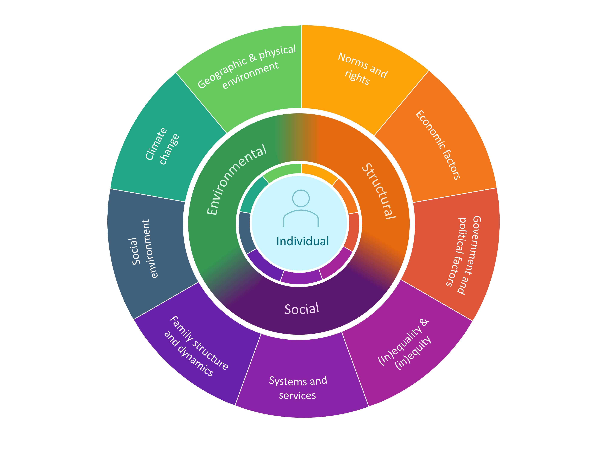

\section*{Introduction}

\addcontentsline{toc}{section}{Introduction}

Mental health is an essential part of human flourishing. As defined by the \acr{WHO}, it encompasses “a state of well-being in which every individual realizes [their] own potential, can cope with the normal stresses of life, can work productively and fruitfully, and is able to make a contribution to [their] community.”[@worldhealthorganizationComprehensiveMentalHealth2013] 

For much of the global population, however, attaining this state of mental health is an enduring challenge, with over one billion people worldwide living with a mental or addictive disorder.[@rehmGlobalBurdenDisease2019] Mental disorders are a leading cause of disability,[@charlsonExcessMortalityMental2015; @rehmGlobalBurdenDisease2019] with the \acr{GBD} study estimating that 4.9% of \acr{DALYs} and 14.6% of \acr{YLDs} were attributable to mental disorders in 2019.[@vosGlobalBurden3692020a] Mental disorders are also closely linked to physical health and can be a significant risk factor for premature mortality.[@walkerMortalityMentalDisorders2015] Among patients living with the most severe mental illnesses, premature mortality may reduce life expectancy by as much as 10 to 20 years.[@demooijDyingTooSoon2019] 

At all levels of sociodemographic development, this burden is rising.[@patelLancetCommissionGlobal2018] Yet despite this global scale and despite a growing evidence base for impactful, cost-effective interventions that may help,[@patelMentalNeurologicalSubstance2016] the profound impact of mental disorders has been met by a profound treatment gap.[@demyttenaerePrevalenceSeverityUnmet2004] A majority of the world's population lives in countries with fewer than 10 psychiatrists for every 100,000 people (Figure \ref{figure_service_gap}). Most of those living with a mental disorder do not have access to adequate care,[@bassUnitedNationsGeneral2012a; @demyttenaerePrevalenceSeverityUnmet2004] and many face stigma,[@alonsoPerceivedStigmaIndividuals2009; @angermeyerStigmaMentalIllness2003] discrimination,[@stuartMentalIllnessEmployment2006; @thornicroftDiscriminationHealthCare2007] and abuse.[@humanrightswatchDeathSentenceAbuses2012; @mfoafo-mcarthyHumanRightsViolations2014; @rahmanMentalDistressHuman2021] 

In addition to the long-standing challenges of these unmet needs, new and emerging dangers such as climate change and COVID-19 reveal additional stressors that threaten to exacerbate this burden. Global climate change—an accelerating existential threat to planetary health that the United Nations considers the “defining crisis of our time”—is already manifesting profound impacts on mental health.[@worldhealthorganizationMentalHealthClimate2022] 

\blandscape

```{r figure_service_gap, include = TRUE, echo=FALSE, warnings = FALSE, fig.width = 11, fig.height = 6.5, fig.align='center', out.width = '97%', fig.scap="Countries where fewer than 10 psychiatrists per 100,000 capita were working in the health sector, 2013-2017.", out.extra='', fig.cap="\\label{figure_service_gap}Countries where fewer than 10 psychiatrists per 100,000 capita were working in the health sector between 2013-2017, average. Data from the Global Health Observatory (GHO) of the World Health Organization (WHO)."} 

# Loading libraries
library(readxl)
library(dplyr)
library(tidyr)
library(ggplot2)
library(RColorBrewer)
library(sp)
library(broom)
library(sf)
library(scales)
library(viridis)
library(data.table)
library(ggpubr)
library(lemon)
library(rnaturalearth)
library(rnaturalearthdata)
library(sysfonts)
library(showtext)
font_add_google("Source Sans Pro")
library(gridExtra)
showtext_auto() 
showtext_opts(dpi = 300) 
library(rnaturalearthhires) # install.packages("rnaturalearthhires", repos = "http://packages.ropensci.org", type = "source")
library(ggtext)


world_map <- ne_countries(scale = "large", returnclass = "sf")

who_gho_data <- read.csv("C:/Users/danie/Dropbox (Harvard University)/Important Files/3. PhD/Thesis/3. Draft/1. RMarkdown/phd_thesis/who_gho_data.csv") %>% rename_with(~ gsub("_working_in_mental_health_sector_.per_100_000_population.", "", .), 
                                                                                                                                                                        contains("_working_in_mental_health_sector_.per_100_000_population.")) %>%
  pivot_longer(cols = -country, 
               names_to = c("type", "year"), 
               names_pattern = "(.*)_(.*)",
               values_to = "value") %>%
  group_by(country, type) %>%
  mutate(average = mean(value, na.rm = TRUE)) %>%
  ungroup() %>%
  select(average, country, type) %>%
  unique() %>%
  filter(type == "psychiatrists")

country <- c("Afghanistan", "Albania", "Angola", "Antigua and Barbuda", "Argentina", "Armenia", "Australia", "Azerbaijan", "Bahrain", "Bangladesh", "Barbados", "Belarus", "Belgium", "Belize", "Bhutan", "Bolivia (Plurinational State of)", "Bosnia and Herzegovina", "Brazil", "Brunei Darussalam", "Bulgaria", "Burkina Faso", "Burundi", "Cambodia", "Canada", "Central African Republic", "Chad", "Chile", "China", "Colombia", "Comoros", "Congo", "Cook Islands", "Costa Rica", "Côte d'Ivoire", "Croatia", "Cuba", "Cyprus", "Czechia", "Dominican Republic", "Ecuador", "Egypt", "El Salvador", "Equatorial Guinea", "Eritrea", "Estonia", "Eswatini", "Ethiopia", "Fiji", "Finland", "France", "Gabon", "Gambia", "Georgia", "Germany", "Ghana", "Greece", "Grenada", "Guatemala", "Guinea", "Guinea-Bissau", "Guyana", "Haiti", "Honduras", "Hungary", "India", "Indonesia", "Iran (Islamic Republic of)", "Iraq", "Israel", "Italy", "Jamaica", "Japan", "Jordan", "Kenya", "Kiribati", "Kyrgyzstan", "Latvia", "Lebanon", "Liberia", "Lithuania", "Luxembourg", "Madagascar", "Malaysia", "Maldives", "Mali", "Marshall Islands", "Mauritania", "Mauritius", "Mexico", "Monaco", "Mongolia", "Montenegro", "Morocco", "Mozambique", "Myanmar", "Namibia", "Nauru", "Nepal", "Netherlands", "New Zealand", "Nicaragua", "Niger", "Norway", "Oman", "Panama", "Peru", "Philippines", "Poland", "Qatar", "Republic of Korea", "Republic of Moldova", "North Macedonia", "Romania", "Russian Federation", "Rwanda", "Saint Kitts and Nevis", "Saint Lucia", "Saint Vincent and the Grenadines", "Samoa", "Sao Tome and Principe", "Saudi Arabia", "Senegal", "Serbia", "Seychelles", "Sierra Leone", "Singapore", "Slovenia", "South Africa", "South Sudan", "Spain", "Sri Lanka", "Sudan", "Suriname", "Sweden", "Switzerland", "Syrian Arab Republic", "Tajikistan", "Thailand", "Timor-Leste", "Togo", "Tonga", "Tunisia", "Türkiye", "Uganda", "Ukraine", "United Arab Emirates", "United Republic of Tanzania", "United States of America", "Uruguay", "Uzbekistan", "Vanuatu", "Yemen", "Zambia", "Zimbabwe")

adm0_a3 <- c("AFG", "ALB", "AGO", "ATG", "ARG", "ARM", "AUS", "AZE", "BHR", "BGD", "BRB", "BLR", "BEL", "BLZ", "BTN", "BOL", "BIH", "BRA", "BRN", "BGR", "BFA", "BDI", "KHM", "CAN", "CAF", "TCD", "CHL", "CHN", "COL", "COM", "COG", "COK", "CRI", "CIV", "HRV", "CUB", "CYP", "CZE", "DOM", "ECU", "EGY", "SLV", "GNQ", "ERI", "EST", "SWZ", "ETH", "FJI", "FIN", "FRA", "GAB", "GMB", "GEO", "DEU", "GHA", "GRC", "GRD", "GTM", "GIN", "GNB", "GUY", "HTI", "HND", "HUN", "IND", "IDN", "IRN", "IRQ", "ISR", "ITA", "JAM", "JPN", "JOR", "KEN", "KIR", "KGZ", "LVA", "LBN", "LBR", "LTU", "LUX", "MDG", "MYS", "MDV", "MLI", "MHL", "MRT", "MUS", "MEX", "MCO", "MNG", "MNE", "MAR", "MOZ", "MMR", "NAM", "NRU", "NPL", "NLD", "NZL", "NIC", "NER", "NOR", "OMN", "PAN", "PER", "PHL", "POL", "QAT", "KOR", "MDA", "MKD", "ROU", "RUS", "RWA", "KNA", "LCA", "VCT", "WSM", "STP", "SAU", "SEN", "SRB", "SYC", "SLE", "SGP", "SVN", "ZAF", "SSD", "ESP", "LKA", "SDN", "SUR", "SWE", "CHE", "SYR", "TJK", "THA", "TLS", "TGO", "TON", "TUN", "TUR", "UGA", "UKR", "ARE", "TZA", "USA", "URY", "UZB", "VUT", "YEM", "ZMB", "ZWE")


iso_crosswalk <- as.data.frame(cbind(country, adm0_a3))


who_gho_data <- who_gho_data %>%
  inner_join(., iso_crosswalk)


col_highlight = "#E4007C"
col_grey = "#CCCCCC"
col_light_grey = "#F2F2F2"

world_map <- world_map %>%
  st_as_sf() %>%
  st_transform(CRS("+proj=robin")) 

map <- world_map %>%
  filter(admin != "Antarctica") %>%
  full_join(who_gho_data, by = "adm0_a3") %>%
  mutate(fill = ifelse(average < 10,
                       "Fewer than 10 psychiatrists per 100,000 capita",
                       "Others")) %>%
  mutate(fill = ifelse(is.na(fill), "No data", fill)) %>%
  mutate(fill = factor(fill, 
                       levels = c("Fewer than 10 psychiatrists per 100,000 capita", 
                                  "Others",
                                  "No data"))) %>%
  ggplot(aes(geometry = geometry, fill = fill)) +
  geom_sf(color = NA) +
  theme_void() +
  # labs(title = "Availability of psychiastrists",
  #  subtitle = " ") +
  scale_fill_manual(name = "",
                    values = c(col_highlight, col_grey, col_light_grey)) +
  theme(legend.position = "bottom",
        legend.justification='center',
        legend.direction='horizontal',
        text = element_text(family = "Arial"),
        # plot.title =element_text(size=18, 
        #       face = "bold",
        #       hjust = 0),
        axis.title.x = element_text(color=col_grey, size=10, hjust = 0),
        plot.caption = element_text(hjust = 0, 
                                    vjust = 1,
                                    face = "bold",
                                    size=10))


data <- world_map %>%
  filter(admin != "Antarctica") %>%
  full_join(who_gho_data, by = "adm0_a3") %>%
  mutate(category = ifelse(average < 10,
                           "A",
                           "B")) %>%
  select(category, pop_est) %>%
  st_drop_geometry() %>%
  group_by(category) %>%
  mutate(count = sum(as.numeric(pop_est), na.rm = TRUE)) %>%
  select(category, count) %>%
  ungroup() %>%
  unique() %>%
  mutate(category = ifelse(is.na(category), "B", category)) %>%
  mutate(category = factor(category, 
                           levels = c("A", 
                                      "B"))) %>%
  arrange(category)


# Compute percentages
data$fraction <- data$count / sum(data$count)

# Compute the cumulative percentages (top of each rectangle)
data$ymax <- cumsum(data$fraction)

# Compute the bottom of each rectangle
data$ymin <- c(0, head(data$ymax, n=-1))

# Make the plot
circle <- data %>%
  ggplot(aes(ymax=ymax, ymin=ymin, xmax=4, xmin=3, fill=category)) +
  geom_rect() +
  # geom_label( x=3.5, aes(y=labelPosition, label=label), size=6) +
  geom_richtext(aes(x = 0,
                    y = 0),
                label = paste0(round(data$fraction[data$category == "A"]*100,0),
                               "%"),
                color = "black", 
                fill = NA,
                label.color = NA,
                size = 10 / .pt,
                hjust = 0.5,
                vjust = .9) +
  coord_polar(theta="y") +
  xlim(c(-1, 4)) +
  theme_void() +
  theme(legend.position = "none") +
  scale_fill_manual(values = c(col_highlight, col_grey))

text <- ggplot() +
  theme_void() +
  xlim(0, Inf) +
  geom_richtext(aes(x = 0,
                    y = 0),
                label = paste0('**',
                               "of the world's",
                               "**<br>**",
                               "population",
                               ",",
                               "**<br>",
                               paste0(round(data$count[data$category == "A"]/1000000000,1),
                                      " billion")),
                color = "black", 
                fill = NA,
                label.color = NA,
                size = 12 / .pt,
                hjust = 0,
                vjust = 0.5) 


circle_text <- cowplot::plot_grid(circle, text, 
                                  ncol = 2,
                                  rel_heights = c(7,1.3)) 

# title <- ggplot() +
# geom_segment(aes(x = 0, y = 0, xend = .25, yend = 0), linewidth = .9, color = col_grey) +
# # annotate("text", x = 0, y = 0, size=12, label = "Average, 2013-2017",
# #   hjust = 0, vjust = -0.3,
# #   color = "black", fontface = 'bold', family = "Martel") + 
# theme_void() +
# xlim(0, 0.25) +
# ylim(-0.01, 0.04)

# combo <- cowplot::plot_grid(title, circle_text, 
#        nrow = 2,
#        rel_heights = c(1.2,3)) 
# 

# ggsave(map,
#  filename = paste0("gdp_",
#       year,
#       ".png"),
#  path = "C:/Users/danie/Dropbox (Harvard University)/Important Files/7. Data Science/mckinsey",
#  height = 7.5,
#  width= 12,
# #  bg = "white")
# 
# ggsave(combo,
#  filename = paste0("gdp_pie_",
#       year,
#       ".png"),
#  path = "C:/Users/danie/Dropbox (Harvard University)/Important Files/7. Data Science/mckinsey",
#  height = 2.05,
#  width= 2.25,
#  bg = "white")


final_figure <- cowplot::ggdraw(map) +
  cowplot::draw_plot(
    {circle_text}
    
    ,
    # The distance along a (0,1) x-axis to draw the left edge of the plot
    x = 0.05, 
    # The distance along a (0,1) y-axis to draw the bottom edge of the plot
    y = 0.20,
    # The width and height of the plot expressed as proportion of the entire ggdraw object
    width = 0.225, 
    height = 0.25)


ggsave(filename = paste0("Figure_1.png"), 
    plot = final_figure, 
    width = 13.33,
    height = 6.3,
    bg = "white")

print(final_figure)


```

\elandscape

These impacts are shaped both by the disastrous upheaval caused by worsening extreme weather events and by the incremental change rising temperatures and sea levels have wrought on livelihoods and means of living—altering the availability and access to natural resources, land use, infrastructure, and community.[@atwoliMentalHealthClimate2022; @hayesClimateChangeMental2018] The essential connections between mental health and human well-being have been further underscored by the devastating impacts of the COVID-19 pandemic, which continues to deal psychological and psychiatric harm to patients, health care workers, and the public overall.[@vindegaardCOVID19PandemicMental2020]

The extant and evolving challenges of global mental health, in turn, entail jeopardy to health systems and to the three intrinsic goals of improving health, responsiveness, and financial protection.[@robertsGettingHealthReform2008] According to the \acr{WHO}'s Mental Health Atlas report from 2020, mental health system governance, capacity, and integration into routine service delivery is fundamentally lacking across nations of all levels of economic development, with only 15% of countries having functional integration of mental health into primary health care.[@worldhealthorganizationMentalHealthAtlas2021] This lack of service delivery echoes a lack of basic epidemiological data,[@steinCrossnationalEpidemiologySocial2017] constraining research and frustrating efforts to respond to mental health needs. Among nations, the Atlas report highlights widening disparities in health system indicators, with worsened gaps in service availability and public health expenditure for mental health between low- and middle-income countries and high-income peers. With respect to health spending, mental health care services in many countries have traditionally relied primarily or exclusively on out-of-pocket payments,[@dixonFinancingMentalHealth2006] resulting in a greater risk of catastrophic health expenditure among households with patients living with a mental disorder. These direct costs, when coupled with the indirect costs of diminished earnings due to disability, may exacerbate conditions of poverty, [@patelPovertyCommonMental2003] which, in turn, may lead to worsening mental health[@lundPovertyCommonMental2010]—feeding a vicious cycle that harms households and nations alike. 

A better understanding of the evolving burden and dynamics of global mental health may thus have broad consequences to strengthening health system responses to mental disorders and improving health outcomes for millions of individuals worldwide. 

Contributing to such an understanding has motivated this dissertation, which takes as its focus different quantitative aspects of the global burden of mental illness—how we measure and evaluate it, how it may be changing, and how novel data sources may help in characterizing it, particularly in the absence of robust, high-frequency epidemiological surveillance. 

The three chapters presented in this dissertation reflect the interdisciplinary nature of global mental health, utilizing a diverse range of quantitative methods and drawing on insights from epidemiology, health economics, and econometrics. Furthermore, these papers align with the broader conceptual framework of population mental health (Figure \ref{figure_conceptual_framework}), which recognizes the complex interplay of environmental, social, and structural determinants in shaping mental health outcomes. This framework, based on determinants identified by Dykxhoorn et al.,[@dykxhoornConceptualisingPublicMental2022] illustrates the comprehensive contributions of these determinants to individual and public mental health and guides the approaches in Chapters 1, 2, and 3.

```{r figure_conceptual_framework, include = TRUE, echo=FALSE, warnings = FALSE, fig.width = 8.5, fig.height = 9.5, fig.align='center', out.width = '95%', fig.scap="Conceptual framework for population mental health.", out.extra='', fig.cap="\\label{figure_conceptual_framework}Conceptual framework for population mental health. Original design, based on framework from Dykxhoorn, J., Fischer, L., Bayliss, B. et al. Conceptualising public mental health: development of a conceptual framework for public mental health.BMC Public Health 22, 1407 (2022). https://doi.org/10.1186/s12889-022-13775-9. Creative Commons Attribution 4.0 International License"}



```

In Chapter 1, we investigated the share of the global burden of disease attributable to mental disorders and its associated economic value. We reviewed recent efforts to estimate both the epidemiologic and economic burden of mental disorders, and we propose a composite approach to estimation to capture a broader share of attributable morbidity and mortality.[@bloomGlobalEconomicBurden2011; @charlsonExcessMortalityMental2015; @vigoEstimatingTrueGlobal2016; @vosGlobalBurden3692020a; @walkerMortalityMentalDisorders2015; @whitefordGlobalBurdenDisease2013] Applying this approach using the most recently available \acr{GBD} data, we estimated that the global burden of mental disorders is likely much higher than previously estimated, encompassing 16% of disability-adjusted life years in 2019. Using value of a statistical life approaches, we estimated that the economic value of this burden would exceed 4.7 trillion \acr{USD}.

In Chapter 2, we investigated how health system visits for mental disorders in Madagascar may be shifting in respond to changes in climate. Madagascar has little to no mental health surveillance data and is among the nations most vulnerable to climate change. To address these gaps, we studied the impact of three climate change exposures—temperature, soil moisture, and duration of cyclones and tropical storms—by leveraging meteorologic, geospatial, and health system data reported by 3,413 facilities from 2010 to 2020. We found a statistically significant reduction in monthly mental health related visits associated with each degree Celcius increase in temperature, primarily localized to facilities in the central highlands, where cooler temperatures are more prevalent. We further found that higher soil moisture may be associated with more mental health visits in the future, after a three-month lag; this increase was primarily found in the eastern lowlands and the northern dry deciduous forests, consistent with the geographic concentration of flood risk in Madagascar. Our findings point to potential heterogeneity in how changing climate conditions will impact mental health needs and system responses.

In Chapter 3, I investigated how internet search data for health symptoms might provide high-frequency insight into the state of population mental health during the COVID-19 pandemic. Using search data from Australia, Ireland, New Zealand, Singapore, the United Kingdom, and the United States, I explored how announcements of COVID-19 vaccine safety and efficacy data in November 2020 impacted Google search trends for mental health symptoms. I found evidence of statistically significant immediate and sustained declines in searches for anxiety, depression, and major depressive disorder throughout the 40 days following these announcements. The findings underscore the importance of timely and transparent public health communication and illustrate the potential application of high-frequency internet search data for population mental health surveillance.

Overall, these three chapters highlight different facets of the global burden of mental disorders and speak to the interconnectedness of mental health and human well-being, as well as the urgent need for greater research and resources to better illuminate such pathways. Taken together, they contribute to a growing effort to generate a more comprehensive understanding of the challenges posed by this burden—as well as opportunities for improving mental health at local, regional, and global levels.