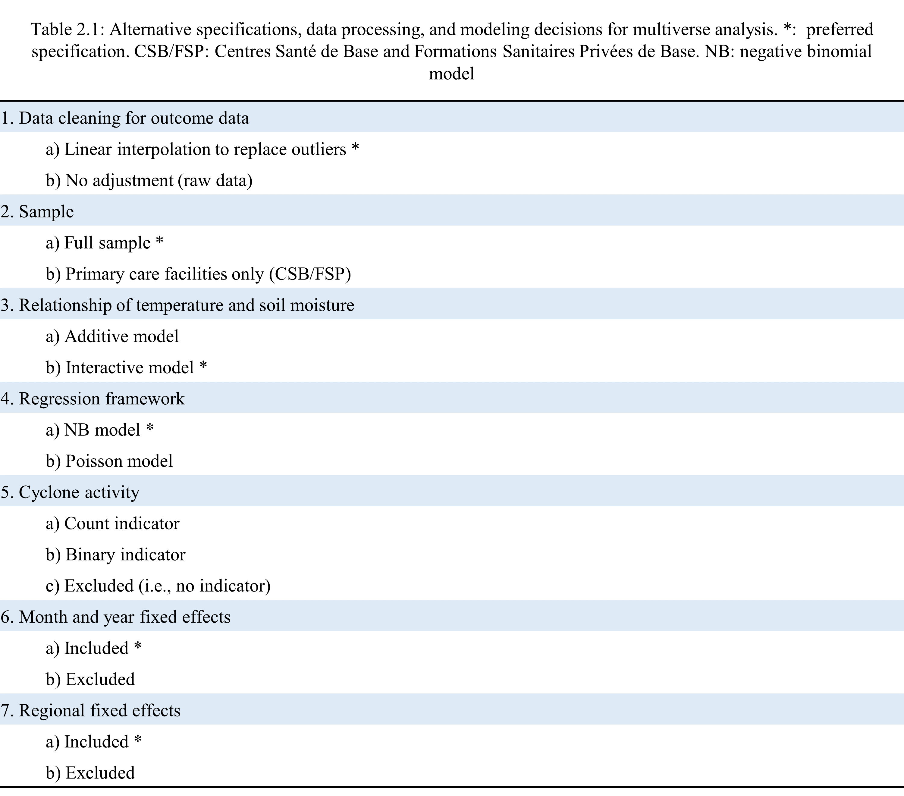

```{r loading_libraries}


# Loading libraries
# library(MASS) # We load this and then detach it just to clear the package
# library(margins) # We load this and then detach it just to clear the package
# library(lme4) # We load this and then detach it just to clear the package
# detach("package:lme4", unload=TRUE) # Needed to use dplyr's select function
# detach("package:margins", unload=TRUE) # Needed to use dplyr's select function
# detach("package:MASS", unload=TRUE) # Needed to use dplyr's select function
library(readxl)
library(readr)
library(dplyr)
library(zoo)
library(tidyr)
library(psych)
library(ggplot2)
library(RColorBrewer)
library(sp)
library(broom)
library(sf)
library(scales)
library(viridis)
library(data.table)
library(ggpubr)
library(ggmap)
library(maps)
library(mapdata)
library(ggrepel)
library(table1)
library(stringr) 
library(stringi)
library(fixest)
library(stats)
library(lubridate)
library(forecast)
library(gtools)
# library(devtools)
library(reticulate)
library(stargazer)
library(lwgeom)
if (!require("ggsflabel")) devtools::install_github("yutannihilation/ggsflabel")
library(openxlsx)
library(gganimate)
library(transformr)
library(huxtable)
library(ggtext)
# library(margins)
library(ncdf4) # package for netcdf manipulation
library(magrittr)
library(lmtest)
library(sandwich)
library(rgee)
library(gt)
library(knitr)
library(webshot2)
library(sysfonts)
library(showtext)
font_add_google("Source Sans Pro")
library(gridExtra)
library(tibble)
showtext_auto() 
showtext_opts(dpi = 300) 
# library(googledrive)
# drive_auth(email = TRUE)
library(rmdHelpers)
library(gtExtras)
library(kableExtra)
library(DescTools)
library(rvest)
library(httr)
library(polite)
library(janitor)
library(cowplot)
library(ggridges)
library(elevatr)
library(rayshader)


# library(ggsn)

# library(glmmTMB)

# Setting directories - change these to your local directory
path <- 'C:/Users/danie/Dropbox (Harvard University)/madagascar_mh'
code <- paste(path,'code', sep = "/")
path_python = "C:/Users/danie/AppData/Local/Programs/Python/Python310/python.exe"

# Data
datasource <- paste('C:/Users/danie/Dropbox (Harvard University)/data',
          sep = "/") # The complete data set is not uploaded to 
# Github. Ask golden@hsph.harvard.edu for access. 
datapath <- paste(path,'data', sep = "/")
datapath_reference <- paste(datapath,'0_reference', sep = "/")
data_mh_chd <- paste(datapath,'1_mental_health', sep = "/")
data_mh_csb <- data_mh_chd 
data_mh_chu_chrr <- paste(data_mh_chd,'pathologies neuropsychiatriques CHU CHRR', sep = "/")
data_gps <- paste(datapath,'2_gps', sep = "/")
data_gps_sources <- paste(data_gps,'gps_sources', sep = "/")
data_gps_sources_searches <- paste(data_gps_sources,'searches', sep = "/")
data_gps_sources_reposit <- paste(data_gps_sources,'repositories', sep = "/")
data_climate_path <- paste(datapath,'3_climate', sep = "/")
data_climate_era <- paste(data_climate_path,'ERA5', sep = "/")
data_climate_esa <- paste(data_climate_path,'ESA_CCI', sep = "/")

# Results
resultspath <- paste(path,'results', sep = "/")
mh_path <- paste(resultspath,'1_mental_health', sep = "/")
gpspath <- paste(resultspath,'2_gps', sep = "/")
gpspath_admin_names <- paste(gpspath,'0_reference', sep = "/")
gpspath_fig <- paste(gpspath,'1_figures', sep = "/")
gpspath_spread <- paste(gpspath,'2_spreadsheets', sep = "/")
gpspath_spread_fuzzy <- paste(gpspath_spread,'3_fuzzy_matching', sep = "/")
analysispath <- paste(resultspath,'4_analysis', sep = "/")
analysis_figures <- paste(analysispath,'1_figures', sep = "/")
analysis_models <- paste(analysispath,'3_models', sep = "/")


# Shapefiles
mappath <- paste(path,'shapefiles', sep = "/")
mappath_MOH <- paste(mappath,'MOH', sep = "/")
mappath_OCHA <- paste(mappath,'OCHA', sep = "/")

# Color palette 
col_light = "cyan4"
col_dark = "cyan3"
col_bright = "coral"
col_black = "black"
col_grey_dark = "grey20"
col_grey_med = "grey40"
col_grey_light = "grey80"
col_grey_lightest = "grey85"
col_soilmoisture = col_dark
col_temperature = col_light
col_interaction = col_bright
col_cyclone = "steelblue2"
 
pal <- c("lightskyblue2", "steelblue2", "dodgerblue2", "dodgerblue3", "dodgerblue4", "darkblue")

col_within_threshold = "cyan3"
col_beyond_threshold = "coral"

col_centroid <- "grey20"
col_exact_all <- "cyan2"
col_exact_rhino <- "cyan3"
col_exact_val <- "cyan4"
col_search <- "coral"

col_CH <- "coral"
col_CHD <- "coral1"
col_CHR <- "deeppink3"
col_CSB <- "steelblue2"
col_CSB1 <- "steelblue1"
col_CSB2 <- "steelblue3"
col_other <- "grey20"

col_model_main <- "#F3AB00"
col_model_other <- col_grey_med
col_spec_yes <- "#73BDBF"
col_spec_no <- "white"

col_cases <- "chartreuse3"
col_no_cases <- "deeppink3"

col_eco_rainforest <-"#32A42F"
col_eco_highlands <- "#B9CF19"
col_eco_arid <- "#FEEE19"
col_eco_drydecid <- "#FCAF3E"

# Thresholds
# These are cut off values that will be used in the GPS do file

length_lim <- 15 # The maximum distance allowed when the same facility has
# two GPS coordinates in the data sources for the center of
# those two coordinates to be used as the facility's location.
# Note: the selection of 15 is arbitrarily conservative. Spatial resolution of 
# climate data is typically ~ 30km x 30 km


area_lim <- length_lim*length_lim

# The maximum area of the convex hull allowed when the same facility has
# 3+ GPS coordinates in the data sources for the centroid of
# that convex hull to be used as the facility's location

fokontany_lim <- area_lim  # A small fokotanty is one that is ____ km ^2 or smaller

commune_lim <- area_lim  # A small commune is one that is ____ km ^2 or smaller

# Lags: specify how many lags you want for the explanatory variables (e.g., soil moisture, temp)

lags_number <- 18

# Climate data start and end date
start_date <- as.Date("2010-01-01")
end_date <- as.Date("2020-07-01")

start_date_climate <- start_date - lags_number*31 #This ensures there is data for the lagged exposure
end_date_climate <- end_date

# ESA CCI trim dates
date1 <- 200801
date2 <- 202112

# Seed and sampling fraction
set.seed(1960) # Madgascar's year of independence
sample_fraction = .01


######################
##   MAPS    ##
######################
#  
# # There are two map options available. One set of shapefiles were available
# # from humdata.org, while the other set was provided by the MOH.
#  
# # Loading high-resolution maps of St. Lucia (from data.humdata.org)
map_mdg_0_un <- st_read(paste0(mappath_OCHA,"/",
                "mdg_admbnda_adm0_BNGRC_OCHA_20181031.shp"))
map_mdg_1_un <- st_read(paste0(mappath_OCHA,"/",
                "mdg_admbnda_adm1_BNGRC_OCHA_20181031.shp"))
map_mdg_2_un <- st_read(paste0(mappath_OCHA,"/",
                "mdg_admbnda_adm2_BNGRC_OCHA_20181031.shp"))
map_mdg_3_un <- st_read(paste0(mappath_OCHA,"/",
                "mdg_admbnda_adm3_BNGRC_OCHA_20181031.shp"))
loaded_maps_un <- 1


# Load in data from MOH
map_mdg_0 <- st_read(paste0(mappath_MOH,"/",
              "adm0_mada_utm38S.shp"))
map_mdg_1 <- st_read(paste0(mappath_MOH,"/",
              "adm1_mada_utm38S.shp"))
map_mdg_2 <- st_read(paste0(mappath_MOH,"/",
              "adm2_mada_utm38S.shp"))
map_mdg_3 <- st_read(paste0(mappath_MOH,"/",
              "adm3_mada_utm38S.shp"))
map_mdg_4 <- st_read(paste0(mappath_MOH,"/",
              "adm4_mada_utm38S.shp"))


```

```{r rayshader}

crsLONGLAT <- "+proj=longlat +datum=WGS84 +no_defs"
map_mdg_0_un <- map_mdg_0_un %>%
 st_as_sf(crs= crsLONGLAT)

library(elevatr)
library(rayshader)
library(raster)

z_level = 6

country_elevation <- get_elev_raster(
 locations = map_mdg_0_un,
 z = z_level,
 clip = "locations")

extent_map = extent(country_elevation)

country_elevation = raster_to_matrix(country_elevation)


ground_units <- ifelse(z_level == 5, 4892.0, 
            ifelse(z_level == 6, 2446.0,
               "ERROR"))

height_max <- max(country_elevation, na.rm = TRUE)

zscale_selected <- ground_units/40

country_elevation %>%
 sphere_shade(colorintensity=0.25,
        sunangle = 360-90+15,
        texture = 
         create_texture(lightcolor = "#FEFEFE",
                shadowcolor = "#C6C6C6",
                leftcolor = "#EAEAEA",
                rightcolor = "#EAEAEA",
                centercolor = "#FDFDFD")
        
         # grey70","grey60","grey75","grey80","white")
        # create_texture(col_grey_lightest, col_grey_dark, col_grey_med ,col_grey_light,"white")
        # create_texture("#8AD7FE","#051C2D","#1D3EDB","white","white")
        ) %>%
 # add_shadow(ray_shade(country_elevation, zscale = zscale_selected), max_darken=0.95) %>%
 # add_shadow(ambient_shade(country_elevation, zscale = zscale_selected), max_darken=0.95) %>%
 add_water(detect_water(country_elevation), color = "white") %>%
 save_png(paste0(gpspath_fig, "/elevation_map.png"))

 library(png)
 
 madagascar_topo_map <- readPNG(source = paste0(gpspath_fig, "/elevation_map.png"))
 
 
 madagascar_bbox <- st_bbox(map_mdg_0_un)

# # Get the spatial extent of the PNG image
# madagascar_map_bbox <- c(xmin = 0, ymin = 0, xmax = ncol(madagascar_topo_map), ymax = nrow(madagascar_topo_map))
# 
# 
# # Calculate the scaling factor for the x-axis
# x_scale_factor <- diff(madagascar_bbox[c("xmin", "xmax")]) / diff(madagascar_map_bbox[c("xmin", "xmax")])
# 
# # Calculate the scaling factor for the y-axis
# y_scale_factor <- diff(madagascar_bbox[c("ymin", "ymax")]) / diff(madagascar_map_bbox[c("ymin", "ymax")])
# 
# 
# # Extract minimum and maximum longitude and latitude
# min_lon <- as.numeric(bbox["xmin"])
# max_lon <- as.numeric(bbox["xmax"])
# min_lat <- as.numeric(bbox["ymin"])
# max_lat <- as.numeric(bbox["ymax"])

function_add_rayshading <- function(){
  annotation_raster(madagascar_topo_map, 
          xmin = madagascar_bbox["xmin"], 
          ymin = madagascar_bbox["ymin"], 
          xmax = madagascar_bbox["xmax"], # + (1-x_scale_factor * ncol(madagascar_topo_map)), 
          ymax = madagascar_bbox["ymax"]) # + (1-y_scale_factor * nrow(madagascar_topo_map))) +
 }


detach("package:raster", unload=TRUE)

```


```{r loading_data}

###### MH DATA

load(file = paste(mh_path, 
         "mh_data_all_facilities.Rdata", sep = "/"))

###### OUTPUTS

load(file = paste(gpspath_spread,"1_matched",
         "gps_outputs.Rdata", sep = "/"))

load(file = paste(gpspath_spread,"1_matched", 
         "gps_facilities.Rdata", sep = "/"))

load(file = paste(resultspath,"3_climate", 
         "climate_facilities_subset.Rdata", sep = "/"))

load(file = paste(resultspath,"3_climate", 
         "cyclone_data.Rdata", sep = "/"))


# load(file = paste(analysispath,"2_data", 
#          "data.Rdata", sep = "/"))

load(file = paste(analysispath,"2_data", 
         "outputs_models.Rdata", sep = "/"))

load(file = paste(analysispath,"2_data", 
         "model_outputs_preferred_model.Rdata", sep = "/"))

load(file = paste(analysispath,"2_data", 
         "outputs_lags.Rdata", sep = "/"))


load(file = paste(analysispath,"2_data", 
         "model_outputs_regional.Rdata", sep = "/"))

load(file = paste(analysispath,"2_data",
         "outputs_marginal_effects.Rdata", sep = "/"))

load(file = paste(analysispath,"2_data",
         "outputs_marginal_effects_predictions.Rdata", sep = "/"))

ecological_zones <- read_excel(
 paste(data_climate_path,
    "ecological_zones.xlsx",
    sep = "/")) %>%
 rename(ecological_zone = 'ecological_zone (1 = Eastern rainforest; 2 = High Plateau; 3 = Arid/Desert; 4 = Dry Deciduos Forest)',
     REGION_NAM = region_name)


```

```{r customizing_outputs}

a = "All facilities"
b = "Any mental or neurological disorders"
c = "total"
d = "both"
e = "mean"


num_facilities_CSB <- facilities_all_gps %>% filter(clinic_type_clean == "CSB/FSP") %>% nrow()
num_facilities_CHD <- facilities_all_gps %>% filter(clinic_type_clean == "CHD") %>% nrow()
num_facilities_CHRR_CHU <- facilities_all_gps %>% filter(clinic_type_clean == "CHR/CHU") %>% nrow()
num_facilities <- facilities_all_gps %>% nrow()

num_facilities_CSB = format(num_facilities_CSB, big.mark = ",") 
num_facilities_CHD = format(num_facilities_CHD, big.mark = ",") 
num_facilities_CHRR_CHU = format(num_facilities_CHRR_CHU, big.mark = ",") 
num_facilities_pretty = format(num_facilities, big.mark = ",") 


n_facilities_who <- gps_outputs$value[gps_outputs$variable == "n_facilities_who"]
n_facilities_rhino <- gps_outputs$value[gps_outputs$variable == "n_facilities_rhino"]
n_gps_facilities_new <- gps_outputs$value[gps_outputs$variable == "n_gps_facilities_new"]
n_gps_facilities <- gps_outputs$value[gps_outputs$variable == "n_gps_facilities"]

validation_mean_dist <- gps_outputs$value[gps_outputs$variable == "validation_mean_dist"]

validation_max_dist <- gps_outputs$value[gps_outputs$variable == "validation_max_dist"]


n_matched_facilities <- facilities_all_gps %>% filter(source == "Exact - Validated sources") %>% nrow()
n_matched_facilities_RHINO <- facilities_all_gps %>% filter(source == "Exact - RHINoVision") %>% nrow()
n_gps_facilities_fuzzy <- facilities_all_gps %>% filter(source == "Exact - All sources") %>% nrow()
n_centroid <- facilities_all_gps %>% filter(source == "Centroid") %>% nrow()
n_gps_facilities_searches <- facilities_all_gps %>% filter(source == "Searches") %>% nrow()


earliest_climate_date <- min(as.yearmon(start_date_climate), 
               as.yearmon(as.Date(paste0(as.character(date1), '01'), format='%Y%m%d')))
earliest_climate_date <- format(as.yearmon(earliest_climate_date), "%B %Y")

latest_climate_date <- as.yearmon(end_date_climate)
latest_climate_date <- format(as.yearmon(latest_climate_date), "%B %Y")

n_facilities_sm <- data_climate_subset %>% 
 filter(date == "Jan 2010") %>%
 dplyr::select(sm_mean, facility_ID) %>%
 filter(!is.na(sm_mean)) %>%
 dplyr::select(facility_ID) %>%
 unique() %>%
 nrow()

n_facilities_sm_missing <- data_climate_subset %>% 
 filter(date == "Jan 2010") %>%
 dplyr::select(sm_mean, facility_ID) %>%
 filter(is.na(sm_mean)) %>%
 dplyr::select(facility_ID) %>%
 unique() %>%
 nrow()


```


```{r dynamic_text_results}


function_dynamic_text_results <-
 function(section = "main",     #c(main, lags, regional, multiverse)
      coefficient_option,
      lag_option,
      region_option = "all",
      model_option = "4",
      value = "irr",
      value_include = TRUE,
      multiverse_sign = "positive",
      multiverse_p = FALSE) #(TRUE, FALSE, only),) 
 {
  output_df <- get(paste0(
   "model_outputs",
   ifelse(
    section == "main",
    "_preferred_model",
    ifelse(section == "multiverse", "",
        
        paste0("_", section)))))
  
  if(section == "multiverse"){
   
   if(multiverse_sign == "positive"){ 
    
    output_df <- output_df %>% filter(estimate >= 0) %>% filter(coefficient == coefficient_option)
    
   } else {output_df <- output_df %>% filter(estimate < 0) %>% filter(coefficient == coefficient_option)}    
   
   
   if(multiverse_p != FALSE)
   {
    models_counts <- output_df <- output_df %>% filter(p_value < multiverse_p) %>% nrow()
    return(models_counts)
    
   } else {
    
    models_counts <- output_df %>% nrow()
    
    return(models_counts)
    
   }
   
  }else
   
   
  {
   
   if(section == "lags"){
    
    output_df <- output_df %>% filter(lag == lag_option) %>% filter(coefficient == coefficient_option)
    
   } 
   
   if(section == "regional")
    
   {
    
    output_df <- output_df %>% filter(coefficient == coefficient_option) %>%
     filter(region == region_option)
   }
   
   if(section != "lags" & section != "regional"){
    
    output_df <-
     output_df %>% filter(coefficient == coefficient_option) %>%
     filter(model_number == model_option)
    
   }
   
   
   if (value == "irr"){
     
     val <- round(exp(output_df$estimate), 3)
     p_val <- round(output_df$p_value, 3)
     low <- format(round(exp(output_df$lower_99), 3), nsmall = 3)
     high <- format(round(exp(output_df$upper_99), 3), nsmall = 3)
     

    if (value_include == TRUE){
     
     return(paste0(
      "(IRR: ",
       format(val, nsmall = 3),
      ", p ",
      ifelse(p_val < 0.001,
          "< 0.0001, ",
          paste0("= ",
             format(p_val, nsmall = 3),
             ", ")),
      "99\\% CI: ",
      low,
      " – ",
      high
      ,
      ")"))
     
     
    }
    
    if (value_include == FALSE){
     
     return(paste0(
      "(p ",
      ifelse(p_val < 0.001,
          "< 0.0001, ",
          paste0("= ",
             format(p_val, nsmall = 3),
             ", ")),
      "99\\% CI: ",
      low,
      " – ",
      high
      ,
      ")"))
     
     
    }
    
    
    if (value_include == "only"){
     # IRR only
     
     return(paste0(ifelse(
      val < 1,
      paste0(round(1 - val, 3) * 100, "\\% fewer"),
      paste0(round(val - 1, 3) * 100, "\\%")
     )))
     
    }
    
    
   }
   
   
   if (value == "ame"){
     
    val <- round(output_df$ame, 3)
    p_val <- round(output_df$ame_p_value, 3)
    low <- format(round(output_df$ame_lower_99, 3), nsmall = 3)
    high <- format(round(output_df$ame_upper_99, 3), nsmall = 3)
    
    if (value_include == TRUE){
     return(paste0(
      "(AME: ",
      format(val, nsmall = 3),
      ", p ",
      ifelse(p_val < 0.001,
          "< 0.001, ",
          paste0("= ",
             format(p_val, nsmall = 3),
             ", ")),
      "99\\% CI: ",
      low,
      " – ",
      high
      ,
      ")"))
     
     
    }
    
    if (value_include == FALSE) {
     # AME without value
     
     return(paste0(
      "(p ",
      ifelse(p_val < 0.001,
          "< 0.001, ",
          paste0("= ",
             format(p_val, nsmall = 3),
             ", ")),
      "99\\% CI: ",
      low,
      " – ",
      high
      ,
      ")"))
     
     
    }
    
    
    if (value_include == "only") {
     # AME only
     
     return(format(round(val, 3), nsmall = 3))
     
    }
   }
  }
 }

num_models_multiverse = format(max(model_outputs$model_number), big.mark = ",") 


function_pval_stars <- function(x){
 
 
 ifelse(stars.pval(x) ==".", "", stars.pval(x))
 
 }


```


# Climate exposures and population mental health in Madagascar: an ecological study of national health information system data

\begin{centering}

\emph{Daniel Arias, Karestan Koenen, and Christopher Golden}

\vspace{12pt}

\noindent\rule{8cm}{0.4pt}

\end{centering}

\begin{raggedright}

{\bf Background:} Climate change-related exposures (CCEs) are linked to worsened mental health, yet few studies of CCEs have taken place in low- and middle-income countries. 

{\bf Methods:} To better understand climate conditions and population mental health in these settings, we leverage meteorologic and geospatial data to explore the mental health impacts of three CCEs on monthly counts of patient visits for mental and neurological disorders reported by `r num_facilities_pretty` facilities in Madagascar from 2010 to 2020. We used negative binomial regression to examine the impacts of three CCEs: temperature, soil moisture, and duration of cyclones and tropical storms. 

{\bf Findings and interpretation:} We found a statistically significant reduction in monthly visits reported associated with temperature—approximately `r function_dynamic_text_results(section = "main", coefficient_option = "exposure_temperature", model_option = 4, value = "irr", value_include = "only")` visits reported per each degree Celsius increase `r function_dynamic_text_results(section = "main", coefficient_option = "exposure_temperature", model_option = 4, value = "irr", value_include = TRUE)`. A multiverse analysis of `r num_models_multiverse` models found this estimate to be robust to alternative specifications; ecoregion analysis indicated that this association was primarily localized to facilities in the central highlands, where cooler temperatures are more prevalent. We further found that higher soil moisture may be associated with higher mental health related visits in the future, with an `r function_dynamic_text_results(section = "lags", lag_option = 3, coefficient_option = "exposure_sm", value = "irr", value_include = "only")` elevation in visits reported `r function_dynamic_text_results(section = "lags", lag_option = 3, coefficient_option = "exposure_sm", value = "irr", value_include =TRUE)` after a three-month lag. Ecoregion analysis suggests more visits are reported in the eastern lowlands and the northern dry deciduous forests when soil moisture rises, which is consistent with the geographic concentration of flood risk in Madagascar. Our findings highlight the complex interactions between CCEs and population mental health and suggest potential heterogeneity in how changing climate conditions will impact mental health needs and system responses.

\emph{Keywords: climate mental health, planetary health, eco-anxiety, climate change, humidity, soil moisture, drought, temperature, cyclones.}

\end{raggedright}

## Introduction

As empirical evidence increasingly highlights the wide-scale impact of human activities on climate, there is a growing, parallel body of evidence documenting the impacts our changing climate has on human health.[@watts2020ReportLancet2021] Rising temperatures and extreme weather events (including floods, hurricanes, droughts, and fires) have been associated with worsened health outcomes in multiple settings.[@cianconiImpactClimateChange2020a; @rocqueHealthEffectsClimate2021] In particular, these and other \acr{CCEs} have been increasingly linked to worsened mental health[@padhyMentalHealthEffects2015 @batterhamSystematicReviewQuantitative2022], with systematic reviews suggesting, among other climate condition impacts, positive associations between high ambient temperatures and mental disorders,[@liuThereAssociationHot2021] drought conditions and suicide,[@stankeHealthEffectsDrought2013] and cyclones and negative mental health outcomes.[@tasdikhasanExploringMentalHealth2020]

Despite the weight of this evidence, few quantitative studies evaluating the effects of climate on population mental health have, to date, taken place in low- and middle-income countries (\acr{LMICs}),[@sharpeClimateChangeClimaterelated2021] populations that—despite contributing the least to human-driven climate change—are among the most likely to be vulnerable to its impacts.[@bakerProjectingGlobalEmissions2020] 

Among low-income countries most vulnerable to the health consequences of climate change is Madagascar, a nation that generates one percent *of* one percent of global carbon dioxide emissions. Worsening \acr{CCEs} in Madagascar (primarily in the form of droughts, floods, and cyclones) are likely to exacerbate endemic, climate-sensitive threats to health, including malnutrition and malaria.[@rakotoarisonAssessmentRiskVulnerability2018] In particular, persistent drought conditions in recent years have led to extensive food insecurity.[@adamtaylorMadagascarHeadedClimate2021] Though there is debate concerning the extent to which human activity is directly responsible for Madagascar's current drought,[@harringtonAttributionSevereLow; @zhongManyDimensionsDrought2021] the extremity of the situation has led some observers to classify conditions in Madagascar as the first climate change famine in history.[@worldfoodprogrammeMadagascarSevereDrought2021]

Understanding how both incremental and extreme changes in climate impact population mental health is critical to gauging the full extent to which \acr{CCEs} impact human health and well-being under a multidisciplinary approach to population health.[@berryCaseSystemsThinking2018] This understanding is particularly important in contexts such as Madagascar, where climate conditions are already demonstrating pronounced pressures on economic, social, and physical well-being.

In investigating the impact of climate exposures on mental health, health system data can serve as a useful tool in settings where epidemiological survey data is sparse. Despite the poor availability of mental health services in many settings, routine health system data can still provide valuable insights into trends and patterns of service use and the need and distribution of care for mental health issues. Although these data may only capture a share of the true burden of disease, reported visits related to mental health complaints can be a valuable starting point for preliminary research into the impact of climate change on population mental health in resource-constrained settings.

In this ecological study, we investigated the association of climate conditions and population mental health in Madagascar between 2010 and 2020 using routine health system data from Madagascar’s Ministry of Public Health. The use of health system data enabled us to indirectly evaluate the extent to which existing public health data may already be showing signals of \acr{CCEs}, which may aid efforts to prevent and mitigate mental health stressors and better design systemic responses to mental health needs.


As a measure of population mental health, we considered facility-level monthly reported visits related to mental disorders; in terms of exposure, we explored the predictive association of three \acr{CCEs} with incident mental health visits: mean monthly ambient air temperature, mean monthly soil moisture, and monthly cyclone activity. As exposure to these stressors could involve a delay in onset of mental health symptoms and subsequent care seeking, we further explored whether exposures in prior months were associated with monthly reported visits in subsequent ones. We further considered interactive and additive models to account for complexity in the interaction of climate variables in Madagascar, as well as ecological variation to capture differences in regional climate systems. 

## Methods

### Data 

To analyze the impact of climate on population mental health in Madagascar, we first obtained \acr{HMIS} data through a collaboration with the Madagascar Ministère de la Santé Publique. We then obtained gridded temperature and soil moisture data from the \acr{ERA5}[@copernicusclimatechangeservicec3sFifthGenerationECMWF2017] and the \acr{ESA CCI},[@europeanspaceagencyEuropeanSpaceAgency2022] respectively. Data on tropical storms and cyclones were obtained from open-source compilations of storms in the South-West Indian Ocean[@wikipediaSouthWestIndianOcean2023], which were in turn cross-referenced against storm trajectory data from the \acr{NOAA}[@internationalbesttrackarchiveforclimatestewardshipibtracsInternationalBestTrack2021] for accuracy.

#### Outcomes 

Madagascar’s health information system provided facility-level data on counts of disease incidence summarized and reported monthly. Prior to 2019, this system was the \acr{GESIS}; in early 2019, the system transitioned to using \acr{DHIS2}.[@measureevaluationStrengtheningHealthInformation2019]

Among facilities reporting any mental health data between 2010 and 2020, data were obtained from `r num_facilities_CSB` public and private primary health centers, known as Centres Santé de Base or CSBs, and Formations Sanitaires Privées de Base or FSBs, respectively, `r num_facilities_CHD` district referral hospitals (CHDs), `r num_facilities_CHRR_CHU` regional referral hospitals (CHRRs) and university hospitals (CHUs), for a total of `r num_facilities_pretty` uniquely-identified facilities in our sample.

Exploratory data analysis indicated that the classification and reporting of counts of mental disorders in \acr{GESIS} varied across types of facilities in their level of detail. Among CHD facilities, incidence of mental disorders was aggregated with neurological disorders (coded as “neuro psychiatric disorders”), while CHRR and CHU facilities reported more detailed counts of specific mental disorders, such as depression, personality disorders, and schizophrenia. Across all facilities, disaggregated data were reported by age group but not by sex. Among CSB facilities, incidences of mental disorders were reported by age group under “mental illnesses and psychic disorders” until June 2015, when reporting was reclassified to “mental disorders”; disaggregated data were reported by both age and sex. A summary of classification by facility type and year is provided in Appendix 2.1, Table S2.1, with English translations of the French disease names provided in Table S2.2 and yearly cumulative reported visit totals by disorder reported by facility level and year in Tables S2.3-5.

To address heterogeneity in reporting, our analysis aggregated any monthly visits concerning mental or neurological disorders reported by a facility into a summary outcome measure, irrespective of age and sex. To address outliers, monthly observations of the outcome were arranged separately for each facility into a unique time series. The nonparametric Friedman’s super smoother regression estimator[@friedmanVariableSpanScatterplot1984] was applied to each time series to identify outlier observations and replace them through linear interpolation.[@hyndmanAutomaticTimeSeries2008] By considering outliers on a facility-by-facility basis, the data cleaning approach preserved extreme values that may reflect true variances in incidence (for example, incidences reported by a large, regional reference hospital) while addressing potential errors in data entry. (Additional detail on the data cleaning process is available in Appendix 2.1) 

#### Geospatial data 

To retrieve spatial climate data for the facilities in our sample, it was first necessary to geocode facilities to obtain their latitude and longitude. Facility data from \acr{GESIS} included limited information on the location of facilities. While exact facility coordinates were not available, information on the relevant administrative unit served by a facility was included in the data (e.g., regions for CHRRs, districts for CHDs, and communes for CSBs). These data informed a stepwise matching process to locate facilities in our sample. 

First, region, district, and commune names in our sample were standardized against reference shapefiles to address variations in translation, abbreviation, transposition, accent marks, spacing, hyphenation, and spelling. (A summary of the standardized names is provided in Appendix 2.2.) Next, facility names, types, and associated administrative units were used to match facilities to a validated spatial inventory of health facilities in Sub-Saharan Africa,[@mainaSpatialDatabaseHealth2019] of which `r format(as.numeric(n_facilities_who), big.mark = ",")` coordinates were provided for public facilities in Madagascar. In order to systematically match facilities in our sample to facilities in the spatial inventory, we implemented approximate string matching, which allowed for facility names and administrative units to be matched approximately, rather than exactly, to corresponding patterns in the validated spatial inventory. Applying this matching technique, `r format(as.numeric(n_matched_facilities), big.mark = ",")` facilities (`r round(as.numeric(n_matched_facilities)/num_facilities * 100,0)`%) in our sample were matched to validated coordinates. 

Among the remaining facilities, an additional `r format(as.numeric(n_matched_facilities_RHINO), big.mark = ",")` primary facilities were matched to coordinates from a spatial inventory of `r format(as.numeric(n_facilities_rhino), big.mark = ",")` coordinates obtained from the \acr{RHINO},[@rhinovisiondecisionsupportsystemMadagascarDecisionSupport] which supports an open source database of health facility data in conjunction with the \acr{USAID}, the government of Madagascar, and other stakeholders. 

To geolocate the remaining facilities, our existing inventories were combined with additional spatial inventories of health facility coordinates gathered from local consultants, the Global Healthsites Mapping Project, and other sources to create a database of `r format(as.numeric(n_gps_facilities_new), big.mark = ",")` uniquely identified coordinates for potential matches. Using this database, an additional `r format(as.numeric(n_gps_facilities_fuzzy), big.mark = ",")` facilities in our sample were geolocated using manual and approximate string matching. 

An additional `r format(as.numeric(n_centroid), big.mark = ",")` facilities were matched to the centroid of their relevant administrative unit in cases where the unit was less than or equal to `r min(commune_lim, fokontany_lim)` square \acr{km}, as these administrative units are quite small relative to the spatial resolution of gridded climate data (approximately 900 \acr{km}²). Among the remaining facilities, geolocations were manually identified for `r format(n_gps_facilities_searches, big.mark = ",")` facilities using targeted searches, resulting in `r format(as.numeric(n_matched_facilities) + as.numeric(n_matched_facilities_RHINO) + as.numeric(n_centroid) + as.numeric(n_gps_facilities_fuzzy) + as.numeric(n_gps_facilities_searches), big.mark = ",")` of the `r format(num_facilities, big.mark = ",")` facilities (`r round((as.numeric(n_matched_facilities) + as.numeric(n_matched_facilities_RHINO) + as.numeric(n_centroid) + as.numeric(n_gps_facilities_fuzzy) + as.numeric(n_gps_facilities_searches))/as.numeric(num_facilities) * 100,0)`%) in the sample being geolocated. 

To gauge the accuracy of the geolocating process, a subset of 1% of geolocated facilities was selected for validation against manually identified coordinates. Comparing the geolocated coordinates to validated coordinates for each facility, the mean distance between coordinates in the validation sample was `r format(round(as.numeric(validation_mean_dist),2), big.mark = ",")` \acr{km}, with a maximum distance of approximately `r format(round(as.numeric(validation_max_dist), 1), big.mark = ",")` \acr{km}, indicating high accuracy in the geolocated process relative to the spatial resolution of climate data. Additional detail on the geolocating and validation process is available in Appendix 2.2.

#### Climate data 

Facility geolocations were then used to retrieve spatially referenced monthly averages of temperature and soil moisture data from \acr{ERA5} and \acr{ESA CCI}, respectively. To allow for modelling of lagged associations, data were obtained for both \acr{ERA5} and \acr{ESA CCI SM} from `r earliest_climate_date` to `r latest_climate_date`.

\acr{ERA5} is a global atmospheric reanalysis from the \acr{ECMWF} and is freely available through its \acr{C3S}[@europeanspaceagencyEuropeanSpaceAgency2022]. The spatial resolution of \acr{ERA5} is approximately 30 \acr{km}, with quality-assured hourly estimates available from 1959 to the present.[@europeanspaceagencyEuropeanSpaceAgency2022] Using Google Earth Engine, a time series of monthly aggregate values for mean air temperature in degrees Kelvin at a height of 2 meters was obtained for each facility geolocation.[@googleearthengineERA5MonthlyAggregates2022] Temperature data was then converted to degrees Celsius.

We obtained soil moisture data from \acr{ESA CCI SM}, the world’s first and most comprehensive, multi-decade, satellite-observed dataset of global soil moisture. The spatial resolution of \acr{ESA CCI SM} is approximately 26 \acr{km}, with daily estimates available from 1978 to 2021. Using \acr{ESA CCI SM} active and passive radiometer data, a time series of monthly aggregate values for mean soil moisture—measured as saturation percentage—was constructed from daily observations at each land grid point within Madagascar. We then applied nearest neighbor matching to link these time series to our geolocated facilities. 

For a location to have soil moisture data available in \acr{ESA CCI SM}, it must fall within one of 244,243 land grid points. For some facilities on Madagascar’s coastline, their location placed them outside of \acr{ESA CCI}’s spatial coverage, resulting in missing values. To address facilities without any soil moisture data, nearest neighbor searching was conducted to identify the nearest land grid point for which \acr{ESA CCI SM} data would be available; this nearest neighbor’s soil moisture time series data would then be applied to the facility with missing data. Within a time series of \acr{ESA CCI} data for a given location, however, monthly data could still be missing if adequate satellite observation was not recorded anytime during a given month; for these values, we used linear interpolation to address missing data within a time series.

In addition, we obtained data on tropical storms and cyclones in the South-West Indian Ocean for the 2009-2010 to 2020-2021 seasons, inclusive. Open source data on tropical cyclones in the south-west Indian Ocean was obtained by scraping information from Wikipedia summaries of each cyclone season, which were originally sourced from alerts issued by \acr{MFR La Réunion}, the \acr{WMO}-designated \acr{RSMC} for the provision of forecasts and warnings of tropical cyclones in the South-West Indian Ocean. To ensure that the compiled data accurately reflected storms in Madagascar during the study period, we cross-referenced these data against storm trajectory data for the South Indian Basin from \acr{NOAA}.[@internationalbesttrackarchiveforclimatestewardshipibtracsInternationalBestTrack2021] 

With these data, we generated two indicators to measure exposure to storm activity in a given month: a binary indicator for whether a storm impacted Madagascar in that month and a count indicator for the number of days per month with a storm. To capture lingering post-dissipation effects, we defined impact as the storm's duration plus an additional 14 days.

### Statistical analysis

All analyses were completed using R (version 4.2.1).[@rcoreteamLanguageEnvironmentStatistical2022] Marginal effects were calculated using the 'margins' package (version 0.3.26)[@leeperMarginsMarginalEffects2021] for R. 

#### Modeling approach

Exploratory data analysis highlighted that the variance of monthly facility-level counts of incident mental disorders highly exceeded the mean; consequently, our statistical analysis utilized \acr{NB} regression, which is recommended in the case of over-dispersed count data.

Our primary analysis involved conducting four models to estimate the association between facility-level counts of incident mental disorders and climate conditions. Model 1 used temperature as the principal predictor of counts of incident mental disorders. Model 2 only used soil moisture as a predictor. Model 3 used both temperature and soil moisture independently as predictors, while Model 4—our preferred model—introduced an interaction term between the two. 

Duration of cyclone activity was included in all models using our count indicator of exposure. In all models, we included fixed effects for Madagascar’s twenty-two regions to account for geographic differences in climate patterns and case/visit reporting. We further included month and year fixed effects to account for seasonality and time-varying omitted variables. 

In addition, to aid in the interpretation of results, our analysis further reported the average marginal effect of each model predictor. Marginal effects clarify the effect of a per-unit change in a continuous explanatory variable (e.g., temperature) on an outcome where the regression model involves interaction. (In models without interaction or higher-order terms, the slope coefficient from the model will equal the marginal effect.) In addition to estimating the average marginal effects of our temperature, soil moisture, and cyclone variables, we further calculated the marginal effect and predicted values of the outcome for each unit of climate exposure across the three variables of interest.

Though \acr{CCEs} could acutely impact mental health in our sample, we could anticipate that these impacts might not immediately result in changes to monthly case and visit counts, owing to delays in symptom onset, care seeking, and care delivery. To test for lagged associations—that is, whether in a given month, climate conditions in prior months were associated with counts of mental disorders—versions of Model 4 were conducted using lagged predictors. Measures of association were estimated for each monthly lag increment between 1 month and 18 months, inclusive. 

Owing to the large number of observations in our sample, significance was evaluated against an alpha of 0.01, with 99% confidence intervals reported. Coefficients and confidence intervals for our indicators of climate exposure were exponentiated to generated \acr{IRRs}. Confidence intervals (\acr{CIs}) were constructed using heteroskedasticity-robust standard errors.

#### Subgroup analysis 

Madagascar is home to a diverse range of terrestrial ecoregions, each of which has unique physical, climatic, and ecological characteristics. These variations in the environment include distinct patterns of rainfall, temperature, and cyclone activity, potentially resulting in effect heterogeneity when examining how these exposures impact human health across different ecoregions. 

To explore potential heterogeneity of our effect estimates, we evaluated Models 1 through 4 among facilities in each of Madagascar's four predominant ecoregions: the lowland, humid forests of the east, the subhumid forests of the Central High Plateau, the desert and xeric shrublands of the south, and the northeastern dry deciduous forests. (Ecoregions are presented in Figure \ref{figure_ecological_zone}.) 

```{r figure_ecological_zone, include = TRUE, echo=FALSE, warnings = FALSE, fig.cap="\\label{figure_ecological_zone}Predominant ecoregions of Madagascar, summarized by administrative region.", fig.width = 8, fig.height = 9, fig.align='center', out.width = '90%'}


map_mdg_1_un %>% rename(REGION_NAM = ADM1_EN) %>% inner_join(ecological_zones, by = "REGION_NAM") %>%
 mutate(ecological_zone = ifelse(ecological_zone == 1, "Eastern lowland forests",
                 ifelse(ecological_zone == 2, "Highland subhumid forests",
                     ifelse(ecological_zone == 3, "Desert and xeric shrubland", "Dry deciduous forests")))) %>%
 mutate(ecological_zone = factor(ecological_zone, levels = c("Eastern lowland forests",
                               "Highland subhumid forests",
                               "Desert and xeric shrubland",
                               "Dry deciduous forests"))) %>%
 ggplot(aes(geometry = geometry, fill = ecological_zone)) +
 function_add_rayshading() + 
  geom_sf(size = 0.2,
     color = col_grey_med,
     alpha = 0.4) +
 geom_sf(data = map_mdg_0_un,
     size = 0.2,
     color = col_black,
     fill = NA) +theme(text = element_text(family = "Source Sans Pro"),
    legend.position = "right") +
 scale_fill_manual(values = c(col_eco_rainforest,
                col_eco_highlands,
                col_eco_arid,
                col_eco_drydecid),
          name = "Ecoregion") +
 theme_void()


ggsave(filename = paste0("Figure_5.jpg"),
    plot = last_plot(),
    width = 8,
    height = 10,
    bg = "white")


```
\newpage

#### Sensitivity analysis 

In order to evaluate the robustness of our main results to alternative specifications, data processing, and modeling decisions, we generated `r num_models_multiverse` plausible model combinations to conduct a multiverse analysis to identify how sensitive effect estimates and confidence intervals were to different methodological choices. 

To generate the model combinations, we first detailed seven methodological choices and their potential specifications. These criteria are outlined in Table 2.1. 

\vspace{12pt}

\begin{raggedright}

```{r table2_1, echo = FALSE, include = TRUE, out.width = '100%'}



```

\addcontentsline{lot}{table}{Table 2.1: Alternative specifications, data processing, and modeling decisions for multiverse analysis}

\end{raggedright}

First, we considered the role of data cleaning of the outcome data and chose to compare our analysis using the cleaned outcome data against the raw unadjusted values. Second, we chose to compare our findings using data from all facilities (the full sample) against a sample without district and regional hospitals (CSB/FSP facilities only). Primary care facilities have smaller catchment areas than hospitals; consequently, it is more likely that climate data for primary care facilities will closely reflect patients' climate exposure compared to referral hospitals. Third, we considered the decision to model temperature and soil moisture as an additive or interactive relationship (Model 3 vs. Model 4), with both alternatives included in our multiverse analysis. Fourth, we evaluated our decision to account for overdispersion with a \acr{NB} model by using a Poisson regression framework as an alternative. Fifth, we evaluated alternative specifications of exposure to cyclone activity, using three options: our binary indicator, our count indicator, and no term for cyclone activity included. Sixth, we varied whether time fixed effects (month and year) were included. Seventh, we similarly included and excluded regional fixed effects for comparison.


<!-- ```{r table1prep, fig.scap="scap table", fig.cap="Real caption of table", include = TRUE, echo=FALSE, warnings = FALSE} -->

<!-- choice <- c("1. Data cleaning for outcome data", -->
<!--       "1. Data cleaning for outcome data", -->
<!--       "2. Sample", -->
<!--       "2. Sample", -->
<!--       "3. Relationship of temperature and soil moisture", -->
<!--       "3. Relationship of temperature and soil moisture", -->
<!--       "4. Regression framework", -->
<!--       "4. Regression framework", -->
<!--       "5. Cyclone activity", -->
<!--       "5. Cyclone activity", -->
<!--       "5. Cyclone activity", -->
<!--       "6. Month and year fixed effects", -->
<!--       "6. Month and year fixed effects", -->
<!--       "7. Regional fixed effects", -->
<!--       "7. Regional fixed effects") -->

<!-- criteria <- c("a) Linear interpolation to replace outliers*", -->
<!--        " b) No adjustment (raw data)", -->
<!--        "a) Full sample*", -->
<!--        " b) Primary care facilities only (CSB/FSP)", -->
<!--        "a) Additive model", -->
<!--        "b) Interactive model*", -->
<!--        "a) NB model*", -->
<!--        "b) Poisson model", -->
<!--        "a) Count indicator*", -->
<!--        " b) Binary indicator", -->
<!--        "c) Excluded (i.e., no indicator)", -->
<!--        "a) Included*", -->
<!--        "b) Excluded", -->
<!--        "a) Included*", -->
<!--        "b) Excluded") -->


<!-- table_1 <- cbind(choice, criteria) -->

<!-- table_1 <- as.data.frame(table_1) -->

<!-- table_1 %>% -->
<!--  group_by(choice) %>% -->
<!--  gt(rowname_col = "criteria") %>% -->
<!--  tab_header(title = md("Table 2.1: Alternative specifications, data processing, and modeling decisions for multiverse analysis")) %>% -->
<!--  tab_footnote(footnote = "*: preferred specification. CSB/FSP: Centres Santé de Base and Formations Sanitaires Privées de Base. NB: negative binomial model") -->

<!-- ``` -->


<!-- ```{r table1, fig.scap="scap table", fig.cap="Real caption of table", include = TRUE, echo=FALSE, warnings = FALSE} -->

<!-- kableExtra::kable((table_1$criteria)) %>% -->
<!--   pack_rows(index = table(fct_inorder(table_1$choice))) -->

<!-- ``` -->


We then interacted the methodological choices to generate `r num_models_multiverse` plausible model specifications. Using the effect estimates and confidence intervals for these models, we constructed specification curves for monthly temperature, soil moisture, and—for the `r as.numeric(num_models_multiverse)/3` models that included the cyclone count indicator— cyclone activity to visually compare the distribution of plausible estimates for different combinations.

#### Ethics statement
The \acr{IRB} of the Harvard T.H. Chan School of Public Health determined that this study was not human subjects research and that additional review was not required (protocol number: IRB21-1303, determined on October 19, 2021).

## Results
Our geolocated sample of facilities—which is displayed in Figure \ref{figure_gps}—showed geographic diversity and comprehensive coverage across Madagascar, with most geolocations identified through validated sources. 

Figure \ref{figure_gps_climate} shows the spatial distribution of temperature and soil moisture across the facilities in our sample during January and June 2015, corresponding to the warmer, wet season and the drier, cool season, respectively. When evaluated over time, annual climate trends in Madagascar showed a relatively stable distribution of average temperatures, while soil moisture had a slight upward shift through 2020 (Figure \ref{figure_climate_distribution}). Data of tropical storm and cyclone activity throughout the study period also exhibited seasonal patterns, with most major storms occurring in the hot season, with a peak between February and May (Figure \ref{figure_cyclone}).

\blandscape

```{r figure_gps, include = TRUE, echo=FALSE, warnings = FALSE, fig.scap="Map of facilities in Madagascar, by coordinate source and facility type.", out.extra='', fig.cap="\\label{figure_gps}Map of facilities in Madagascar, by coordinate source (left panel) and facility type (right panel).", fig.width = 16, fig.height = 10, fig.align='center', out.height= '90%'}


map_a <- facilities_all_gps %>%
 ggplot(aes(geometry=geometry)) +
   function_add_rayshading() + 

 # geom_sf(data = map_mdg_3_un,
 #     size = 0.2,
 #     color = col_grey_light,
 #     fill = NA) +
 geom_sf(data = map_mdg_2_un,
     size = 0.2,
     color = col_grey_med,
     fill = NA) +
 geom_sf(data = map_mdg_1_un,
     size = 0.2,
     color = col_black,
     fill = NA) +
 geom_sf(alpha = 0.5, aes(color = source)) +
 theme_void() +
 theme(text = element_text(size = 16, family = "Source Sans Pro"),
    legend.position = "left") +
 scale_color_manual(values = c(col_centroid,
                col_exact_all,
                col_exact_rhino,
                col_exact_val,
                col_search),
           name = "Source")


map_b <- facilities_all_gps %>%
 mutate(clinic_type_clean = ifelse(clinic_type_clean == "CSB/FSP", "Primary",
                  ifelse(clinic_type_clean == "CHD", "District hospital",
                      "Regional/university hospital"))) %>%
 mutate(clinic_type_clean = factor(clinic_type_clean, levels = c("Primary",
                                 "District hospital",
                                 "Regional/university hospital"))) %>%
 ggplot(aes(geometry=geometry)) +
  function_add_rayshading() + 

 # geom_sf(data = map_mdg_3_un,
 #     size = 0.2,
 #     color = col_grey_light,
 #     fill = NA) +
 geom_sf(data = map_mdg_2_un,
     size = 0.2,
     color = col_grey_med,
     fill = NA) +
 geom_sf(data = map_mdg_1_un,
     size = 0.2,
     color = col_black,
     fill = NA) +
 geom_sf(alpha = 0.5, aes(color = clinic_type_clean)) +
 theme_void() +
 theme(text = element_text(size = 16, family = "Source Sans Pro"),
    legend.position = "right") +
 scale_color_manual(values = c(col_CSB,
                col_CHD,
                col_CHR),
           name = "Facility type")

combined_plot <- ggarrange(map_a, map_b, ncol = 2)

compass_file <- paste0(analysis_figures, "/compass.png")
# From https://commons.wikimedia.org/wiki/File:Gray_compass_rose.svg

ggdraw() +  draw_plot(combined_plot) +
 draw_image(
  compass_file, scale = .2, x = .51, y = .02,
  hjust = 1, halign = 1, valign = 0
 ) 

ggsave(filename = paste0("Figure_6a.jpg"),
    plot = map_a,
    width = 8,
    height = 10,
    bg = "white")

ggsave(filename = paste0("Figure_6b.jpg"),
    plot = map_b,
    width = 8,
    height = 10,
    bg = "white")

```

\elandscape

```{r figure_gps_climate, include = TRUE, echo = FALSE, warnings = FALSE, fig.scap="Spatial distribution of climate conditions across clinics and seasons in Madagascar.", out.extra='', fig.cap="\\label{figure_gps_climate}Spatial distribution of climate conditions across clinics and seasons in Madagascar. Mean monthly temperature (top) is measured in degrees Celsius  and mean soil moisture is measured in percent saturation (below).", fig.width = 6, fig.height = 7.5, fig.align='center', out.width = '90%'}

panel_a <- data_climate_subset %>%
 dplyr::select(date, facility_ID, mean_2m_air_temperature) %>%
 unique() %>%
 inner_join(., facilities_all_gps) %>%
 dplyr::select(date, geometry, facility_ID, mean_2m_air_temperature) %>%
 filter(date == "Jan 2015" | date == "June 2015" ) %>%
 mutate(date_2 = ifelse(date == "Jan 2015", "January 2015", "June 2015")) %>%
 filter(!is.na(date_2)) %>%
 ggplot(aes(geometry=geometry)) +
 # geom_sf(data = map_mdg_3_un,
 #     size = 0.2,
 #     color = col_grey_light,
 #     fill = NA) +
 # geom_sf(data = map_mdg_2_un,
 #     size = 0.2,
 #     color = "grey40",
 #     fill = NA) +
 geom_sf(data = map_mdg_1_un,
     size = 0.2,
     color = col_black,
     fill = NA) +
 # geom_sf_text(data = map_mdg_1_un, aes(label = ADM1_EN),
 #       size = 2, color = col_grey_lightest) +
 # geom_sf(alpha = 0.1, size = 5, aes(color = temp_monthly)) +
 geom_sf(alpha = 0.9, size = .7, aes(color = mean_2m_air_temperature)) +
 theme_void() +
 # scale_alpha(range = c(0,1)) +
 scale_color_viridis(option = "magma") +
 labs(color = "Temperature ( ̊ C)") +
 theme(text = element_text(family = "Source Sans Pro"),
    strip.background = element_rect(colour="white",
                    fill="white")) +
 facet_wrap(~date_2)

panel_b <- data_climate_subset %>%
 dplyr::select(date, facility_ID, sm_mean) %>%
 unique() %>%
 inner_join(., facilities_all_gps) %>%
 dplyr::select(date, geometry, facility_ID, sm_mean) %>%
 filter(date == "Jan 2015" | date == "June 2015" ) %>%
 mutate(date_2 = ifelse(date == "Jan 2015", "January 2015", "June 2015")) %>%
 filter(!is.na(date_2)) %>%
 ggplot(aes(geometry=geometry)) +
 # geom_sf(data = map_mdg_3_un,
 #     size = 0.2,
 #     color = col_grey_light,
 #     fill = NA) +
 # geom_sf(data = map_mdg_2_un,
 #     size = 0.2,
 #     color = "grey40",
 #     fill = NA) +
 geom_sf(data = map_mdg_1_un,
     size = 0.2,
     color = col_black,
     fill = NA) +
 # geom_sf_text(data = map_mdg_1_un, aes(label = ADM1_EN),
 #       size = 2, color = col_grey_lightest) +
 # geom_sf(alpha = 0.1, size = 5, aes(color = temp_monthly)) +
 geom_sf(alpha = 0.9, size = .9, aes(color = sm_mean)) +
 theme_void() +
 # scale_alpha(range = c(0,1)) +
 scale_color_viridis(option = "mako", direction = -1) +
 labs(color = "Soil moisture (%)") +
 theme(text = element_text(family = "Source Sans Pro"),
    strip.background = element_rect(colour="white",
                    fill="white")) +
 facet_wrap(~date_2)

ggarrange(panel_a,panel_b, nrow = 2)

ggsave(filename = paste0("figure_2.jpg"),
    plot = last_plot(),
    path = analysis_figures,
    width = 6,
    height = 7,
    bg = "white")


ggsave(filename = paste0("Figure_7.jpg"),
    plot = last_plot(),
    width = 6,
    height = 6,
    bg = "white")

```

\newpage

```{r figure_climate_distribution, include = TRUE, echo=FALSE, warnings = FALSE, fig.scap="Distribution of temperature and soil moisture across all month-years and all clinics.", out.extra='', fig.cap="\\label{figure_climate_distribution}Distribution of A) temperature and B) soil moisture across all month-years and all clinics.", fig.width = 6, fig.height = 7.5, fig.align='center', out.width = '90%'}


panel_a <- data_climate_subset %>%
 mutate(date = as.yearmon(date),
     year = as.factor(year(date)),
     month = month(date)) %>%
 filter(year != "2022") %>%
 ggplot(aes(x=mean_2m_air_temperature, y = year, fill = stat(x))) +
 geom_density_ridges_gradient() +
 labs(x = "Temperature ( ̊ C)",
    title = "A:",
    y = "Year") +
 theme_classic() +
 theme(text = element_text(family = "Source Sans Pro"),
    legend.position = "") +
 scale_fill_viridis(option = "magma")

panel_b <- data_climate_subset %>%
 mutate(date = as.yearmon(date),
     year = as.factor(year(date)),
     month = month(date)) %>%
 filter(year != "2022") %>%
 ggplot(aes(x=sm_mean, y = year, fill = stat(x))) +
 geom_density_ridges_gradient() +
 labs(x = "Soil moisture (%)",
    title = "B:",
    y = "Year") +
 theme_classic() +
 theme(text = element_text(family = "Source Sans Pro"),
    legend.position = "") +
 scale_fill_viridis(option = "mako", direction = -1)

# panel_a <- data_climate_subset %>%
#  mutate(date = as.yearmon(date),
#     year = as.factor(year(date)),
#     month = month(date)) %>%
#  filter(year != "2022") %>%
#  ggplot(aes(x=temp_monthly, group = year, fill = year, color = year)) +
#  geom_density(alpha=0.45, position="identity") +
#  labs(x = "Temperature ( ̊ C)",
#    title = "A:",
#    y = "Density",
#    fill = "Year",
#    color = "Year") +
#  theme_classic() +
#  theme(text = element_text(family = "Source Sans Pro")) +
#  scale_color_viridis(discrete = TRUE, option = "magma") +
#  scale_fill_viridis(discrete = TRUE, option = "magma")
#
# panel_b <- data_climate_subset %>%
#  mutate(date = as.yearmon(date),
#     year = as.factor(year(date)),
#     month = month(date)) %>%
#  filter(year != "2022") %>%
#  ggplot(aes(x=sm_monthly, group = year, fill = year, color = year)) +
#  geom_density(alpha=0.45, position="identity") +
#  labs(x = "Soil moisture (%)",
#    title = "B:",
#    y = "Density",
#    fill = "Year",
#    color = "Year") +
#  theme_classic() +
#  theme(text = element_text(family = "Source Sans Pro")) +
#  scale_color_viridis(discrete = TRUE, option = "mako") +
#  scale_fill_viridis(discrete = TRUE, option = "mako")


ggarrange(panel_a,panel_b, nrow = 2)

ggsave(filename = paste0("figure_3.jpg"),
    plot = last_plot(),
    path = analysis_figures,
    width = 6,
    height = 7)


ggsave(filename = paste0("Figure_8.jpg"),
    plot = last_plot(),
    width = 10,
    height = 6,
    bg = "white")

```

\newpage

\blandscape


```{r figure_cyclone, include = TRUE, echo=FALSE, warnings = FALSE, fig.cap="\\label{figure_cyclone}Tropical storms and cyclones in Madagascar by intensity and season, 2009-2010 to 2020-2021, inclusive.", fig.width = 8, fig.height = 5, fig.align='center', out.width = '90%'}

library(vistime)

category <- c("Moderate tropical storm",
       "Severe tropical storm",
       "Subtropical depression",
       "Tropical cyclone",
       "Intense tropical cyclone",
       "Very intense tropical cyclone")

color <- c("cyan2",
      "lightblue1",
      "steelblue3",
      "palegoldenrod",
      "orange",
      "red")

cylclone_col <- as.data.frame(cbind(category, color))

data_cyclone_vis <- data_cyclone %>%
 mutate(start = as.character(paste0(start_date_timeline, " 2020")),
     end = as.character(paste0(end_date_timeline, " 2020"))) %>%
 mutate(start = as.Date(start, format = "%B %d %Y"),
     end = as.Date(end, format = "%B %d %Y")) %>%
 left_join(.,cylclone_col)

plot_data <- gg_vistime(data_cyclone_vis,
            col.event = "name",
            col.group = "season",
            show_labels = FALSE,
            background_lines = 0) +
 scale_x_datetime(breaks = breaks_width("2 months"),
          labels = date_format("%B")) +
 theme(text = element_text(size = 10,
              family = "Source Sans Pro"))

col <- as.character(data_cyclone_vis$color)
names(col) <- as.character(data_cyclone_vis$category)


my_hist <- data_cyclone_vis %>%
 ggplot(aes(wind_speed_kmh, fill = category)) +
 geom_bar() +
 scale_fill_manual(values = col,
          name = " ") +
 theme(text = element_text(size = 8,
              family = "Source Sans Pro"),
    legend.position = "bottom") +
 guides(fill = guide_legend(nrow = 2))

legend <- cowplot::get_legend(my_hist)

### Combine the main plot and legend into a single figure
plot_combined <- ggdraw(plot_data) +
 
 draw_plot(
  {legend},
  # The distance along a (0,1) x-axis to draw the left edge of the plot
  x = 0.4,
  # The distance along a (0,1) y-axis to draw the bottom edge of the plot
  y = 0.3,
  # The width and height of the plot expressed as proportion of the entire ggdraw object
  width = 0.6,
  height = 0.5)

plot_combined <- plot_grid(plot_data, legend,
              nrow = 2,
              rel_heights = c(1, 0.15),
              rel_widths = c(1, 1))
plot_combined


ggsave(filename = paste0("figure_4.jpg"),
    plot = last_plot(),
    path = analysis_figures,
    width = 9,
    height = 5,
    bg = "white")


ggsave(filename = paste0("Figure_9.jpg"),
    plot = last_plot(),
    width = 10,
    height = 6,
    bg = "white")

```


\elandscape


\newpage

\begin{spacing}{1.5}


```{r table 2,include = TRUE, echo=FALSE, warnings = FALSE}


function_filter_results <- function(data,
                  preferred_model = FALSE,
                  filter_disease = "Any mental or neurological disorders",
                  filter_age = "total",
                  filter_sex = "both",
                  filter_temp_statistic = "mean",
                  filter_cleaned_data = TRUE, 
                  filter_sample = "all",
                  filter_cyclone = "count",
                  filter_time_fe = "fixed",
                  # filter_type_fe = "fixed",
                  filter_region_fe = "fixed",
                  filter_model_type = "NB"){
 
 if(preferred_model == FALSE){
  
  data %>% filter(disease == filter_disease & 
           age == filter_age & sex == filter_sex & 
           temp_statistic == filter_temp_statistic)
  
 }else{
  
  data %>%
   filter(disease == filter_disease & 
        age == filter_age & sex == filter_sex & 
        temp_statistic == filter_temp_statistic) %>%
   filter(cleaned_data == filter_cleaned_data & 
        sample == filter_sample & cyclone == filter_cyclone & 
        time_fe == filter_time_fe & 
        region_fe == filter_region_fe & 
        # clinic_type_fe == filter_type_fe &
        model_type == filter_model_type)
 }
}

model_outputs_preferred_model %>%
 filter(model_type == "NB") %>%
 filter(coefficient %in% c("exposure_temperature:exposure_sm", "exposure_temperature", "exposure_sm", "days_with_cyclone")) %>%
 mutate(
  cell_coef =
   paste0(
    signif(exp(estimate), 3),
    " (",
    signif(exp(lower_99), 3),
    " – ",
    signif(exp(upper_99), 3),
    ")",
    function_pval_stars(p_value)
   ),
  cell_me = ifelse(
   coefficient == "exposure_temperature:exposure_sm",
   "",
   paste0(
    signif(ame, 3),
    " (",
    signif(ame_lower_99, 3),
    " – ",
    signif(ame_upper_99, 3),
    ")",
    function_pval_stars(ame_p_value)
   )
  ),
  coefficient = ifelse(
   coefficient == "exposure_sm",
   "Soil moisture",
   ifelse(
    coefficient == "exposure_temperature",
    "Temperature",
    ifelse(coefficient == "days_with_cyclone",
        "Cyclone (count)",
        "Temperature X Soil moisture"
    )
   )
  ),
  coefficient = factor(
   coefficient ,
   # Reordering group factor levels
   levels = c("Temperature",
         "Soil moisture",
         "Temperature X Soil moisture",
         "Cyclone (count)")
  ),
  model = ifelse(
   model_form == "Temperature only",
   "Model 1 ",
   ifelse(
    model_form == "Soil moisture only",
    "Model 2 ",
    ifelse(model_form == "Temperature + Soil moisture",
        "Model 3 ",
        "Model 4 ")
   )
  ),
  model = factor(model ,   # Reordering group factor levels
          levels = c("Model 1 ",
               "Model 2 ",
               "Model 3 ",
               "Model 4 "))
 ) %>%
 dplyr::select(model, coefficient, cell_coef, cell_me) %>%
 rename('IRR (99% CI)' = cell_coef,
     'M.E. (99% CI)' = cell_me) %>%
 gt(rowname_col = "coefficient", groupname_col = "model") %>%
 tab_header(title = md("Table 2.2: incidence rate ratios (IRRs) and average marginal effects (AME) of climate exposures on monthly reported visits related to mental and neurological disorders, Models 1 through 4.")) %>%
 
 cols_align(align = "left",
       columns = c('IRR (99% CI)' , 'M.E. (99% CI)')) %>%
 tab_footnote(footnote = "Model 1: Temperature only. Model 2: Soil moisture only. Model 3: Temperature and soil moisture, additive model. Model 4: Temperature and soil moisture, interactive model. All models include a count indicator for days of exposure to cyclone activity, as well as month, year, and regional fixed effects.",
        locations = cells_row_groups()) %>%
 tab_footnote(footnote = "*** p < 0.001, ** p < 0.01, * p < 0.05",
        locations = cells_row_groups()) %>%
 opt_footnote_marks("letters") %>%
 tab_options(table.font.names = "Source Sans Pro") %>%
 tab_style(locations = cells_column_labels(),
      style   = list(cell_text(weight = "bold"))) %>%
 tab_options(table.width = pct(100))

```
\end{spacing}{1.5}

\addcontentsline{lot}{table}{Table 2.2: Main analysis results, summarized by incidence rate ratios (IRRs) and average marginal effects (AME) from Models 1 through 4.}

\newpage

### Main analysis

The regression models predicting monthly counts of any mental or neurological disorder (Table 2.2) showed significant associations with temperature across all models. A one-degree Celsius increase in temperature was associated with approximately `r function_dynamic_text_results(section = "main", model_option = 1, coefficient_option = "exposure_temperature", value = "irr", value_include ="only")` visits reported `r function_dynamic_text_results(section = "main", model_option = 1, coefficient_option = "exposure_temperature", value = "irr", value_include =TRUE)` by primary clinics and hospitals in Model 1. Inclusion of both climate predictors resulted in little change in the measure of association for temperature. In an additive model with soil moisture included (Model 3), the effect estimate associated with temperature grew to `r function_dynamic_text_results(section = "main", model_option = 3, coefficient_option = "exposure_temperature", value = "irr", value_include ="only")` visits reported `r function_dynamic_text_results(section = "main", model_option = 3, coefficient_option = "exposure_temperature", value = "irr", value_include =TRUE)`. Adopting an interactive model (Model 4) attenuated the association `r function_dynamic_text_results(section = "main", model_option = 4, coefficient_option = "exposure_temperature", value = "irr", value_include =TRUE)`, but remained significant at a 95% level of confidence. Across all models with temperature, the average marginal effect associated with temperature (across a sample with all clinics) ranged between 2 and 3 fewer monthly mental health visits reported and was statistically significant at an alpha of 0.01, with the average marginal effect in Model 4 being `r function_dynamic_text_results(section = "main", model_option = 4, coefficient_option = "exposure_temperature", value = "ame", value_include ="only")` visits `r function_dynamic_text_results(section = "main", model_option = 4, coefficient_option = "exposure_temperature", value = "ame", value_include =FALSE)`. 

Effect estimates associated with soil moisture were not statistically significant across all four models. In all models, we observed a modest reduction in visits reported per each additional day duration of cyclone activity, with the incidence ratio ratios of Models 3 `r function_dynamic_text_results(section = "main", model_option = 3, coefficient_option = "days_with_cyclone", value = "irr", value_include =TRUE)` and Models 4 `r function_dynamic_text_results(section = "main", model_option = 3, coefficient_option = "days_with_cyclone", value = "irr", value_include = TRUE)` being significant at a level of 0.05. In all models, however, the average marginal effect was close to 0, with the average marginal effect in Model 4 being only `r function_dynamic_text_results(section = "main", model_option = 4, coefficient_option = "days_with_cyclone", value = "ame", value_include ="only")` visits `r function_dynamic_text_results(section = "main", model_option = 4, coefficient_option = "days_with_cyclone", value = "ame", value_include ="FALSE")`.

```{r figure_marginal, include = TRUE, echo=FALSE, warnings = FALSE, fig.width = 13, fig.height = 13, fig.align='center', out.width = '95%', fig.scap="Predicted values of monthly mental health visits and marginal effect estimates by coefficient and their 95\\% and 99\\% confidence intervals.", out.extra='', fig.cap="\\label{figure_marginal} Predicted values of monthly mental health visits and marginal effect estimates by coefficient and their 95\\% and 99\\% confidence intervals. The left panels show predicted values of monthly counts of visits related to mental and neurological disorders in Madagascar, given different units of climate exposure. The right panels show marginal effect estimates over different units of climate exposure in the data. The dotted horizontal lines in the right panel depict no marginal effect on visit counts. In all panels, the model used to generate predictions and marginal effects corresponds to Model 4. Units of climate exposure are degrees Celsius for temperature (top), saturation percentage for soil moisture (middle), and days with cyclone activity (bottom).", }

panel_l <- outputs_marginal_effects_predictions %>%
 pivot_wider(names_from = level, values_from = c(lower, upper)) %>%
 mutate(factor = ifelse(factor == "exposure_sm", "Soil moisture",
             ifelse(factor == "exposure_temperature", "Temperature",
                ifelse(factor == "days_with_cyclone", "Days with cyclone activity",
                    "ERROR")))) %>%
 mutate(factor = factor(factor ,   # Reordering group factor levels
             levels = c("Temperature",
                  "Soil moisture",
                  "Days with cyclone activity"))) %>%
 ggplot(aes(x = xvals,
       y = yvals,
       group = factor,
       fill = factor,
       color= factor)) +
 # geom_hline(yintercept = 0, color = col_grey_dark, linetype='dotted') +
 geom_ribbon(aes(ymin = lower_0.99,
         ymax = upper_0.99),
       alpha = 0.15) +
 geom_ribbon(aes(ymin = lower_0.95,
         ymax = upper_0.95),
       alpha = 0.25) +
 geom_line() +
 geom_point() +
 labs(y = "Predicted monthly mental health visit counts, given climate exposure",
    x = "Units of climate exposure") +
 theme_classic() +
 theme(panel.grid.major.y = element_line(colour = col_grey_lightest),
    legend.position = "none",
    strip.background = element_rect(colour="white",
                    fill="white"),
    strip.text = element_text(size=12),
    text = element_text(family = "Source Sans Pro")) +
 scale_color_manual(values =
            c(col_temperature,
             col_soilmoisture,
             col_cyclone)) +
 scale_fill_manual(values =
           c(col_temperature,
            col_soilmoisture,
            col_cyclone)) +
 facet_wrap(~factor, scales = "free", nrow = 3)


panel_r <- outputs_marginal_effects %>%
 pivot_wider(names_from = level, values_from = c(lower, upper)) %>%
 mutate(factor = ifelse(factor == "exposure_sm", "Soil moisture",
             ifelse(factor == "exposure_temperature", "Temperature",
                ifelse(factor == "days_with_cyclone", "Days with cyclone activity",
                    "ERROR")))) %>%
 mutate(factor = factor(factor ,   # Reordering group factor levels
             levels = c("Temperature",
                  "Soil moisture",
                  "Days with cyclone activity"))) %>%
 ggplot(aes(x = xvals,
       y = yvals,
       group = factor,
       fill = factor,
       color= factor)) +
 geom_hline(yintercept = 0, color = col_grey_dark, linetype='dotted') +
 # geom_ribbon(aes(ymin = lower_0.99,
 #         ymax = upper_0.99),
 #       alpha = 0.15) +
 geom_ribbon(aes(ymin = lower_0.95,
         ymax = upper_0.95),
       alpha = 0.25) +
 geom_line() +
 geom_point() +
 labs(y = "Marginal effect estimate",
    x = "Units of climate exposure") +
 theme_classic() +
 theme(panel.grid.major.y = element_line(colour = col_grey_lightest),
    legend.position = "none",
    strip.background = element_rect(colour="white",
                    fill="white"),
    strip.text = element_text(size=12),
    text = element_text(family = "Source Sans Pro")) +
 scale_color_manual(values =
            c(col_temperature,
             col_soilmoisture,
             col_cyclone)) +
 scale_fill_manual(values =
           c(col_temperature,
            col_soilmoisture,
            col_cyclone)) +
 facet_wrap(~factor, scales = "free", nrow = 3)


ggarrange(panel_l, panel_r, ncol = 2)

ggsave(filename = paste0("figure_9.jpg"),
    plot = last_plot(),
    path = analysis_figures,
    width = 8,
    height = 7)


ggsave(filename = paste0("Figure_10.jpg"),
    plot = last_plot(),
    width = 10,
    height = 6,
    bg = "white")

```

```{r figure_lag, include = TRUE, echo=FALSE, warnings = FALSE, fig.scap="Effect estimates by coefficient with lagged exposures and their 95\\% and 99\\% confidence intervals, Model 4.", out.extra='', fig.cap="\\label{figure_lag}Effect estimates by coefficient with lagged exposures and their 95\\% and 99\\% confidence intervals, Model 4. The x-axis correspond to the length of the lag (e.g., a value of 2 reflects a lag of two months, such that visit counts are predicted by climate conditions two months prior), with the value of 0 reflecting a model without any lag in exposure. The dotted horizontal lines depict a null effect. IRR: incidence rate ratio.", fig.width = 8, fig.height = 9, fig.align='center', out.width = '90%'}

model_outputs_lags %>%
 mutate(coefficient = ifelse(coefficient == "exposure_sm", "Soil moisture",
               ifelse(coefficient == "exposure_temperature", "Temperature",
                   ifelse(coefficient == "exposure_temperature:exposure_sm",
                      "Interaction (Temperature X Soil moisture)",
                      "Days with cyclone activity")))) %>%
 mutate(coefficient = factor(coefficient , # Reordering group factor levels
               levels = c("Temperature",
                     "Soil moisture",
                     "Interaction (Temperature X Soil moisture)",
                     "Days with cyclone activity"))) %>%
 filter(coefficient != "Interaction (Temperature X Soil moisture)") %>%
 ggplot(aes(x = as.factor(as.numeric(lag)),
       group = coefficient,
       fill = coefficient,
       color= coefficient)) +
 geom_hline(yintercept = 1, color = col_grey_dark) +
 geom_ribbon(aes(ymin = exp(lower_99),
         ymax = exp(upper_99)),
       alpha = 0.15) +
 geom_ribbon(aes(ymin = exp(lower_95),
         ymax = exp(upper_95)),
       alpha = 0.25) +
 geom_line(aes(y = exp(estimate))) +
 geom_point(aes(y = exp(estimate))) +
 labs(y = "IRR estimate",
    x = "Lag (months)") +
 theme_classic() +
 scale_color_manual(values =
            c(col_temperature,
             col_soilmoisture,
             col_cyclone)) +
 scale_fill_manual(values =
           c(col_temperature,
            col_soilmoisture,
            col_cyclone)) +
 theme(panel.grid.major.y = element_line(colour = col_grey_light),
    legend.position = "none",
    strip.background = element_rect(colour="white",
                    fill="white"),
    strip.text = element_text(size=11),
    text = element_text(family = "Source Sans Pro")) +
 facet_wrap(~coefficient, scales = "free", nrow = 3)


ggsave(filename = paste0("figure_8.jpg"),
    plot = last_plot(),
    path = analysis_figures,
    width = 6,
    height = 7)

ggsave(filename = paste0("Figure_11.jpg"),
    plot = last_plot(),
    width = 10,
    height = 6,
    bg = "white")

```
Predicted values of monthly mental health related visit counts under Model 4 echoed the effect estimates from Table 2, with fewer visits reported in warmer months (Figure \ref{figure_marginal}). Marginal effect estimates across the distribution of temperatures in our data showed that the greatest level of reduction occurred between 10 and 15 degrees Celsius, with each degree increase associated with 4 to 5 fewer visits related to mental or neurological disorders reported, controlling for other covariates. Months with greater levels of soil moisture and days with cyclone activity also showed fewer reported visits; however, the marginal effects associated with soil moisture were not significant across any unit of exposure, while those associated with days with cyclone activity were close to zero for all lengths of activity.

Examining lagged effects showed potential temporal associations between soil moisture levels in preceding months and visit counts in those following (Figure \ref{figure_lag}), with higher saturation leading to a statistically significant elevation in visits reported 1 to 5 months later. At a lag of 3 months, the elevation in visits was approximately `r function_dynamic_text_results(section = "lags", lag_option = 3, coefficient_option = "exposure_sm", value = "irr", value_include = "only")` `r function_dynamic_text_results(section = "lags", lag_option = 3, coefficient_option = "exposure_sm", value = "irr", value_include =TRUE)`. There appeared to be a significant elevation of similar magnitude 13 to 17 months prior, suggesting a potential annual pattern in the lagged association. Effects for temperature were not significant across any lag; cyclone activity similarly showed no significance in lags under a year, but did show modest, statistically significant associations at lags of 12 months `r function_dynamic_text_results(section = "lags", lag_option = 12, coefficient_option = "exposure_cyclone", value = "irr", value_include = TRUE)` and 15 months `r function_dynamic_text_results(section = "lags", lag_option = 15, coefficient_option = "exposure_cyclone", value = "irr", value_include = TRUE)`. A slight increase in visits was associated with cyclone activity in a prior month, but this increase was not statistically significant `r function_dynamic_text_results(section = "lags", lag_option = 1, coefficient_option = "exposure_cyclone", value = "irr", value_include = TRUE)`.

### Subgroup analysis

Results from our subgroup analysis showed evidence of potential effect heterogeneity by ecoregion (Table 2.3). For temperature, estimates of association were only statistically significant in the highland subhumid forests, where each one-degree Celsius increase in temperature was associated with `r function_dynamic_text_results(section = "regional", coefficient_option = "exposure_temperature", region_option = "2", value = "irr", value_include = "only")` visits reported `r function_dynamic_text_results(section = "regional", coefficient_option = "exposure_temperature", region_option = "2", value = "irr", value_include = TRUE)`. Temperature was associated with a slight increase in visits in the eastern lowland forests `r function_dynamic_text_results(section = "regional", coefficient_option = "exposure_temperature", region_option = "1", value = "irr", value_include = TRUE)` and the desert and xeric shrublands `r function_dynamic_text_results(section = "regional", coefficient_option = "exposure_temperature", region_option = "1", value = "irr", value_include = TRUE)`, but in neither case was the estimate significant at a level of 0.05. 

\begin{spacing}{1.5}

\addcontentsline{lot}{table}{Table 2.3: Subgroup analysis results, summarized by incidence rate ratios (IRRs) and average marginal effects (AME) from Models 1 through 4.}

```{r table_3, include = TRUE, echo=FALSE, warnings = FALSE}


model_outputs_regional %>%
 filter(coefficient %in% c("exposure_temperature:exposure_sm", "exposure_temperature", "exposure_sm", "days_with_cyclone")) %>%
 mutate(
  cell_coef =
   paste0(
    signif(exp(estimate), 3),
    " (",
    signif(exp(lower_99), 3),
    " – ",
    signif(exp(upper_99), 3),
    ")",
    function_pval_stars(p_value)
   ),
  cell_me = ifelse(
   coefficient == "exposure_temperature:exposure_sm",
   "",
   paste0(
    signif(ame, 3),
    " (",
    signif(ame_lower_99, 3),
    " – ",
    signif(ame_upper_99, 3),
    ")",
    function_pval_stars(ame_p_value)
   )
  ),
  coefficient = ifelse(
   coefficient == "exposure_sm",
   "Soil moisture",
   ifelse(
    coefficient == "exposure_temperature",
    "Temperature",
    ifelse(coefficient == "days_with_cyclone",
        "Cyclone (count)",
        "Temperature X Soil moisture"
    )
   )
  ),
  coefficient = factor(
   coefficient ,
   # Reordering group factor levels
   levels = c("Temperature",
         "Soil moisture",
         "Temperature X Soil moisture",
         "Cyclone (count)")
  ),
  model = ifelse(
   model_form == "Temperature only",
   "Model 1 ",
   ifelse(
    model_form == "Soil moisture only",
    "Model 2 ",
    ifelse(model_form == "Temperature + Soil moisture",
        "Model 3 ",
        "Model 4 ")
   )
  ),
  model = factor(model ,   # Reordering group factor levels
          levels = c("Model 1 ",
               "Model 2 ",
               "Model 3 ",
               "Model 4 "))
 ) %>%
 
 mutate(ecological_zone = ifelse(region == "all", "All",
                 ifelse(region == 1, "Eastern lowland forests",
                     ifelse(region == 2, "Highland subhumid forests", 
                        ifelse(region == 3, "Desert and xeric shrubland", 
                            "Dry deciduous forests"))))) %>%
 mutate(ecological_zone = factor(ecological_zone, levels = c("All",
                               "Eastern lowland forests",
                               "Highland subhumid forests",
                               "Desert and xeric shrubland", 
                               "Dry deciduous forests"))) %>%
 
 dplyr::select(coefficient, cell_coef, cell_me, ecological_zone) %>%
 rename('IRR (99% CI)' = cell_coef,
     'M.E. (99% CI)' = cell_me) %>%
 gt(rowname_col = "ecological_zone", groupname_col = "coefficient") %>%
 tab_header(title = md("Table 2.3: subgroup analysis results, summarized by incidence rate ratios (IRRs) and average marginal effects (AME) from Models 1 through 4.")) %>%
 
 cols_align(align = "left",
       columns = c('IRR (99% CI)' , 'M.E. (99% CI)')) %>%
 tab_footnote(footnote = "Estimates from Model 4 (interactive model), which include month, year, and regional fixed effects.",
        locations = cells_row_groups()) %>%
 tab_footnote(footnote = "*** p < 0.001, ** p < 0.01, * p < 0.05",
        locations = cells_row_groups()) %>%
 opt_footnote_marks("letters") %>%
 tab_options(table.font.names = "Source Sans Pro") %>%
 tab_style(locations = cells_column_labels(),
      style   = list(cell_text(weight = "bold"))) %>%
 tab_options(table.width = pct(100))

```

\end{spacing}


With respect to soil moisture, while our primary analysis found no evidence of a statistically significant association with reported visits in the full sample, we found evidence of heterogeneity in our subgroup analysis. Among facilities in the highland subhumid forests, we found that each percentage point increase in soil moisture was associated with `r function_dynamic_text_results(section = "regional", coefficient_option = "exposure_sm", region_option = "2", value = "irr", value_include = "only")` reported visits `r function_dynamic_text_results(section = "regional", coefficient_option = "exposure_sm", region_option = "2", value = "irr", value_include = TRUE)`, with an average marginal effect of `r function_dynamic_text_results(section = "regional", coefficient_option = "exposure_sm", region_option = "2", value = "ame", value_include = "only")` reported visits `r function_dynamic_text_results(section = "regional", coefficient_option = "exposure_sm", region_option = "2", value = "ame", value_include = FALSE)`. Conversely, each percentage point increase in soil moisture in the dry deciduous forests was associated with a `r function_dynamic_text_results(section = "regional", coefficient_option = "exposure_sm", region_option = "4", value = "irr", value_include = "only")` increase in reported visits `r function_dynamic_text_results(section = "regional", coefficient_option = "exposure_sm", region_option = "4", value = "irr", value_include = TRUE)`, with an average marginal effect of `r function_dynamic_text_results(section = "regional", coefficient_option = "exposure_sm", region_option = "4", value = "ame", value_include = "only")` reported visits `r function_dynamic_text_results(section = "regional", coefficient_option = "exposure_sm", region_option = "4", value = "ame", value_include = FALSE)`.

Finally, our estimates of the incidence rate ratio associated with each additional day of cyclone duration in a given month were consistent between each ecoregion and our full sample. Among facilities in the dry deciduous forests, each additional day of cyclone activity was associated with the greatest reduction in reported visits `r function_dynamic_text_results(section = "regional", coefficient_option = "days_with_cyclone", region_option = "4", value = "irr", value_include = TRUE)`. 

### Multiverse analysis

In our multiverse analysis, `r function_dynamic_text_results(section = "multiverse", coefficient_option = "exposure_temperature", multiverse_sign = "negative", multiverse_p = FALSE)` of `r num_models_multiverse` models (`r round(function_dynamic_text_results(section = "multiverse", coefficient_option = "exposure_temperature", multiverse_sign = "negative", multiverse_p = FALSE)/as.numeric(num_models_multiverse)*100,0)`%) returned effect estimates for temperature associating a one-degree increase with fewer reported visits related to mental or neurological disorders, with `r function_dynamic_text_results(section = "multiverse", coefficient_option = "exposure_temperature", multiverse_sign = "negative", multiverse_p = 0.01)` (`r round(function_dynamic_text_results(section = "multiverse", coefficient_option = "exposure_temperature", multiverse_sign = "negative", multiverse_p = 0.01)/as.numeric(num_models_multiverse)*100,0)`%) of those estimates having p-values below 0.01 (Figure \ref{figure_sensitivity_analysis_temp}). Only `r function_dynamic_text_results(section = "multiverse", coefficient_option = "exposure_temperature", multiverse_sign = "positive", multiverse_p = 0.01)` (`r round(function_dynamic_text_results(section = "multiverse", coefficient_option = "exposure_temperature", multiverse_sign = "positive", multiverse_p = 0.01)/as.numeric(num_models_multiverse)*100,0)`%) models returned statistically significant IRR estimates greater than 1; all six models were negative binomial interactive models that excluded month and year fixed effects and were run on data that restricted to the CSB/FSP sample only. 

With respect to soil moisture, only `r function_dynamic_text_results(section = "multiverse", coefficient_option = "exposure_sm", multiverse_sign = "negative", multiverse_p = 0.01) + function_dynamic_text_results(section = "multiverse", coefficient_option = "exposure_sm", multiverse_sign = "positive", multiverse_p = 0.01)` of `r num_models_multiverse` models (`r round((function_dynamic_text_results(section = "multiverse", coefficient_option = "exposure_sm", multiverse_sign = "negative", multiverse_p = 0.01) + function_dynamic_text_results(section = "multiverse", coefficient_option = "exposure_sm", multiverse_sign = "positive", multiverse_p = 0.01))/as.numeric(num_models_multiverse)*100,0)`%) returned effect estimates with p-values below 0.01, with `r function_dynamic_text_results(section = "multiverse", coefficient_option = "exposure_sm", multiverse_sign = "positive", multiverse_p = 0.01)` of such models reporting IRRs greater than 1 and `r function_dynamic_text_results(section = "multiverse", coefficient_option = "exposure_sm", multiverse_sign = "negative", multiverse_p = 0.01)` models reporting IRRs smaller than 1 (Figure \ref{figure_sensitivity_analysis_sm}). The overwhelming majority of models showed no significant association between soil moisture and monthly visit counts, in either direction. Of models showing statistically significant IRRs of a magnitude greater than 1, all excluded both region and time fixed effects. 

Among the `r as.numeric(num_models_multiverse)/3` models that included cyclone activity measured in days per month, `r function_dynamic_text_results(section = "multiverse", coefficient_option = "days_with_cyclone", multiverse_sign = "negative", multiverse_p = FALSE)` models (`r round((function_dynamic_text_results(section = "multiverse", coefficient_option = "days_with_cyclone", multiverse_sign = "negative", multiverse_p = FALSE)*100/(as.numeric(num_models_multiverse)/3)),0)`%) reported reduced visit counts associated with cyclone duration, compared to `r function_dynamic_text_results(section = "multiverse", coefficient_option = "days_with_cyclone", multiverse_sign = "positive", multiverse_p = FALSE)` models (`r round((function_dynamic_text_results(section = "multiverse", coefficient_option = "days_with_cyclone", multiverse_sign = "positive", multiverse_p = FALSE)*100/(as.numeric(num_models_multiverse)/3)),0)`%) showing IRRs below 1 (Figure \ref{figure_sensitivity_analysis_cyclone}). None of the `r as.numeric(num_models_multiverse)/3` models, however, had a p-value below 0.01.

\newpage

\blandscape

```{r figure_sensitivity_analysis_temp, include = TRUE, echo=FALSE, warnings = FALSE, fig.scap=paste("Specification curve depicting the effect estimates and confidence intervals for mean monthly temperature (degrees Celsius) across", num_models_multiverse, "models."), out.extra='', fig.cap=paste("\\label{figure_sensitivity_analysis_temp}Specification curve depicting the effect estimates and confidence intervals for mean monthly temperature (degrees Celsius) across", num_models_multiverse, "models. In the top panel, estimated incidence rate ratios (IRRs) across different models are shown as circles; the darkly and lightly shaded regions above and below these circles correspond to 95\\% and 99\\% confidence intervals of these estimates, respectively. The dotted horizontal line depicts a null effect. The IRR estimate and confidence intervals of the preferred model, Model 4, are highlighted in orange. Below each model, a legend of shaded and unshaded boxes indicates which modeling decisions correspond to a given model, with boxes shaded teal showing active features. FE: fixed effects. CSB/FSP: Centres Santé de Base and Formations Sanitaires Privées de Base. NB: negative binomial model.", sep=" "), fig.width = 15, fig.height = 9, fig.align='center', out.width = '95%'}


coef_plot_coefficients <- c("exposure_temperature")

preferred_model <- model_outputs %>%
 function_filter_results(preferred_model = TRUE) %>%
 filter(model_form == "Temperature X Soil moisture") %>%
 dplyr::select(model_number) %>% unique()

preferred_model <- as.numeric(preferred_model$model_number)


for (l in coef_plot_coefficients) {
 
 model_outputs_temp <- model_outputs %>%
  function_filter_results(preferred_model = FALSE) %>%
  filter(coefficient == l) %>%
  filter(model_type != "ZINB") %>%
  filter(model_form == "Temperature X Soil moisture" |
       model_form == "Temperature + Soil moisture")
 
 min_space = 0.5
 y_min_val = min(model_outputs_temp$lower_99)
 y_max_val = max(model_outputs_temp$upper_99)
 count_models <- nrow(model_outputs_temp)
 # model_outputs_temp %>%
 #  ggplot(aes(x = reorder(model_number, estimate))) +
 #  geom_hline(yintercept=1, linetype='dotted') +
 #  geom_errorbar(aes(x = reorder(model_number, estimate), ymin = estimate, ymax = standard_error),
 #         alpha = 0.15)
 
 
 coef_plot <- model_outputs_temp %>%
  mutate(model_preference = ifelse(model_number == preferred_model,
                   "Main",
                   "Alternative")) %>%
  mutate(model_preference = factor(model_preference,
                   levels = c("Main",
                        "Alternative"))) %>%
  ggplot(aes(x = reorder(model_number, estimate),
        y = exp(estimate),
        color = model_preference,
        fill = model_preference)) +
  geom_hline(yintercept=1, linetype='dotted') +
  geom_crossbar(aes(ymin = exp(lower_99),
           ymax = exp(upper_99)),
         fatten = 0,
         alpha = 0.2) +
  geom_crossbar(aes(ymin = exp(lower_95),
           ymax = exp(upper_95)),
         fatten = 0,
         alpha = 0.3) +
  geom_point(alpha = 1, size=1) +
  theme_classic() +
  theme(axis.text.x = element_blank(),
     legend.position = "top",
     axis.title = element_blank(),
     axis.ticks.x = element_blank(),
     strip.text = element_text(size=12),
     text = element_text(family = "Source Sans Pro")) +
  coord_cartesian(xlim=c(1-min_space, max(nrow(model_outputs_temp))+min_space)) +
  scale_color_manual(values = c(col_model_main,
                 col_model_other),
            name = "") +
  scale_fill_manual(values = c(col_model_main,
                 col_model_other),
           name = "") +
  labs(title = ifelse(l == "exposure_temperature", "Temperature ( ̊ C)",
            ifelse(l == "exposure_sm", "Soil moisture",
                ifelse(l == "exposure_temperature:exposure_sm", "Interaction (temperature X soil moisture)",
                   ifelse(l == "cyclone_binary", "Cyclone (binary)",
                       "Cyclone (count)")))))
 
 
 ggsave(filename = paste0("sensitivity_analysis_top_", l,".jpg"),
     plot = last_plot(),
     path = analysis_figures,
     width = 7,
     height = 5)
 
 
 control_plot <-
  
  model_outputs_temp %>%
  mutate(
   NB = ifelse(model_type == "NB", 1, 0),
   Poisson = ifelse(model_type == "Poisson", 1, 0),
   # ZINB = ifelse(zero_inflated == TRUE, 1, 0),
   'Full sample' = ifelse(sample == "all", 1, 0),
   'CSB/FSP only' = ifelse(sample == "primary", 1, 0),
   'Cleaned data' = ifelse(cleaned_data == TRUE, 1, 0),
   'Raw data' = ifelse(cleaned_data == FALSE, 1, 0),
   'Interactive model' = ifelse(model_form == "Temperature X Soil moisture", 1, 0),
   'Additive model' = ifelse(model_form == "Temperature + Soil moisture", 1, 0),
   'Cyclone (count)' = ifelse(cyclone == "count", 1, 0),
   'Cyclone (binary)' = ifelse(cyclone == "binary", 1, 0),
   'Time FE' = ifelse(time_fe == "fixed", 1, 0),
   'Region FE' = ifelse(region_fe == "fixed", 1, 0)) %>%
  dplyr::select(model_number, estimate, NB:'Region FE') %>%
  pivot_longer(cols = c(NB:'Region FE'),
         names_to = "spec_name",
         values_to = "spec_status") %>%
  mutate(spec_name = factor(spec_name,
               levels = c("NB",
                     "Poisson",
                     'Full sample',
                     'CSB/FSP only',
                     'Cleaned data',
                     'Raw data',
                     'Interactive model',
                     'Additive model',
                     'Cyclone (count)',
                     'Cyclone (binary)',
                     'Time FE',
                     'Region FE'))) %>%
  ggplot(aes(x = reorder(model_number, estimate),
        y = spec_name,
        fill = as.factor(spec_status))) +
  geom_point(shape=22, size=2.2) +
  
  scale_fill_manual(values = c(col_spec_no, col_spec_yes),
           name = "") +
  guides(fill= "none") +
  # scale_y_continuous(breaks = unique(control_grid_logit$y),
  #          labels = unique(control_grid_logit$key),
  #          limits=c(min(control_grid_logit$y)-1, max(control_grid_logit$y)+1)) +
  #scale_x_continuous(breaks=c(1:nrow(model_outputs_temp))) +
  coord_cartesian(xlim=c(1-min_space, nrow(model_outputs_temp)+min_space)) +
  theme_classic() +
  theme(panel.grid.major.y = element_blank(),
     panel.grid.minor.y = element_blank(),
     axis.text.x = element_blank(),
     axis.title = element_blank(),
     axis.text.y = element_text(size=10),
     axis.ticks = element_blank(),
     axis.line = element_blank(),
     strip.text = element_text(size=12),
     text = element_text(family = "Source Sans Pro"))
 
 ggsave(filename = paste0("sensitivity_analysis_bottom_", l,".jpg"),
     plot = last_plot(),
     path = analysis_figures,
     width = 7,
     height = 3)
 
 combined_plot <- cowplot::plot_grid(coef_plot,
                   control_plot,
                   rel_heights=c(1,0.5),
                   align='v', ncol=1, axis='b')
 
 print(combined_plot)
 
 ggsave(filename = paste0("sensitivity_analysis_0_", l,".jpg"),
     plot = last_plot(),
     path = analysis_figures,
     width = 12.5,
     height = 7)
 
 ggsave(filename = paste0("figure_5.jpg"),
     plot = last_plot(),
     path = analysis_figures,
     width = 12.5,
     height = 7)
 
 
 ggsave(filename = paste0("Figure_12.jpg"),
    plot = last_plot(),
    width = 13.33,
    height = 6.3,
    bg = "white")

 
}


```


```{r figure_sensitivity_analysis_sm, include = TRUE, echo=FALSE, warnings = FALSE, fig.scap=paste("Specification curve depicting the effect estimates and confidence intervals for mean monthly soil moisture (percent saturation) across", num_models_multiverse, "models."), out.extra='', fig.cap=paste("\\label{figure_sensitivity_analysis_sm}Specification curve depicting the effect estimates and confidence intervals for mean monthly soil moisture (percent saturation) across", num_models_multiverse, "models. In the top panel, estimated incidence rate ratios (IRRs) across different models are shown as circles; the darkly and lightly shaded regions above and below these circles correspond to 95\\% and 99\\% confidence intervals of these estimates, respectively. The dotted horizontal line depicts a null effect. The IRR estimate and confidence intervals of the preferred model, Model 4, are highlighted in orange. Below each model, a legend of shaded and unshaded boxes indicates which modeling decisions correspond to a given model, with boxes shaded teal showing active features. FE: fixed effects. CSB/FSP: Centres Santé de Base and Formations Sanitaires Privées de Base. NB: negative binomial model.", sep=" "), fig.width = 15, fig.height = 9, fig.align='center', out.width = '95%'}

coef_plot_coefficients <- c("exposure_sm")

preferred_model <- model_outputs %>%
 function_filter_results(preferred_model = TRUE) %>%
 filter(model_form == "Temperature X Soil moisture") %>%
 dplyr::select(model_number) %>% unique()

preferred_model <- as.numeric(preferred_model$model_number)


for (l in coef_plot_coefficients) {

model_outputs_temp <- model_outputs %>%
 function_filter_results(preferred_model = FALSE) %>%
 filter(coefficient == l) %>%
 filter(model_type != "ZINB") %>%
 filter(model_form == "Temperature X Soil moisture" |
      model_form == "Temperature + Soil moisture")

min_space = 0.5
y_min_val = min(model_outputs_temp$lower_99)
y_max_val = max(model_outputs_temp$upper_99)

# model_outputs_temp %>%
#  ggplot(aes(x = reorder(model_number, estimate))) +
#  geom_hline(yintercept=1, linetype='dotted') +
#  geom_errorbar(aes(x = reorder(model_number, estimate), ymin = estimate, ymax = standard_error),
#         alpha = 0.15)


coef_plot <- model_outputs_temp %>%
 mutate(model_preference = ifelse(model_number == preferred_model,
                  "Main",
                  "Alternative")) %>%
 mutate(model_preference = factor(model_preference,
                  levels = c("Main",
                       "Alternative"))) %>%
 ggplot(aes(x = reorder(model_number, estimate),
       y = exp(estimate),
       color = model_preference,
       fill = model_preference)) +
 geom_hline(yintercept=1, linetype='dotted') +
 geom_crossbar(aes(ymin = exp(lower_99),
          ymax = exp(upper_99)),
        fatten = 0,
        alpha = 0.2) +
 geom_crossbar(aes(ymin = exp(lower_95),
          ymax = exp(upper_95)),
        fatten = 0,
        alpha = 0.3) +
 geom_point(alpha = 1, size=1) +
 theme_classic() +
 theme(axis.text.x = element_blank(),
    legend.position = "top",
    axis.title = element_blank(),
    axis.ticks.x = element_blank(),
    strip.text = element_text(size=12),
    text = element_text(family = "Source Sans Pro")) +
 coord_cartesian(xlim=c(1-min_space, max(nrow(model_outputs_temp))+min_space)) +
 scale_color_manual(values = c(col_model_main,
                col_model_other),
           name = "") +
 scale_fill_manual(values = c(col_model_main,
                col_model_other),
           name = "") +
 labs(title = ifelse(l == "exposure_temperature", "Temperature (C)",
           ifelse(l == "exposure_sm", "Soil moisture (%)",
               ifelse(l == "exposure_temperature:exposure_sm", "Interaction (temperature X soil moisture)",
                ifelse(l == "cyclone_binary", "Cyclone (binary)",
                   "Cyclone (count)")))))


ggsave(filename = paste0("sensitivity_analysis_top_", l,".jpg"),
    plot = last_plot(),
    path = analysis_figures,
    width = 7,
    height = 5)


control_plot <-

 model_outputs_temp %>%
 mutate(
  NB = ifelse(model_type == "NB", 1, 0),
  Poisson = ifelse(model_type == "Poisson", 1, 0),
  # ZINB = ifelse(zero_inflated == TRUE, 1, 0),
  'Full sample' = ifelse(sample == "all", 1, 0),
  'CSB/FSP only' = ifelse(sample == "primary", 1, 0),
  'Cleaned data' = ifelse(cleaned_data == TRUE, 1, 0),
  'Raw data' = ifelse(cleaned_data == FALSE, 1, 0),
  'Interactive model' = ifelse(model_form == "Temperature X Soil moisture", 1, 0),
  'Additive model' = ifelse(model_form == "Temperature + Soil moisture", 1, 0),
  'Cyclone (count)' = ifelse(cyclone == "count", 1, 0),
  'Cyclone (binary)' = ifelse(cyclone == "binary", 1, 0),
  'Time FE' = ifelse(time_fe == "fixed", 1, 0),
  'Region FE' = ifelse(region_fe == "fixed", 1, 0)) %>%
 dplyr::select(model_number, estimate, NB:'Region FE') %>%
 pivot_longer(cols = c(NB:'Region FE'),
        names_to = "spec_name",
        values_to = "spec_status") %>%
 mutate(spec_name = factor(spec_name,
              levels = c("NB",
                    "Poisson",
                    'Full sample',
                    'CSB/FSP only',
                    'Cleaned data',
                    'Raw data',
                    'Interactive model',
                    'Additive model',
                    'Cyclone (count)',
                    'Cyclone (binary)',
                    'Time FE',
                    'Region FE'))) %>%
 ggplot(aes(x = reorder(model_number, estimate),
       y = spec_name,
       fill = as.factor(spec_status))) +
 geom_point(shape=22, size=2.2) +

 scale_fill_manual(values = c(col_spec_no, col_spec_yes),
           name = "") +
 guides(fill= "none") +
 # scale_y_continuous(breaks = unique(control_grid_logit$y),
 #          labels = unique(control_grid_logit$key),
 #          limits=c(min(control_grid_logit$y)-1, max(control_grid_logit$y)+1)) +
 #scale_x_continuous(breaks=c(1:nrow(model_outputs_temp))) +
 coord_cartesian(xlim=c(1-min_space, nrow(model_outputs_temp)+min_space)) +
 theme_classic() +
 theme(panel.grid.major.y = element_blank(),
    panel.grid.minor.y = element_blank(),
    axis.text.x = element_blank(),
    axis.title = element_blank(),
    axis.text.y = element_text(size=10),
    axis.ticks = element_blank(),
    axis.line = element_blank(),
    strip.text = element_text(size=12),
    text = element_text(family = "Source Sans Pro"))

ggsave(filename = paste0("sensitivity_analysis_bottom_", l,".jpg"),
    plot = last_plot(),
    path = analysis_figures,
    width = 7,
    height = 3)

combined_plot <- cowplot::plot_grid(coef_plot,
          control_plot,
          rel_heights=c(1,0.5),
          align='v', ncol=1, axis='b')

print(combined_plot)

ggsave(filename = paste0("sensitivity_analysis_0_", l,".jpg"),
    plot = last_plot(),
    path = analysis_figures,
    width = 12.5,
    height = 7)

ggsave(filename = paste0("figure_6.jpg"),
    plot = last_plot(),
    path = analysis_figures,
    width = 12.5,
    height = 7)

 ggsave(filename = paste0("Figure_13.jpg"),
    plot = last_plot(),
    width = 13.33,
    height = 6.3,
    bg = "white")


}


```


```{r figure_sensitivity_analysis_cyclone, include = TRUE, echo=FALSE, warnings = FALSE, fig.width = 15, fig.height = 9, fig.align='center', out.width = '95%', fig.scap=paste("Specification curve depicting the effect estimates and confidence intervals for duration of cyclone activity across", num_models_multiverse, "models."), out.extra='', fig.cap=paste("\\label{figure_sensitivity_analysis_cyclone}Specification curve depicting the effect estimates and confidence intervals for cyclone activity (measured as days with a tropical storm or cyclone impacting Madagascar in a month) across", as.numeric(num_models_multiverse)/3, "models. In the top panel, estimated incidence rate ratios (IRRs) across different models are shown as circles; the darkly and lightly shaded regions above and below these circles correspond to 95\\% and 99\\% confidence intervals of these estimates, respectively. The dotted horizontal line depicts a null effect. The IRR estimate and confidence intervals of the preferred model, Model 4, are highlighted in orange. Below each model, a legend of shaded and unshaded boxes indicates which modeling decisions correspond to a given model, with boxes shaded teal showing active features. FE: fixed effects. CSB/FSP: Centres Santé de Base and Formations Sanitaires Privées de Base. NB: negative binomial model.", sep=" ")}


coef_plot_coefficients <- c("days_with_cyclone")

preferred_model <- model_outputs %>%
 function_filter_results(preferred_model = TRUE) %>%
 filter(model_form == "Temperature X Soil moisture") %>%
 dplyr::select(model_number) %>% unique()

preferred_model <- as.numeric(preferred_model$model_number)


for (l in coef_plot_coefficients) {

model_outputs_temp <- model_outputs %>%
 function_filter_results(preferred_model = FALSE) %>%
 filter(coefficient == l) %>%
 filter(model_type != "ZINB") %>%
 filter(model_form == "Temperature X Soil moisture" |
      model_form == "Temperature + Soil moisture")

min_space = 0.5
y_min_val = min(model_outputs_temp$lower_99)
y_max_val = max(model_outputs_temp$upper_99)

# model_outputs_temp %>%
#  ggplot(aes(x = reorder(model_number, estimate))) +
#  geom_hline(yintercept=1, linetype='dotted') +
#  geom_errorbar(aes(x = reorder(model_number, estimate), ymin = estimate, ymax = standard_error),
#         alpha = 0.15)


coef_plot <- model_outputs_temp %>%
 mutate(model_preference = ifelse(model_number == preferred_model,
                  "Main",
                  "Alternative")) %>%
 mutate(model_preference = factor(model_preference,
                  levels = c("Main",
                       "Alternative"))) %>%
 ggplot(aes(x = reorder(model_number, estimate),
       y = exp(estimate),
       color = model_preference,
       fill = model_preference)) +
 geom_hline(yintercept=1, linetype='dotted') +
 geom_crossbar(aes(ymin = exp(lower_99),
          ymax = exp(upper_99)),
        fatten = 0,
        alpha = 0.2) +
 geom_crossbar(aes(ymin = exp(lower_95),
          ymax = exp(upper_95)),
        fatten = 0,
        alpha = 0.3) +
 geom_point(alpha = 1, size=1) +
 theme_classic() +
 theme(axis.text.x = element_blank(),
    legend.position = "top",
    axis.title = element_blank(),
    axis.ticks.x = element_blank(),
    strip.text = element_text(size=12),
    text = element_text(family = "Source Sans Pro")) +
 coord_cartesian(xlim=c(1-min_space, max(nrow(model_outputs_temp))+min_space)) +
 scale_color_manual(values = c(col_model_main,
                col_model_other),
           name = "") +
 scale_fill_manual(values = c(col_model_main,
                col_model_other),
           name = "") +
 labs(title = ifelse(l == "exposure_temperature", "Temperature (C)",
           ifelse(l == "exposure_sm", "Soil moisture (%)",
               ifelse(l == "exposure_temperature:exposure_sm", "Interaction (temperature X soil moisture)",
                ifelse(l == "cyclone_binary", "Cyclone (binary)",
                   "Cyclone activity (days per month)")))))


ggsave(filename = paste0("sensitivity_analysis_top_", l,".jpg"),
    plot = last_plot(),
    path = analysis_figures,
    width = 7,
    height = 5)


control_plot <-

 model_outputs_temp %>%
 mutate(
  NB = ifelse(model_type == "NB", 1, 0),
  Poisson = ifelse(model_type == "Poisson", 1, 0),
  # ZINB = ifelse(zero_inflated == TRUE, 1, 0),
  'Full sample' = ifelse(sample == "all", 1, 0),
  'CSB/FSP only' = ifelse(sample == "primary", 1, 0),
  'Cleaned data' = ifelse(cleaned_data == TRUE, 1, 0),
  'Raw data' = ifelse(cleaned_data == FALSE, 1, 0),
  'Interactive model' = ifelse(model_form == "Temperature X Soil moisture", 1, 0),
  'Additive model' = ifelse(model_form == "Temperature + Soil moisture", 1, 0),
  'Cyclone (count)' = ifelse(cyclone == "count", 1, 0),
  'Cyclone (binary)' = ifelse(cyclone == "binary", 1, 0),
  'Time FE' = ifelse(time_fe == "fixed", 1, 0),
  'Region FE' = ifelse(region_fe == "fixed", 1, 0)) %>%
 dplyr::select(model_number, estimate, NB:'Region FE') %>%
 pivot_longer(cols = c(NB:'Region FE'),
        names_to = "spec_name",
        values_to = "spec_status") %>%
 mutate(spec_name = factor(spec_name,
              levels = c("NB",
                    "Poisson",
                    'Full sample',
                    'CSB/FSP only',
                    'Cleaned data',
                    'Raw data',
                    'Interactive model',
                    'Additive model',
                    'Cyclone (count)',
                    'Cyclone (binary)',
                    'Time FE',
                    'Region FE'))) %>%
 ggplot(aes(x = reorder(model_number, estimate),
       y = spec_name,
       fill = as.factor(spec_status))) +
 geom_point(shape=22, size=4) +

 scale_fill_manual(values = c(col_spec_no, col_spec_yes),
           name = "") +
 guides(fill= "none") +
 # scale_y_continuous(breaks = unique(control_grid_logit$y),
 #          labels = unique(control_grid_logit$key),
 #          limits=c(min(control_grid_logit$y)-1, max(control_grid_logit$y)+1)) +
 #scale_x_continuous(breaks=c(1:nrow(model_outputs_temp))) +
 coord_cartesian(xlim=c(1-min_space, nrow(model_outputs_temp)+min_space)) +
 theme_classic() +
 theme(panel.grid.major.y = element_blank(),
    panel.grid.minor.y = element_blank(),
    axis.text.x = element_blank(),
    axis.title = element_blank(),
    axis.text.y = element_text(size=10),
    axis.ticks = element_blank(),
    axis.line = element_blank(),
    strip.text = element_text(size=12),
    text = element_text(family = "Source Sans Pro"))

ggsave(filename = paste0("sensitivity_analysis_bottom_", l,".jpg"),
    plot = last_plot(),
    path = analysis_figures,
    width = 7,
    height = 3)

combined_plot <- cowplot::plot_grid(coef_plot,
          control_plot,
          rel_heights=c(1,0.5),
          align='v', ncol=1, axis='b')

print(combined_plot)

ggsave(filename = paste0("sensitivity_analysis_0_", l,".jpg"),
    plot = last_plot(),
    path = analysis_figures,
    width = 12.5,
    height = 7)

ggsave(filename = paste0("figure_7.jpg"),
    plot = last_plot(),
    path = analysis_figures,
    width = 12.5,
    height = 7)

 ggsave(filename = paste0("Figure_14.jpg"),
    plot = last_plot(),
    width = 13.33,
    height = 6.3,
    bg = "white")
 
}


```

\elandscape

\newpage

## Discussion

In our study of health facilities in Madagascar, we investigated how temperature, soil moisture, and exposure to cyclone activity impacted monthly counts of patient visits for mental and neurological disorders reported by `r num_facilities_pretty` facilities between 2010 and 2020. This study had three major findings. First, we found evidence of a statistically significant reduction in reported mental health visits of approximately 4.5% associated with mean monthly temperature, with warmer temperature being, on average, associated with 2 to 3 fewer visits per month. According to our multiverse analysis, the statistically significant inverse association we observed was robust to numerous specifications, while our subgroup analysis indicated that this association was primarily localized in the highland subhumid forest ecoregion. Second, we found evidence to suggest potential lagged impacts, with higher soil saturation being associated with an `r function_dynamic_text_results(section = "lags", lag_option = 3, coefficient_option = "exposure_sm", value = "irr", value_include = "only")` elevation in reported visit counts in the subsequent quarter. We also found evidence of possible effect heterogeneity, with each percentage point increase in soil moisture leading to an *elevation* of visits in the dry deciduous forest ecoregion and a *decrease* in visits in the highland subhumid forests. Third, while our lagged models and multiverse analysis suggested the possibility of a negative relationship between cyclone activity and mental health visits reported in Madagascar, the marginal effects associated with cyclone duration were negligible, and we did not observe sufficient statistically significant evidence to reject the null assumption of no association at a level of 0.01.

It is important to note that the true relationship between reported mental health visits and actual cases of mental disorders is not well understood in Madagascar due to the lack of epidemiological data on the prevalence or distribution of mental disorders in the general population. The changes in mental health visits could reflect changes in the actual cases of mental disorders but could also result from the influence of \acr{CCEs} on help-seeking behavior, diagnostic capacity, or other factors. Additionally, it has been widely recognized that the majority individuals with mental disorders often do not receive any mental health treatment, particularly in low-income settings. [@demyttenaerePrevalenceSeverityUnmet2004]

With these caveats in mind, our results concerning an inverse relationship between temperature and visits related to mental and neurological disorders are nonetheless surprising and run counter to our expectation, given that a robust body of literature has documented that heat and heat waves have a harmful effect on mental health outcomes[@thompsonAssociationsHighAmbient2018] and general aspects such as mood,[@connollyItMildNot2013] life satisfaction,[@maddisonImpactClimateLife2011] and happiness.[@rehdanzClimateHappiness2005]

Research in subtropical regions, however, has found that the association between temperature and mental disorders is likely non-linear, with both extreme cold and extreme heat being associated with harmful effects on mental morbidity.[@zhangEffectTemperatureCausespecific2020] Degree increases in temperature, therefore, could show a protective effect in colder months, resulting in an overall inverse association between temperature and reported cases in a sample with few extremely warm months. This is consistent with our marginal effect estimates, which show the greatest reduction in visit counts being associated with degree increases at the coldest temperatures. In addition, this explanation would be consistent with our subgroup analysis, which found that the protective effect of warmer temperatures was observed only among facilities in the central high plateau—where temperatures are generally cooler than those in the surrounding lowlands. 

An alternative explanation could be that access to mental health services is limited in warmer months due to factors such as the increased demand for medical services related to heat-related illnesses. A crowding out of provider availability due to physical complaints in warmer months (for example, malaria-related fever) could lead to decreased availability of provider access for mental disorders, especially at primary health facilities with already limited diagnostic capacity. Understanding how climate conditions in Madagascar impact the broader burden of disease, including physical conditions, is the subject of current investigation, and will lend further insight into potential mechanistic explanations for our findings. 

With respect to soil moisture, to the best of our knowledge, there have been no studies that directly explore the association between soil saturation and mental health in non-emergency conditions. In terms of extremely low soil moisture, evidence from droughts suggest potential indirect pathways to worsened mental health outcomes,[@obrienDroughtMentalHealth2014] but these impacts are not well characterized and may not manifest over a short time horizon.[@vinsMentalHealthOutcomes2015]

Though incidence rate ratios and marginal effect estimates associated with soil moisture were not statistically significant in our main analysis, we observed a significant association of higher soil moisture and visits for mental health complaints in the following quarter, echoing similar findings from United States meteorological data linking higher precipitation with worsened mental health.[@obradovichEmpiricalEvidenceMental2018] In addition, our subgroup analysis also indicated significant and divergent effects among different ecoregions. In particular, we found that greater soil moisture was associated with more visits reported in the eastern lowlands and the northern dry deciduous forests, which echoes the geographic concentration of flood risk in Madagascar.[@rakotoarisonSpatialAnalysisRisks2021] Conversely, the observed (though statistically modest) reduction in visits associated with higher soil moisture in the desert and xeric shrublands overlaps with the concentration of drought risk, where higher soil moisture could indicate reduced drought vulnerability. It is important to note, however, that the time frame of available GESIS data excludes the most severe period of the ongoing drought in Madagascar, limiting our ability to directly study the impact of the current crisis on population mental health in this analysis. Further research could leverage spatial reanalysis data on precipitation to further characterize these associations.

Madagascar’s wet season is marked by frequent tropical storms and cyclones—the intensification of which has been linked to rising temperatures in the Indian Ocean.[@ottoClimateChangeIncreased2022] In the majority of our models in the multiverse analysis, we found that months with greater duration of cyclone activity were associated with *fewer* monthly report visits for mental disorders, though none of these models were significant at the threshold of 0.01. In numerous studies, cyclones and similar disasters have been found to worsen mental health;[@obradovichEmpiricalEvidenceMental2018] however, these storms may also result in numerous conditions that make access to mental health resources more challenging. Disruptions to regular health care services and an intensification of acute health needs [@wangDisruptionExistingMental2008] in the post-disaster period could result in barriers to receiving care for incident mental disorders,[@shultzEpidemiologyTropicalCyclones2005] which would be consistent with a reduction in reported visits despite a rise in mental distress.

Failure to observe effect heterogeneity in our subgroup analysis of the association of cyclone activity with reported monthly visits likely is due, in part, to our specification choice to define exposure to cyclone activity without geographic variation in intensity. While we felt justified in opting for a simplified indicator, given that storms in Madagascar typically impact the whole of the island, a more nuanced (but data-hungry) approach could define exposure with greater geographic precision based on additional climate metrics, including peak wind, rainfall, and distance from the storm’s track.[@andersonExposureAssessmentTropical2022]

A further weakness of our analysis is that inherent to any ecological study relying on aggregated data: the lack of individual-level data substantively constraints our ability to draw causal inferences, account for and exclude potential confounding variables, and ascertain mechanistic explanations for observed associations. While these are important caveats in interpreting our results, we assert that there is considerable value in leveraging existing data from national health management information systems to generate epidemiologic evidence. The opportunity to employ health information system data is particularly important in countries like Madagascar, where, as in many \acr{LMICs}, \acr{HMIS} information is routinely generated but systematically underutilized.[@mbondjiHealthInformationSystems2014] 

Despite these limitations, our study has important implications for future research on the relationship between climate change exposures and population mental health. By leveraging reported visits from over three thousand health facilities over ten years, utilizing the most comprehensive sources of climate data available, and linking the two via a rigorous, multistep geolocating process, our analysis demonstrates how routine health system data may offer valuable insights, particularly when other epidemiological data are not available. As one of the only studies to investigate mental health and climate in Africa using national \acr{HMIS} data, our findings also underscore the need for further research to understand the relationships and pathways between changing climate and population mental health, particularly countries most vulnerable to climate change. Finally, our findings and interpretations highlight the importance of local knowledge and collaboration with local ministries in global health research, to make best use of existing data and to foster research to support health system strengthening. We believe that this approach to research is essential for understanding the complex relationships and mechanisms linking climate change exposures to mental health, as well as identifying strategies to mitigate these impacts amid the unfolding global climate crisis.

## Acknowledgements
<!-- Update with names of internal reviewers -->

We thank Jessica Cohen, Margaret McConnell, and Stéphane Verguet for their feedback on an earlier version of this paper, as well Marissa Lynn Childs, Angela Jean Rigden, Oladimeji Mudele, and Wenchang Yang for their assistance in initially accessing and processing climate data.

### Author contributions
<!-- For future versions: All authors contributed to critical revision of the manuscript, with responses to reviewers and subsequent revisions led by DA. All authors had access to and verified all the data and accept responsibility for the decision to submit for publication. -->

All authors contributed to study conception, methodology, and interpretation. DA oversaw data acquisition, programming, formal analysis, visualization, and the first draft of the manuscript. 

### Funding statement
<!-- Confirm with team -->

This study was supported by funding from the Motsepe Presidential Research Accelerator Fund for Africa, the Ren Che Foundation, and the Harvard University Climate Change Solutions Fund. The funders had no role in the design and conduct of the study, nor in the collection, management, analysis, and interpretation of the data. The authors alone are responsible for the content and writing of the article.

### Declaration of interests
<!-- Confirm with team -->

We declare no competing interests.

### Data sharing statement
<!-- Would be good to provide information on whether the Madagascar mental health data is available -->
All codes used for the analysis in this article are available on GitHub (https://github.com/darias5/madagascar_mh).


```{r paper2_cleanup}


rm(packages_and_paremeters_on, data_climate, data_climate_subset, map_mdg_0, map_mdg_0_un,
  map_mdg_1, map_mdg_1_un, map_mdg_2, map_mdg_2_un)


```


