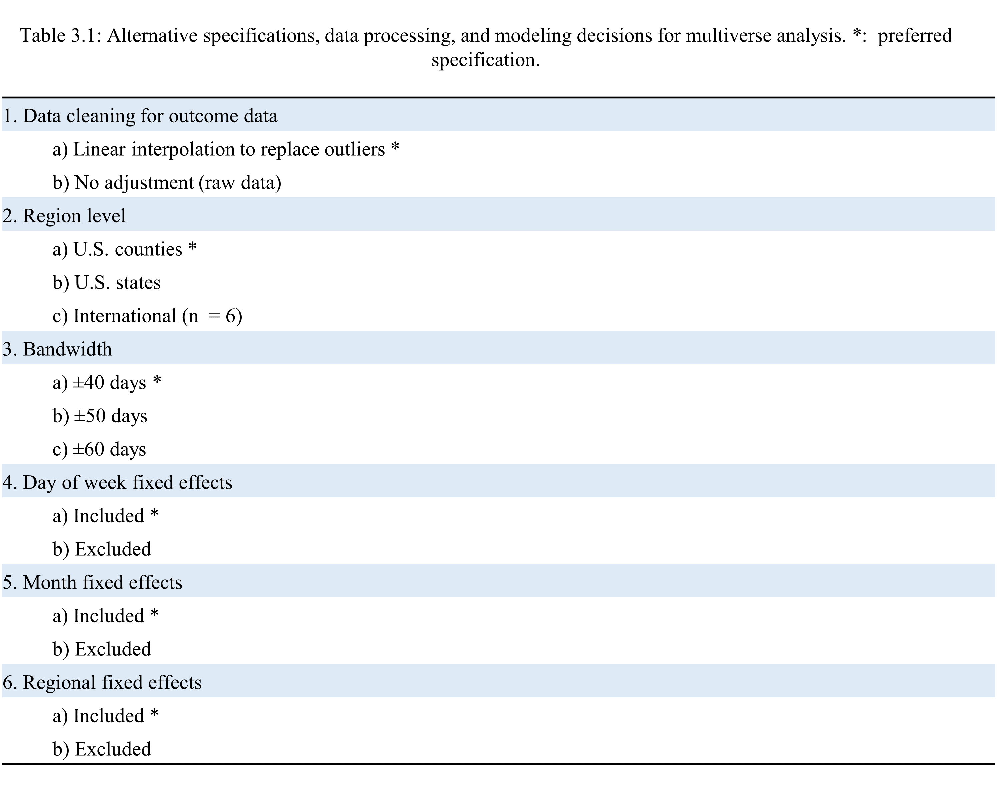

```{r loading, include=FALSE}
  # Loading libraries
  library(readxl)
  library(readr)
  library(dplyr)
  library(zoo)
  library(tidyr)
  library(psych)
  library(ggplot2)
  library(RColorBrewer)
  library(sp)
  library(broom)
  library(sf)
  library(scales)
  library(viridis)
  library(data.table)
  library(ggpubr)
  library(ggmap)
  library(maps)
  library(mapdata)
  library(ggrepel)
  library(table1)
  library(stringr) 
  library(stringi)
  library(fixest)
  library(stats)
  library(lubridate)
  library(forecast)
  library(gtools)
  library(stargazer)
  library(lwgeom)
  library(openxlsx)
  library(gganimate)
  library(transformr)
  library(huxtable)
  library(ggtext)
  library(magrittr)
  library(lmtest)
  library(sandwich)
  library(rgee)
  library(gt)
  library(knitr)
  library(webshot2)
  library(sysfonts)
  library(showtext)
  font_add_google("Source Sans Pro")
  library(gridExtra)
  library(tibble)
  showtext_auto() 
  showtext_opts(dpi = 300)  
  library(augsynth)
  library(dvmisc)
  library(forcats)
  library(rmdHelpers)

  
  # Setting directories - change these to your local directory
  path <- 'C:/Users/danie/Dropbox (Harvard University)/mh_scm'
  
  codepath <- paste(path,'code', sep = "/")

  # Github. Ask golden@hsph.harvard.edu for access. 
  datapath <- paste(path,'data', sep = "/")
  
  # Results
  resultspath <- paste(path,'results', sep = "/")
  
  # Shapefiles
  mappath <- paste(path,'shapefiles', sep = "/")
  
  # Color palette 
  col_light = "cyan4"
  col_dark = "cyan3"
  col_bright = "coral"
  col_black = "black"
  col_grey_dark = "grey20"
  col_grey_med = "grey40"
  col_grey_light = "grey80"
  col_grey_lightest = "grey85"
  col_soilmoisture = col_dark
  col_temperature = col_light
  col_interaction = col_bright
  col_mh = "steelblue3"
  col_headache = "grey50"

  
  col_model_main <- "#F3AB00"
  col_model_other <- col_grey_med
  col_spec_yes <-  "#73BDBF"
  col_spec_no <-  "white"
  
  
  col_positive <- "salmon1"
  col_negative <-"steelblue2"
  
  col_all <- "plum3"
  col_dem <- "steelblue2"
  col_red <- "red2"
  
  # Seed 
  set.seed(4800) 
 
  ######################
  ##      DATES        ##
  ######################
  
  date_shock_vax <- as.Date("2020-11-16")
  trim_bandwidth = 60
  
  start_date <-  date_shock_vax -  trim_bandwidth  #as.Date("2020-06-01")
  end_date <- date_shock_vax + trim_bandwidth  #as.Date("2021-05-31")
  
  disorders <- c("anxiety", "depression", "fever", "generalized_anxiety_disorder",
                 "hair_loss", "headache", "major_depressive_disorder",
                 "pain","panic_attack","sleep_disorder")
  
  week_shock_vax <- floor(as.numeric((date_shock_vax - start_date) / 7))

load(file = paste(datapath,"data_its_state.Rdata", sep = "/"))

data_its_state <- data_temp 

load(file = paste(datapath,"data_its_county.Rdata", sep = "/"))

data_its_county <- data_temp 

load(file = paste(datapath,"data_its_international.Rdata", sep = "/"))

data_its_international <- data_temp 

rm(data_temp)

load(file = paste(resultspath, "1_data",
                  "model_outputs_main.Rdata", sep = "/"))

load(file = paste(resultspath, "1_data",
                  "model_outputs_political.Rdata", sep = "/"))

load(file = paste(resultspath, "1_data",
                  "model_outputs_multiverse.Rdata", sep = "/"))

load(file = paste(resultspath, "1_data",
                  "model_outputs_international.Rdata", sep = "/"))

load(file = paste(resultspath, "1_data",
                  "model_outputs_its.Rdata", sep = "/"))


function_model_main <- function(data, polity = "include", levels = 
                                  "exclude"){
  
  data_temp <- data %>%
    filter(bandwidth == 40 & 
             cleaning == TRUE &
             time == "daily" &
             day_of_week_fe == TRUE &
             month_fe == TRUE &
             geograph_fe == TRUE &
             cits == "TRUE" &
             weights == "population")
  
  if (levels == "exclude") {
    
    data_temp <- data_temp %>%
      filter( geography == "county")
    
  }
  
  if (polity == "exclude") {
    
    data_temp <- data_temp %>%
      filter(polity == "all")
    
  }
  
  return(data_temp)
  
}


model_output_main <- model_outputs_political %>%
  function_model_main()


function_clean_diseases <- function(data){
  
  data %>%
    mutate(disease = str_to_sentence(str_replace_all(disease, "_", " "))) %>%
    mutate(disease = ifelse(disease == "Attention deficit hyperactivity disorder", "ADHD", disease),
           disease = ifelse(disease == "Clouding of consciousness", "CoC", disease),
           disease = ifelse(disease == "Generalized anxiety disorder", "GAD", disease),
           disease = ifelse(disease == "Major depressive disorder", "MDD", disease),
           disease = ifelse(disease == "Avoidant personality disorder", "AvPD", disease)) 
  
}


list_mental_health_symptoms <- read.xlsx(paste(datapath, 
                                               "list_of_diseases.xlsx", sep = "/")) %>%
  filter(mh_indicator == 1) %>%
  select(search)

list_mental_health_symptoms <- list_mental_health_symptoms$search

mental_disorders <- c("anxiety", "depression", "major_depressive_disorder")
geography <- c("state", "county", "international")

paper3_abstract <- paste0("For searches related to depression, we observe a statistically significant slope change of -0.0304 percentage points per day (p < 0.0001, 99\\% CI: -0.0321– -0.0286) and a level shift of -0.184 (p < 0.0001, 99\\% CI: -0.226– -0.143), above and beyond changes in slope and level observed for searches for headaches. For anxiety, we observe a similar slope change decline of 0.0383 percentage points per day (p < 0.0001, 99\\% CI: -0.0400– -0.0366) and a level shift of -0.339 (p < 0.0001, 99\\% CI: -0.378– -0.299).  We do not observe significant variation of estimates across predominately Democrat or Republican voting states and counties, and our results are robust to alternative specifications of bandwidth, fixed effects, and data cleaning decisions.")

```

# The impact of COVID-19 vaccine developments on Google COVID-19 search trends for mental health symptoms: a controlled interrupted time series analysis

\begin{centering}

\emph{Daniel Arias, Jessica Cohen, Karestan Koenen, Margaret McConnell, Stéphane Verguet}

\vspace{24pt}

\noindent\rule{8cm}{0.4pt}

\end{centering}

\begin{raggedright}

\vspace*{\fill}

{\bf Background:} A key obstacle to studying the effects of public health responses on population mental health in the US is a lack of daily surveillance data on mental health indicators. A potential marker of population mental health is the use of Internet search data, which offers the potential for real-time, large-scale analysis and identification of evolving mental health issues. 

{\bf Methods:} We utilize controlled interrupted time series (CITS) approach to evaluate whether the development and announcement of safe and effective COVID-19 vaccines reduced Google searches related to symptoms of depression and anxiety. By comparing how search trends changed in the post period for mental health symptoms above and beyond changes observed in the same period for physical health symptoms, we estimate measures of association between the vaccine announcement and changes in mental health symptom search density. We adjust for state, month, and day of week effects, and we apply a sensitivity analysis to assess the robustness of our estimates to alternative specifications. We further examine whether estimates varied among states and counties that predominantly voted for the Democratic Party candidate in the 2020 presidential election compared to the Republican candidate.

{\bf Findings and interpretation:} Under our main specification, we find evidence of reduced search density associated with the announcement of vaccine safety data for Google search trends for depression and anxiety. `r paper3_abstract`

\emph{Keywords: mental health, controlled interrupted time series, Google searches, United States, COVID-19 vaccines.}

\end{raggedright}

\newpage


## Introduction
It has been well-documented that throughout the pandemic, symptoms of depression and anxiety have markedly increased among US adults. While it is likely that the pandemic has a direct effect on worsened mental health status due to fear of contracting and spreading the virus, public health responses to the pandemic—including lockdowns, school closures, and social distancing measures—likely have an indirect effect as well. Existing research suggests that the effects of these measures on mental health vary, and may be protective, null, or even harmful. Studies of lockdowns in multiple countries, for example, point to worsened feelings of isolation and hopelessness exacerbated by isolation measures. By contrast, the distribution of safe and effective vaccines against COVID-19 has been shown to reduce symptoms of depression and anxiety by as much as XXX. 


* Describe symptoms database and reference published literature using it to predict COVID-19 cases and deaths [@alruilyPredictionCovid19Transmission2022; @abbasAssociationsGoogleSearch2021; @saegnerForecastingSurveillanceCOVID192022]

A recently published evaluation of Google’s COVID-19 Search Trends Symptoms Dataset found strong correlation between search trends for depression and anxiety with indicators of mental health service utilization and need reported in the US Census Household Pulse Survey (HPS) with rates of emergency department visits for mental health condition as reported in the US Centers for Disease Control and Prevention’s (CDC) National Syndromic Surveillance Program (NSSP).[@vaidyanathanEvaluationInternetSearches2022]

controlled interrupted time series (CITS) 
interrupted time series (ITS) 

* Motivation to explore vaccine announcement: evidence that vaccination itself reduced depression and anxiety -- do we see earlier reductions from an anticipatory effect?
* Motivation to analyze by polity: Vaccination became politically charged in the US, possible bias from impact of 2020 election on mental health searches
* Overview of approach: CITS using searches for headache as a control, adjusting for fixed effects, subgroup analysis by polity, analysis for 6 different mental health symptoms

## Methods

### Data

#### Shock date

We take as our first credible signal of the imminent availability of multiple safe and effective COVID-19 vaccines to be November 16, 2020. On November 9, Pzifer announced than early vaccine trial data showed 90% efficacy;[@thomasPfizerEarlyData2020] on the 16th, Moderna similarly announced preliminary results showing 94.5% efficacy for their vaccine.[@gradyEarlyDataShow2020] While U.S. Food and Drug Administration (FDA) Emergency Use Authorization (EUA) was not granted until December, the concurrent announcements of vaccine efficacy were widely reported and interpreted by many public health practitioners, policymakers, and the general public as a substantial signal of a new phase of the pandemic, with Moderna’s chief executive officer calling the news “a game changer” in the fight against COVID-19.

#### Symptoms dataset 

We accessed aggregated national and subnational data from Google’s COVID-19 Search Trends
Symptoms Dataset [@Wahltinez2020] (hereafter referred to as the symptoms dataset) between January 1, 2020 and April 1, 2021. The symptoms dataset provides time series data of search term density, standardized to pairs of health symptoms and regions (e.g., searches for depression in Australia or for fever in Cook County, Illinois) and normalized within each pair based on the symptom’s relative popularity. The time series of search density for each symptom-region pair also contains artificial noise, as Google’s differential privacy technique to data aggregation and anonymization adds random noise to protect user privacy (the errors are symmetrically distributed).

Search density data for over 400 symptoms are reported across national and subnational regions of six countries: Australia, the United Kingdom, Ireland, New Zealand, Singapore, and the United States. In the United States, subnational regions include states and counties.  Because the aggregated search density trends were constructed based on relative search population within each region, comparison of search density for a specific symptom between different regions is not meaningful; however, comparing search density within regions (or a group of regions) is feasible both over time and across different symptoms. 

```{r methods_text_1}

n_states <- data_its_state %>% select(state_name) %>% unique() %>% nrow()
n_counties <- data_its_county %>% select(county_fips) %>% unique() %>% nrow()


n_states <- format(n_states, big.mark = ",") 

n_counties <- format(n_counties, big.mark = ",") 

```

For our analysis, we utilized three levels of region from the symptoms dataset: 1) national level data from the six countries in the dataset; 2) U.S. state level data across `r n_states` states; and 3) U.S. county level data reported by `r n_counties` counties. (Though there are over 3,000 counties in the U.S., due to data privacy concerns, smaller county results were not included in the symptoms dataset.) Following the convention of the symptoms dataset, we will refer to the geographic units (e.g., states, counties, and nations) within the data as "regions."

#### Voting dataset

We further obtained county-level presidential election returns for 2020 from the MIT Election Data and Science Lab,[@mitelectiondataandsciencelabCountyPresidentialElection2022] which we then used to calculate aggregate county and state votes (including absentee, early, and election day ballots) won by each candidate. The aggregate votes were then used to determine vote share and margins (e.g., the percentage points difference in vote share between the candidate with the most votes to the runner up). These margins were then used to sort counties and states into quintiles, such that the 20% most Republican-voting localities appearing in the symptoms dataset were sorted into the first quintile and the 20% most Democratic-voting localities sorted into the fifth). 


#### Population data

Population estimates for 2020 by Federal Information Processing Standards (FIPS) code were obtained from the United States Department of Agriculture (USDA) Economic Research Service.

### Statistical analysis

All analyses were completed using R (version 4.2.1).[@rcoreteamLanguageEnvironmentStatistical2022]

#### Modeling approach


We use an ITS approach to model Google search density for a given symptom $d$ using the following baseline equation: $$Y_{d,g, i} = \lambda_0 + \lambda_1 time_t + \alpha_d Post_{d,i} + \beta_d time_t*post_{d,i} + \theta_r + T^{'}_t\chi + \epsilon_{it} \ \ \ ,\ \ \ \ \ \ \ \ \ \ \ \ (3.1)$$ where $time_t$ is a continuous variable that captures the days leading to the vaccine announcement, $Post_i$ is an indicator variable which equals 1 in the period after the shock data and 0 otherwise, $\theta_r$ is a fixed effect for region $r$, and $T^{'}_t\chi$ is a matrix of time-vary fixed effects (i.e., month and day of week).

In our model, $\alpha_d$ can be interpreted as a level or intercept associated with the shock date—that is, the immediate difference in search density for a disease $d$ following November 19, 2020. The term $\beta_d$—i.e., the slope change—can be interpreted as the sustained change in search density in the days following November 16th.

```{r methods_text}

diseases_n <- format(max(model_outputs_its$model_number), big.mark = ",")  
mh_diseases_n <- format(length(list_mental_health_symptoms), big.mark = ",")  
num_models_multiverse = format(max(model_outputs_multiverse$model_number), big.mark = ",") 

```
We apply this model for all available `r diseases_n` diseases with county-level data. As search density may rapidly change in response to a shock, we trimmed the bandwidth of dates to fit our model to forty days before and after November 16, 2020. 

To control for time-varying confounders which may have affected symptom search trends during the study period, we applied a CITS approach to contrast how searches for mental health symptoms varied above and beyond changes in search density for a comparable physical complaint (i.e., headaches).

After reviewing the list of symptoms for which search density data were available, we identified the following `r mh_diseases_n` mental health related symptoms: `r paste0(gsub("asperger", "Asperger", gsub("_", " ", printList(toPrint = sort(list_mental_health_symptoms), finalSepWord = "and", midSep = ","))),".")` 

For each of these mental health symptoms, $d$, we ran the following model to predict search density:

\begin{spacing}{1}

$$Y_{d,it} = \lambda_0 + \lambda_1 time_t + \lambda_2 Post_t + \lambda_3 time_t*Post_t + \alpha_d treated_{di} + 
\ \ \ \ \ $$
$$\beta_d time_t*treated_{di}  + \delta_{d} Post_i*treated_{di} + \gamma_d time_t*Post_i*treated_{di} + \theta_g + T^{'}_t\chi +  \epsilon_{it}\ \ \ ,\ \ \ \ \ \ \ \ \ \ (3.2)$$
\end{spacing}

\vspace{12pt}

where $treated_{di}$: is an indicator variable which equals 1 if the observation is for a mental health condition $d$, 0 if for headaches. The CITS effect estimates of interest are given by $\delta$, which reflects the additional level shift among mental health related symptoms searches compared to searches for headaches after the vaccine announcement, and  $\gamma$, the additional change in search density over time (i.e., slope change) comparing the same.

Given the high number of observations in our sample, we evaluated significance against an alpha of 0.01, and we constructed 99% confidence intervals using heteroskedasticity-robust standard errors.

##### Sensitivity analysis 

As with other quasi-experimental methods, it is recommended that the modeling choices and specifications of a CITS analysis be evaluated using a sensitivity analysis. To do so, we defined a list of seven methodological choices concerning data processing and modeling assumptions and interacted these choices to generate all their plausible  combinations. These combinations were then conducted to allow for a multiverse analysis to identify how sensitive effect estimates and confidence intervals were to different methodological choices. 

These criteria used to generate the plausible model combinations are outlined in Table 3.1. 

\vspace{12pt}

\begin{raggedright}

```{r table3_1, echo = FALSE, include = TRUE, out.width = '100%'}



```

\addcontentsline{lot}{table}{Table 3.1: Alternative specifications, data processing, and modeling decisions for multiverse analysis}

\end{raggedright}

First, we considered the role of data cleaning in the outcome data, which involved outlier smoothing using Friedman’s nonparametric super smoother regression estimator.[@friedmanVariableSpanScatterplot1984] Second, we compared the level of region of aggregated data, using U.S. counties, U.S. states, and, finally, national trends from the six counties in the sample. Third, we evaluated sensitivity to our specification of the bandwidth cut-off around the shock date, extending this from ±40 days to 40 and 60 days. Fourth, we toggled whether to account for day of week fixed effects. Fifth, we toggled month fixed effects. Sixth, we similarly toggled regional fixed effects (i.e., fixed effects for states in the U.S. state level data, fixed effects for counties in the U.S. county level data, etc.).

Interacting these choices resulted in 144 plausible models for each symptom. Each of the 144 models were run for all `r mh_diseases_n` mental health related symptoms, resulting in `r num_models_multiverse` models being conducted overall. 

##### Subgroup analysis 

Two subgroup analyses were conducted to investigate the generalizability of the findings of the main analysis and to explore potential heterogeneities in measures of association. 

The first subgroup analysis applied the CITS approach against all `r mh_diseases_n` mental health related symptoms against search data from each of the six countries in the sample, using our nationally aggregated data. This analysis aimed to investigate the extent to which effects observed in US states and counties were also seen in other countries.

The second subgroup analysis applied the CITS approach to the 20% most Republican-voting localities (hereafter referred to as red states/counties) and to the 20% most Democratic-voting localities (hereafter referred to as blue states/counties) based on 2020 presidential election vote share. A growing body of evidence has documented that political ideology can play a role in how receptive people are to vaccination; this has been highlighted throughout the COVID-19 pandemic, with people identifying as conservative being more likely to express skepticism of public health authorities and the scientific community and being more likely to express concerns about the safety, effectiveness, or necessity of vaccines. Our subgroup analysis comparing CITS effect estimates in blue vs. red states aimed to investigate whether the initial response to imminent safe and effective COVID-19 vaccines showed evidence of heterogeneity by predominant political ideology, under the hypothesis that if conservative voters were more likely to be averse to vaccination, any impact on mental health related symptom search density from the announcement of upcoming vaccines would be lesser in red states and counties compared to blue ones.

### Ethics statement

The Institutional Review Board (IRB) of the Harvard T.H. Chan School of Public Health has determined that the study was not human subjects research, and that additional review was not required (protocol number: IRB23-0095, determined on January 25, 2023).


## Results

```{r}

function_dynamic_text_results <-
  function(section = "its",         #c(its, main, international, polity, multiverse)
           disease_option,
           coefficient_option,
           lag_option,
           region_option = "all",
           geography_option = "county",
           value_include = TRUE,
           multiverse_sign = "positive",
           multiverse_p = FALSE) #(TRUE, FALSE, only),) 
    
  {output_df <- get(paste0(
    "model_outputs_",section))
  
  term <- ifelse(section == "its" & coefficient_option == "intercept",
                 "post", 
                 ifelse(section != "its" & coefficient_option == "intercept",
                        "post:trt",
                        ifelse(section == "its" & coefficient_option == "slope",
                               "post:time", "post:time:trt")))
  
  
  if(section == "multiverse"){
    
    if(multiverse_sign == "positive"){ 
      
      output_df <- output_df %>% filter(estimate >= 0)  %>% 
        filter(coefficient == term) %>%   
        filter(disease == disease_option)
      
    } else {output_df <- output_df %>% filter(estimate < 0)   %>% 
      filter(coefficient == term) %>%   
      filter(disease == disease_option)}        
    
    
    if(multiverse_p != FALSE)
    {
      models_counts <- output_df <- output_df %>% filter(p_value < multiverse_p) %>% nrow()
      return(models_counts)
      
    } else {
      
      models_counts <- output_df %>% nrow()
      
      return(models_counts)
      
    }
    
  }else{
    
    output_df <-
      output_df %>% filter(coefficient == term) %>%
      filter(disease == disease_option) 
    
     if(section == "political"){ output_df <- output_df %>% filter(polity == region_option) %>%
       filter(geography == geography_option)}


    
    val <- round((output_df$estimate), 3)
    p_val <- round(output_df$p_value, 3)
    low <- round((output_df$lower_99), 3)
    high <- round((output_df$upper_99), 3)
    
    if (value_include == TRUE){
      
      return(paste0(
        val,
        " percentage points",
        ifelse(coefficient_option == "slope",
               " per day "," "),
        "(p ",
        ifelse(p_val < 0.001,
               "< 0.0001, ",
               paste0("= ",
                      p_val,
                      ", ")),
        "99\\% CI: ",
        low,
        " – ",
        high
        ,
        ")"))
      
      
    }
    
    
    if (value_include == "allnumber"){
      
      return(paste0(
        "(",
        val,
        ", p ",
        ifelse(p_val < 0.001,
               "< 0.0001, ",
               paste0("= ",
                      p_val,
                      ", ")),
        "99\\% CI: ",
        low,
        " – ",
        high
        ,
        ")"))
      
      
    }
    
    if (value_include == FALSE){
      
      return(paste0(
        "(p ",
        ifelse(p_val < 0.001,
               "< 0.0001, ",
               paste0("= ",
                      p_val,
                      ", ")),
        "99\\% CI: ",
        low,
        " – ",
        high
        ,
        ")"))
      
      
    }
    
    
    if (value_include == "only"){
      # Estimate only
      
      return(val)
      
    }
    
  }
  
  }


function_pval_stars <- function(x){
  
  
  ifelse(stars.pval(x) ==".", "", stars.pval(x))
  
}


function_figures_cits_data <- function(geography,m){
  
  n = 1
  
  for (g in geography){
    
    data_its <- get(paste0("data_its_",g))
    
    data_its_temp <- data_its %>%
      mutate(post = ifelse(date > date_shock_vax, 1, 0),
             trt = ifelse(search == "headache", 0, 1)) %>%
      mutate(days_post_shock = as.numeric(date - date_shock_vax)) %>%
      filter(days_post_shock %in% (-40:40) ) %>%
      filter(search == m | search == "headache" ) 
    
    model <- glm(daily_mean_clean ~ post*days_post_shock*trt ,
                 data_its_temp, family = "gaussian")
    
    data_its_temp <- data_its_temp %>% 
      mutate(fitted = fitted(model),
             trt = ifelse(trt == 0, "Headache", 
                          str_to_sentence(str_replace_all(m, "_", " "))))
    
    m2 <- c(str_to_sentence(str_replace_all(m, "_", " ")))
    
    
    if(g != "county"){
      
      plot <- data_its_temp %>% 
        filter(days_post_shock %in% (-40:40) ) %>%
        mutate(trt = factor(trt, 
                            levels = c(m2,
                                       "Headache"))) %>%
        ggplot(aes(x = days_post_shock, y = fitted, group = trt, color = trt)) +
        geom_line() +
        theme_classic() +
        labs(x = "Days after November 16, 2020",
             y = "Density of Google Search trends",
             color = "",
             title = ifelse(g == "state", "U.S. states", 
                            ifelse(g == "county", "U.S. counties",
                                   "International data"))) +
        theme(legend.position = "bottom") +
        geom_vline(xintercept = 0, linetype='dotted') +
        geom_point(aes(y = daily_mean_clean),
                   alpha = 0.05) +
        scale_color_manual(values = c(col_mh, col_headache),
                           name = "")
    }else{
      
      plot <- data_its_temp %>% 
        filter(days_post_shock %in% (-40:40) ) %>%
        mutate(trt = factor(trt, 
                            levels = c(m2,
                                       "Headache"))) %>%
        ggplot(aes(x = days_post_shock, y = fitted, group = trt, color = trt)) +
        geom_boxplot(aes(x = days_post_shock, y = daily_mean_clean, 
                         group = interaction(trt, days_post_shock), color = trt, 
                         fill = trt, outlier.shape = NA),
                     outlier.shape = NA,
                     alpha = 0.01) +
        geom_line() +
        theme_classic() +
        labs(x = "Days after November 16, 2020",
             y = "Density of Google Search trends",
             color = "",
             title = ifelse(g == "state", "US states", 
                            ifelse(g == "county", "US counties",
                                   "International data"))) +
        theme(legend.position = "bottom") +
        geom_vline(xintercept = 0, linetype='dotted') +
        scale_color_manual(values = c(col_mh, col_headache),
                           name = "") +
        scale_fill_manual(values = c(col_mh, col_headache),
                          name = "")
      
    }
    
    
    
    
    assign(paste0("plot_",n), plot)
    
    n = n+1
    
  }
    
  combo_plot_1 <- cowplot::plot_grid(plot_1,
                                   plot_2,
                                   plot_3,
                                   # plot_4,
                                   # plot_5,
                                   # plot_6,
                                   # plot_7,
                                   # plot_8,
                                   # plot_9,
                                   align='v', ncol=1, axis='b') 
 print(combo_plot_1)
 
  
}


```

The ITS estimates for the immediate (level shift) and sustained (slope change) effects associated with the announcement of vaccine safety and efficacy data on search density for all `r diseases_n` are presented in Figure \ref{figure_all_diseases}. 

For most symptoms, search density exhibited negligible differences following the announcement, with small positive level shifts offset by modest negative slope changes. For four mental health symptoms, however, we observed relatively large, negative slope changes for searches for anxiety `r function_dynamic_text_results("its","anxiety", "slope", value_include = "allnumber")`, depression `r function_dynamic_text_results("its","depression", "slope", value_include = "allnumber")`, major depressive disorder (MDD)`r function_dynamic_text_results("its","major_depressive_disorder", "slope", value_include = "allnumber")`, and attention deficit hyperactivity disorder (ADHD)`r function_dynamic_text_results("its","attention_deficit_hyperactivity_disorder", "slope", value_include = "allnumber")`. With respect to level shifts, changes for anxiety `r function_dynamic_text_results("its","anxiety", "intercept", value_include = "allnumber")` and depression `r function_dynamic_text_results("its","depression", "intercept", value_include = "allnumber")` were close to zero, while those for MDD `r function_dynamic_text_results("its","major_depressive_disorder", "intercept", value_include = "allnumber")` and ADHD `r function_dynamic_text_results("its","attention_deficit_hyperactivity_disorder", "intercept", value_include = "allnumber")` were approximately 0.3 percentage points.

```{r figure_all_diseases, include = TRUE, echo=FALSE, warnings = FALSE, fig.width = 6, fig.height = 4.5, fig.align='center', out.width = '95%',  fig.scap="Interrupted time series (ITS) effect estimates and confidence intervals by symptom.", out.extra='',  fig.cap="\\label{figure_all_diseases}Interrupted time series (ITS) effect estimates and confidence intervals by symptom. Effect estimates are presented by points;  for each symptom, the estimated slope change per day is shown on the x-axis, while the level shift over the post-announcement period is shown on the y-axis. The horizontal and vertical bars next to each point represent the 99\\% confidence intervals for the estimate slope change and level shift, respectively. Mental health-related symptoms are shown in blue, while physical symptoms are shown in grey. ADHD: Attention deficit hyperactivity disorder. MDD: Major depressive disorder."}


model_outputs_its_graph <- model_outputs_its %>%
  mutate(coefficient = ifelse(coefficient == "post:time", "slope",
                              ifelse(coefficient == "post", "level", "ERROR"))) %>%
  select(coefficient, estimate, lower_95, upper_95, disease, p_value) %>%
  pivot_wider(names_from = coefficient,
              values_from = c(estimate, lower_95, upper_95, p_value)) %>%
  mutate(mh_indicator = ifelse(disease %in% list_mental_health_symptoms, 
                               "Mental symptom",
                               ifelse(disease == "headache", 
                                      "Headache (control)",
                                      "Physical symptom")))  %>%
  mutate(mh_indicator = factor(mh_indicator, 
                               levels = c("Mental symptom", 
                                          "Headache (control)",
                                          "Physical symptom"))) %>%
  function_clean_diseases()


model_outputs_its_graph %>%
  ggplot(aes(y = estimate_level, x = estimate_slope, color = mh_indicator, label = disease)) +
  geom_hline(yintercept = 0) +
  geom_vline(xintercept = 0) +
  geom_errorbarh(aes(xmin = lower_95_slope, xmax = upper_95_slope), alpha = 0.3) +
  geom_errorbar(aes(ymin = lower_95_level, ymax = upper_95_level), alpha = 0.3) +
  theme_classic() +
  geom_point(alpha = 0.75) +
  theme(
    legend.position = "bottom",
    strip.text = element_text(size=12),
    
    text = element_text(family = "Source Sans Pro")) +
  scale_color_manual(values = c(col_mh,
                                col_headache,
                                col_grey_light),
                     name = "") +
  labs(x = "Slope change", y = "Level shift") +
  geom_text_repel(data=subset(model_outputs_its_graph, estimate_slope < -0.04 |
                                (estimate_level <.1 & mh_indicator ==  "Mental symptom" |
                                   mh_indicator == "Headache (control)")), max.overlaps = 10,
                  size = 3)

```

While our ITS analysis provided suggestive evidence that search density for mental health symptoms might have changed in the post-announcement period, it also highlighted that searches may have generally changed across other diseases at the same time. Our CITS estimates of each mental health symptom (Figure \ref{figure_cits_outputs}) using searches for headaches as a comparison broadly echoed our ITS analysis, with most conditions showing level and slope changes close to the null. For three conditions, our CITS analysis showed relatively large slope changes with searches for anxiety `r function_dynamic_text_results("main","anxiety", "slope", value_include = "allnumber")`, depression `r function_dynamic_text_results("main","depression", "slope", value_include = "allnumber")`, and MDD `r function_dynamic_text_results("main","major_depressive_disorder", "slope", value_include = "allnumber")`, all showing sustained declines. All three of these symptoms had relatively large slope changes in our ITS analysis. In addition, the CITS level shift (i.e., the relative immediate effect) for anxiety was `r function_dynamic_text_results("main","anxiety", "level")`, a decrease double in magnitude compared to the majority of estimates for other symptoms.


```{r figure_cits_outputs, include = TRUE, echo=FALSE, warnings = FALSE, fig.width = 7, fig.height = 8, fig.align='center', out.width = '95%', fig.scap="Controlled interrupted time series effect estimates on Google Search density by symptom.", out.extra='',  fig.cap="\\label{figure_cits_outputs}Controlled interrupted time series effect estimates (A: slope change per 10 days and B: level shift)  on Google Search density by symptom. Effect estimates are represented as thick, horizontal lines in between colored bands, which represent the 99\\% confidence intervals for the estimates. Colors reflect the sign and magnitude of effect estimates. Dark blue values above zero indicate an increase in search density, while the yellow and green negative values indicate a decrease. The dotted horizontal line depicts a null effect. ADHD: Attention deficit hyperactivity disorder. CoC: clouding of consciousness. GAD: Generalized anxiety disorder. MDD: Major depressive disorder."}


model_outputs_main %>% 
  filter(disease %in% list_mental_health_symptoms) %>%
  function_model_main("exclude") %>%
  function_clean_diseases () %>%
  arrange(disease) %>%
  mutate(estimate = ifelse(coefficient == "post:time:trt", estimate*10, estimate),
         lower_99 = ifelse(coefficient == "post:time:trt", lower_99*10, lower_99),
         upper_99 = ifelse(coefficient == "post:time:trt", upper_99*10, upper_99)
  ) %>%
  mutate(coefficient = ifelse(coefficient == "post:time:trt", "A: slope change (per 10 days)",
                              ifelse(coefficient == "post:trt", "B: level shift", "ERROR"))) %>%
  mutate(sign = ifelse(estimate >0, TRUE, FALSE)) %>%
  
  ggplot(aes(x = disease, 
             y = estimate, ymin = lower_99, ymax = upper_99, fill = estimate)) +
  geom_crossbar() +
  theme_classic() +
  geom_hline(yintercept = 0, linetype='dotted') +
  
  geom_point(alpha = 0.5) +
  labs(x = "Symptom", y = "Estimate") +
  theme(
    legend.position = "none",
    strip.text = element_text(size=12),
    text = element_text(family = "Source Sans Pro"),
    axis.text.x = element_text(#size = 4, 
      angle = 90, vjust = 0.5, hjust=1)) +
  facet_wrap(~coefficient, scales = "free_y", dir = "v") +
  scale_fill_viridis(direction = -1
                     
  )
#  
# scale_fill_manual(values = c(col_negative, col_positive),
#                      name = "")

```

In both our analyses, search trends for anxiety, depression, and MDD showed potential immediate and sustained declines in density following November 16th. Search density for these three symptoms and the comparison search data for headaches is plotted in Figures \ref{figures_cits_data_anxiety} through \ref{figures_cits_data_mdd} at the level of U.S. states, U.S. counties, and international data. We observed relatively strong concordance between our CITS estimates and the observed trends in the data, with strong fit to both mental health symptoms and headaches. We further observed strong within-week patterns in searches, supporting our inclusion of fixed effects to account for this weekly periodicity.

```{r figures_cits_data_anxiety, include = TRUE, echo=FALSE, warnings = FALSE, fig.width = 4, fig.height = 6.5, fig.align='center', out.width = '99%', fig.scap="Density of Google Search trends for anxiety, by region, as a function of time.", out.extra='',  fig.cap="\\label{figures_cits_data_anxiety}Density of Google Search trends for anxiety, by region and as a function of time. In each row, search density data for two symptoms are displayed: anxiety in blue and headaches in grey. In the first column, data from US states are shown, where each point represents the search density of a specific symptom on a specific date in a specific state. In the second column, data from US counties are shown; because of the large number of counties reporting data, county-level search data are shown as daily boxplots. In the third column, national data from Australia, the United Kingdom, Ireland, New Zealand, Singapore, and the United States are shown. Each graph shows the density of symptom searches on the y-axis, while time is centered and displayed as days prior to and following November 16, 2020 on the x-axis. The solid lines show predicted lines of best fit under a basic controlled interrupted time series (CITS) model (i.e., no fixed effects). US: United States."}


function_figures_cits_data(geography = geography, "anxiety")

```

```{r figures_cits_data_depression, include = TRUE, echo=FALSE, warnings = FALSE, fig.width = 4, fig.height = 6.5, fig.align='center', out.width = '99%', fig.scap="Density of Google Search trends for depression, by region, as a function of time.", out.extra='',  fig.cap="\\label{figures_cits_data_depression}Density of Google Search trends for depression, by region and as a function of time. In each row, search density data for two symptoms are displayed: depression in blue and headaches in grey. In the first column, data from US states are shown, where each point represents the search density of a specific symptom on a specific date in a specific state. In the second column, data from US counties are shown; because of the large number of counties reporting data, county-level search data are shown as daily boxplots. In the third column, national data from Australia, the United Kingdom, Ireland, New Zealand, Singapore, and the United States are shown. Each graph shows the density of symptom searches on the y-axis, while time is centered and displayed as days prior to and following November 16, 2020 on the x-axis. The solid lines show predicted lines of best fit under a basic controlled interrupted time series (CITS) model (i.e., no fixed effects). US: United States."}


function_figures_cits_data(geography = geography, "depression")

```

```{r figures_cits_data_mdd, include = TRUE, echo=FALSE, warnings = FALSE, fig.width = 4, fig.height = 6.5, fig.align='center', out.width = '99%', fig.scap="Density of Google Search trends for major depressive disorder (MDD), by region, as a function of time.", out.extra='',  fig.cap="\\label{figures_cits_data_mdd}Density of Google Search trends for MDD, by region and as a function of time. In each row, search density data for two symptoms are displayed: MDD in blue and headaches in grey. In the first column, data from US states are shown, where each point represents the search density of a specific symptom on a specific date in a specific state. In the second column, data from US counties are shown; because of the large number of counties reporting data, county-level search data are shown as daily boxplots. In the third column, national data from Australia, the United Kingdom, Ireland, New Zealand, Singapore, and the United States are shown. Each graph shows the density of symptom searches on the y-axis, while time is centered and displayed as days prior to and following November 16, 2020 on the x-axis. The solid lines show predicted lines of best fit under a basic controlled interrupted time series (CITS) model (i.e., no fixed effects). US: United States."}


function_figures_cits_data(geography = geography, "major_depressive_disorder")

```

Our multiverse analysis further underscored the robustness of our findings concerning the relatively large negative immediate and sustained effects on searches for anxiety and depression, in particular (Figure \ref{fig_multiverse_analysis_all}). For anxiety, all 144 models had negative level shifts and slope changes. For depression, all `r function_dynamic_text_results("multiverse","depression", "slope", multiverse_sign = "negative")` models had negative slope changes, of which only `r function_dynamic_text_results("multiverse","depression", "intercept", multiverse_sign = "positive")` models had any positive level shift. For MDD, we similarly observed a universally negative slope change in all `r function_dynamic_text_results("multiverse","major_depressive_disorder", "slope", multiverse_sign = "negative", multiverse_p = FALSE)` models; however, the majority of models showed a positive level shift (`r function_dynamic_text_results("multiverse","major_depressive_disorder", "intercept", multiverse_sign = "positive", multiverse_p = FALSE)` models), whereas only `r function_dynamic_text_results("multiverse","major_depressive_disorder", "intercept", multiverse_sign = "negative", multiverse_p = FALSE)` showed a downward level shift.

```{r fig_multiverse_analysis_all, include = TRUE, echo=FALSE, warnings = FALSE, fig.width = 7.5, fig.height = 9.5, fig.align='center', out.width = '95%',  fig.scap="CITS effect estimates and confidence intervals by mental health symptom, all model combinations.", out.extra='',  fig.cap="\\label{fig_multiverse_analysis_all}Controlled interrupted time series effect estimates by mental health related symptom for each model specification combination in multiverse analysis. Each point presents the effect estimates of a sinlge model; for each symptom, the estimated slope change per day is shown on the x-axis, while the level shift over the post-announcement period is shown on the y-axis. ADHD: Attention deficit hyperactivity disorder. CoC: clouding of consciousness. GAD: generalized anxiety disorder. MDD: Major depressive disorder."}


model_outputs_its_graph <- model_outputs_multiverse %>%
  filter(disease %in% list_mental_health_symptoms) %>%
  
  mutate(coefficient = ifelse(coefficient == "post:time:trt", "slope",
                              ifelse(coefficient == "post:trt", "level", "ERROR"))) %>%
  select(!c(z_score, lower_99, upper_99, standard_error)) %>%
  pivot_wider(names_from = coefficient,
              values_from = c(estimate, lower_95, upper_95, p_value)) %>%
  function_clean_diseases()


model_outputs_its_graph %>%
  ggplot(aes(y = estimate_level, x = estimate_slope,  color = disease)) +
  geom_hline(yintercept = 0) +
  geom_vline(xintercept = 0) +
  # geom_errorbarh(aes(xmin = lower_95_slope, xmax = upper_95_slope), alpha = 0.3) +
  # geom_errorbar(aes(ymin = lower_95_level, ymax = upper_95_level), alpha = 0.3) +
  theme_classic() +
  geom_point(alpha = 0.75) +
  theme(
    legend.position = "bottom",
    # strip.text = element_text(size=12),
    text = element_text(family = "Source Sans Pro")) +
  labs(x = "Slope change", y = "Level shift", color = "Symptom") +
  scale_color_viridis(discrete = TRUE) + 
  facet_wrap(~disease)
```


Slope changes and level shifts for anxiety, depression, and MDD are reported for each combination (144 models) in Figure \ref{fig_multiverse_analysis}. Examining the plausible model combinations of the multiverse analysis for these three symptoms underscored the importance of regional level to inference, as the use of county-level data (with a greater number of observations) consistently showed similar effect estimates to state level estimates for each CITS estimand, but with much tighter confidence intervals, even when geographic fixed effects and narrower bandwidths were included.  Across all models, the sustained change in search density for anxiety and depression is negative and significant an alpha of 0.01. In terms of the estimated level shifts, `r function_dynamic_text_results("multiverse","anxiety", "intercept", multiverse_sign = "negative", multiverse_p = 0.01)` models for anxiety (`r round(function_dynamic_text_results("multiverse","anxiety", "intercept", multiverse_sign = "negative", multiverse_p = 0.01)*100/144,0)`%) had a statistically significant negative change, compared to `r function_dynamic_text_results("multiverse","anxiety", "intercept", multiverse_sign = "positive", multiverse_p = 0.01)` models with a positive one. For depression, of the `r function_dynamic_text_results("multiverse","depression", "intercept", multiverse_sign = "positive", multiverse_p = 0.01) + function_dynamic_text_results("multiverse","depression", "intercept", multiverse_sign = "negative", multiverse_p = 0.01)` models with a statistically significant level shift estimate, all `r  function_dynamic_text_results("multiverse","depression", "intercept", multiverse_sign = "negative", multiverse_p = 0.01)` models returned a negative level shift coefficient.

Turning to our subgroup analysis, we found modest evidence of effect estimates of similar magnitude comparing across nations (Figure \ref{fig_international}). Across the most populous countries (Australia, the United Kingdom, and the United States), effect estimates were broadly consistent, with wider confidence intervals than our ITS or CITS main analysis results due to the smaller number of observations. Negative level shifts and slope changes were more pronounced in New Zealand compared to other nations; we caution, however, that owing to the construction of the Google search density data being relative to regions, this may be due to differences in seach volume intensity for depression in New Zealand compared to other nations, and not due to a strong effect itself.  


\blandscape


```{r fig_multiverse_analysis,include = TRUE, echo=FALSE, warnings = FALSE,  fig.width = 20, fig.height = 12, fig.align='center', out.width = '99%', fig.scap="Specification curve depicting the CITS effect estimates and confidence intervals for search density", out.extra='',  fig.cap="\\label{fig_multiverse_analysis}Specification curve depicting the CITS effect estimates and confidence intervals for search density, with panel A depicting the estimated slope change and panel B depicting the estimate level shift. Within each panel, the effect estimates across different models are depicted as circles in the upper graph; the darkly and lightly shaded regions above and below these circles correspond to 95\\% and 99\\% confidence intervals of these estimates, respectively. The dotted horizontal line depicts a null effect. The effect estimates and confidence intervals of the main specification are highlighted in orange. Below each model, a legend of shaded and unshaded boxes indicates which modeling decisions correspond to a given model, with boxes shaded teal showing active features. The three vertical columns show effect estimates by symptom. From left to right, these are anxiety, depression, and major depressive disorder. FE: fixed effects. CITS: controlled interrupted time series. FE: fixed effects. CITS: controlled interrupted time series."}


model_outputs_temp <- model_outputs_multiverse %>%
  filter(time == "daily") %>%
  filter(disease %in% mental_disorders) %>%
  mutate(disease = str_to_sentence(str_replace_all(disease, "_", " ")))


preferred_model <- model_outputs_temp %>% 
  filter(bandwidth == 40 & 
           cleaning == TRUE &
           day_of_week_fe == TRUE &
           month_fe == TRUE &
           geograph_fe == TRUE &
           geography == "county") %>%
  select(model_number) %>%
  unique()

preferred_model <- preferred_model$model_number


min_space = 0.5
y_min_val = min(model_outputs_temp$lower_99)
y_max_val = max(model_outputs_temp$upper_99)


coef_plot_a <-  model_outputs_temp %>%
  filter(coefficient == "post:time:trt") %>%
  mutate(model_preference = ifelse(model_number %in% preferred_model, 
                                   "Main",
                                   "Alternative")) %>%
  mutate(model_preference = factor(model_preference, 
                                   levels = c("Main", 
                                              "Alternative"))) %>%
  
  ggplot(aes(x = reorder(model_number, estimate),
             y = (estimate),
             fill = model_preference,           
             color = model_preference)) +
  geom_hline(yintercept=0, linetype='dotted') +
  geom_crossbar(aes(ymin = (lower_99), 
                    ymax = (upper_99)),
                fatten = 0,
                alpha = 0.2) +
  geom_crossbar(aes(ymin = (lower_95),
                    ymax = (upper_95)),
                fatten = 0,
                alpha = 0.3) +
  geom_point(alpha = 1, size=1) +
  theme_classic() +
  theme(axis.text.x = element_blank(),
        legend.position = "top",
        axis.title = element_blank(),
        axis.ticks.x = element_blank(),
        strip.text = element_text(size=12),
        text = element_text(family = "Source Sans Pro")) +
  # coord_cartesian(xlim=c(1-min_space, max(nrow(model_outputs_temp))+min_space)) +
  scale_color_manual(values = c(col_model_main,
                                col_model_other),
                     name = "") +
  scale_fill_manual(values = c(col_model_main,
                               col_model_other),
                    name = "") +
  # labs(title =  paste0("CITS effect estimates on Google search density for: ", tolower(str_replace_all(d, "_", " "))),
  #      subtitle = "A: slope change") +
  facet_wrap(~disease, scales = "free_x")


control_plot_a <- 
  
  model_outputs_temp %>%
  filter(coefficient == "post:time:trt") %>%
  mutate(
    "State level" = ifelse(geography == "state", 1, 0),
    "County level" = ifelse(geography == "county", 1, 0),
    "International level" = ifelse(geography == "international", 1, 0),
    # "Daily data" = ifelse(time == "daily", 1, 0),
    # "Weekly data" = ifelse(time == "weekly", 1, 0),
    "Replaced outliers?" = ifelse(cleaning == TRUE, 1, 0),
    "FE: day of week" = ifelse(day_of_week_fe == TRUE, 1, 0),
    "FE: month" = ifelse(month_fe == TRUE, 1, 0),
    "FE: state" = ifelse(geograph_fe == TRUE, 1, 0),
    # "Bandwidth = 30" = ifelse(bandwidth == 30, 1, 0),
    "Bandwidth = 40" = ifelse(bandwidth == 40, 1, 0),
    "Bandwidth = 50" = ifelse(bandwidth == 50, 1, 0),
    "Bandwidth = 60" = ifelse(bandwidth == 60, 1, 0)
    
  ) %>%
  
  
  dplyr::select(model_number, estimate, disease, 'State level':'Bandwidth = 60') %>%
  pivot_longer(cols = c('State level':'Bandwidth = 60'), 
               names_to = "spec_name", 
               values_to = "spec_status") %>%
  mutate(spec_name = factor(spec_name, 
                            levels = c("State level",
                                       "County level",
                                       "International level",
                                       # "Daily data",
                                       # "Weekly data",
                                       "Replaced outliers?",
                                       "FE: day of week",
                                       "FE: month",
                                       "FE: state",
                                       # "Bandwidth = 30",
                                       "Bandwidth = 40",
                                       "Bandwidth = 50",
                                       "Bandwidth = 60"))) %>%
  mutate(spec_name = fct_rev(spec_name)) %>%
  
  ggplot(aes(x = reorder(model_number, estimate), 
             y = spec_name, 
             fill = as.factor(spec_status))) +
  geom_point(shape=22, size=1.25) +
  
  scale_fill_manual(values = c(col_spec_no, col_spec_yes),
                    name = "") +
  guides(fill= "none") +
  # scale_y_continuous(breaks = unique(control_grid_logit$y), 
  #                    labels = unique(control_grid_logit$key),
  #                    limits=c(min(control_grid_logit$y)-1, max(control_grid_logit$y)+1)) +
  #scale_x_continuous(breaks=c(1:nrow(model_outputs_temp))) +
  # coord_cartesian(xlim=c(1-min_space, nrow(model_outputs_temp)+min_space)) +
  theme_classic() +
  theme(panel.grid.major.y = element_blank(),
        panel.grid.minor.y = element_blank(),
        axis.text.x = element_blank(),
        strip.text.x = element_blank(),
        axis.title = element_blank(),
        axis.text.y = element_text(size=10),
        axis.ticks = element_blank(),
        axis.line = element_blank(),
        strip.text = element_text(size=12),
        text = element_text(family = "Source Sans Pro"))+
  facet_wrap(~disease, scales = "free_x")


coef_plot_b <-  model_outputs_temp %>%
  filter(coefficient != "post:time:trt") %>%
  
  mutate(model_preference = ifelse(model_number %in% preferred_model, 
                                   "Main",
                                   "Alternative")) %>%
  mutate(model_preference = factor(model_preference, 
                                   levels = c("Main", 
                                              "Alternative"))) %>%
  
  ggplot(aes(x = reorder(model_number, estimate),
             y = (estimate),
             fill = model_preference,           
             color = model_preference)) +
  geom_hline(yintercept=0, linetype='dotted') +
  geom_crossbar(aes(ymin = (lower_99), 
                    ymax = (upper_99)),
                fatten = 0,
                alpha = 0.2) +
  geom_crossbar(aes(ymin = (lower_95),
                    ymax = (upper_95)),
                fatten = 0,
                alpha = 0.3) +
  geom_point(alpha = 1, size=1) +
  theme_classic() +
  theme(axis.text.x = element_blank(),
        legend.position = "none",
        axis.title = element_blank(),
        axis.ticks.x = element_blank(),
        strip.text = element_text(size=12),
        text = element_text(family = "Source Sans Pro")) +
  # coord_cartesian(xlim=c(1-min_space, max(nrow(model_outputs_temp))+min_space)) +
  scale_color_manual(values = c(col_model_main,
                                col_model_other),
                     name = "") +
  scale_fill_manual(values = c(col_model_main,
                               col_model_other),
                    name = "") +
  labs(subtitle = "B: level shift")  +
  facet_wrap(~disease, scales = "free_x")


control_plot_b <- 
  
  model_outputs_temp %>%
  filter(coefficient != "post:time:trt") %>%
  mutate(
    "State level" = ifelse(geography == "state", 1, 0),
    "County level" = ifelse(geography == "county", 1, 0),
    "International level" = ifelse(geography == "international", 1, 0),
    # "Daily data" = ifelse(time == "daily", 1, 0),
    # "Weekly data" = ifelse(time == "weekly", 1, 0),
    "Replaced outliers?" = ifelse(cleaning == TRUE, 1, 0),
    "FE: day of week" = ifelse(day_of_week_fe == TRUE, 1, 0),
    "FE: month" = ifelse(month_fe == TRUE, 1, 0),
    "FE: state" = ifelse(geograph_fe == TRUE, 1, 0),
    # "Bandwidth = 30" = ifelse(bandwidth == 30, 1, 0),
    "Bandwidth = 40" = ifelse(bandwidth == 40, 1, 0),
    "Bandwidth = 50" = ifelse(bandwidth == 50, 1, 0),
    "Bandwidth = 60" = ifelse(bandwidth == 60, 1, 0)
    
  ) %>%
  
  
  dplyr::select(model_number, estimate, disease, 'State level':'Bandwidth = 60') %>%
  pivot_longer(cols = c('State level':'Bandwidth = 60'), 
               names_to = "spec_name", 
               values_to = "spec_status") %>%
  mutate(spec_name = factor(spec_name, 
                            levels = c("State level",
                                       "County level",
                                       "International level",
                                       # "Daily data",
                                       # "Weekly data",
                                       "Replaced outliers?",
                                       "FE: day of week",
                                       "FE: month",
                                       "FE: state",
                                       # "Bandwidth = 30",
                                       "Bandwidth = 40",
                                       "Bandwidth = 50",
                                       "Bandwidth = 60"))) %>%
  mutate(spec_name = fct_rev(spec_name)) %>%
  
  ggplot(aes(x = reorder(model_number, estimate), 
             y = spec_name, 
             fill = as.factor(spec_status))) +
  geom_point(shape=22, size=1.25) +
  
  scale_fill_manual(values = c(col_spec_no, col_spec_yes),
                    name = "") +
  guides(fill= "none") +
  # scale_y_continuous(breaks = unique(control_grid_logit$y), 
  #                    labels = unique(control_grid_logit$key),
  #                    limits=c(min(control_grid_logit$y)-1, max(control_grid_logit$y)+1)) +
  #scale_x_continuous(breaks=c(1:nrow(model_outputs_temp))) +
  # coord_cartesian(xlim=c(1-min_space, nrow(model_outputs_temp)+min_space)) +
  theme_classic() +
  theme(panel.grid.major.y = element_blank(),
        panel.grid.minor.y = element_blank(),
        axis.text.x = element_blank(),
        strip.text.x = element_blank(),
        axis.title = element_blank(),
        axis.text.y = element_text(size=10),
        axis.ticks = element_blank(),
        axis.line = element_blank(),
        strip.text = element_text(size=12),
        text = element_text(family = "Source Sans Pro"))+
  facet_wrap(~disease, scales = "free_x")

combo_plot <- cowplot::plot_grid(coef_plot_a, 
                                 control_plot_a, 
                                 coef_plot_b, 
                                 control_plot_b, 
                                 rel_heights=c(1,0.5, 1,0.5), 
                                 align='v', ncol=1, axis='b')          


ggsave(filename = paste0("sensitivity_analysis_all_international.jpg"),
       plot = last_plot(),
       path = resultspath,
       width = 18,
       height = 14)

print(combo_plot)


```

\elandscape

```{r fig_international, include = TRUE, echo=FALSE, warnings = FALSE, fig.width = 7.5, fig.height = 6.5, fig.align='center', out.width = '95%',  fig.scap="International CITS effect estimates and confidence intervals by mental health symptom.", out.extra='',  fig.cap="\\label{fig_international}International controlled interrupted time series effect estimates of changes in search density by mental health related symptom, reported across six nations (Australia, the United Kingdom, Ireland, New Zealand, Singapore, and the United States). The top panel reports estimates of the level shift and the lower panel reports the estimates for the slope change. Effect estimates are represented as solid black lines, with the shaded regions above and below the lines showing the 95% confidence intervals. The solid black line across all panels reflects a null effect. MDD: Major depressive disorder."}


model_outputs_international %>%
  filter(disease %in% mental_disorders) %>%
  mutate(coefficient = ifelse(coefficient == "post:time:trt", "Slope change",
                              ifelse(coefficient == "post:trt", "Level shift", "ERROR"))) %>%
  # select(!c(z_score, lower_99, upper_99, standard_error)) %>%
  # pivot_wider(names_from = coefficient,
  #             values_from = c(estimate, lower_95, upper_95, p_value)) %>%
  function_clean_diseases() %>%
  # ggplot(aes(y = estimate_level, x = estimate_slope,  color = nation)) +
  ggplot(aes(x = nation, 
             y = estimate, ymin = lower_95, ymax = upper_95, fill = nation)) +
  geom_crossbar() +  geom_hline(yintercept = 0) +
  geom_vline(xintercept = 0) +
  # geom_errorbarh(aes(xmin = lower_95_slope, xmax = upper_95_slope), alpha = 0.3) +
  # geom_errorbar(aes(ymin = lower_95_level, ymax = upper_95_level), alpha = 0.3) +
  theme_classic() +
  # geom_col(alpha = 0.75) +
  theme(
    legend.position = "bottom",
    # strip.text = element_text(size=12),
    axis.text.x = element_blank(),
    axis.ticks.x = element_blank(),
    
    text = element_text(family = "Source Sans Pro")) +
  labs(y = "Estimate", x = "", fill = "Nation") +
  scale_fill_viridis(discrete = TRUE, option = "C", direction = -1) + 
  facet_grid(coefficient~disease, scales = "free_y")


```

Results from our analysis comparing red and blue states and counties showed broad consistency in both slope changes and level shifts for searches for anxiety, depression, and MDD as found in our main analysis (Figure \ref{fig_political}). This was particular observed in our analysis of U.S. state-level data, where confidence intervals for the CITS effect estimates were statistically equivalent across red and blue states. In our county-level analysis, however, we observed larger immediate and sustained declines in searches for depression among red counties than blue ones, with minor overlap in confidence intervals. The observed slope change for searches related to depression among red counties was `r function_dynamic_text_results("political", "depression", "slope", region_option = 1)`, compared to `r function_dynamic_text_results("political", "depression", "slope", region_option = 5)` for blue counties. Similarly, a more pronounced level shift was observed in red counties than blue ones, `r function_dynamic_text_results("political", "depression", "intercept", region_option = 1)` vs. `r function_dynamic_text_results("political", "depression", "intercept", region_option = 5)`, respectively. 

\blandscape

```{r fig_political, include = TRUE, echo=FALSE, warnings = FALSE,fig.scap="CITS effect estimates and confidence intervals symptom, region, and predominant political ideology.", out.extra='', fig.width = 10, fig.height = 5, fig.align='center', out.width = '95%',  fig.cap="\\label{fig_political}CITS effect estimates and confidence intervals symptom, region, and predominant political ideology, with panel A depicting the estimated slope change and panel B depicting the estimate level shift. The vertical panels show CITS effect estimates by three mental health symptoms (from left to right: anxiety, depression, and major depressive disorder); for each symptom, estimates are separately reported using county- and state-level data. For a given symptom and region, three CITS estimates are reported: one estimated from a sample of all counties or states (shown in purple), one conducted solely among the most Democratic counties or states (by 2020 presidential election vote share, shown in blue, and one among the most Republican counties or states (shown in red). Within each panel, the effect estimates across different models are depicted as points on a horizontal bar; the darkly and lightly shaded regions above and below these circles correspond to 95\\% and 99\\% confidence intervals of these estimates, respectively. The dotted horizontal line in each panel depicts a null effect. CITS: controlled interrupted time series. US: United States."}


model_outputs_political %>%
  function_model_main(levels = "include") %>%
  filter(disease %in% mental_disorders) %>%
  function_clean_diseases() %>%
  mutate(geography = ifelse(geography == "state", "US states", "US counties")) %>%
  mutate(polity = ifelse(polity == 1, "Red states/counties (top 20% most Republican", 
                         ifelse(polity == 5, "Blue states/counties (top 20% most Democratic)", "All"))) %>%
  mutate(polity = factor(polity, 
                         levels = c("All", 
                                    "Blue states/counties (top 20% most Democratic)",
                                    "Red states/counties (top 20% most Republican"))) %>%
  mutate(coefficient = ifelse(coefficient == "post:time:trt", "A: slope change",
                              ifelse(coefficient == "post:trt", "B: level shift", "ERROR"))) %>%
  ggplot(aes(x = reorder(model_number, estimate),
             y = (estimate),
             fill = polity,           
             color = polity)) +
  geom_hline(yintercept=0, linetype='dotted') +
  geom_crossbar(aes(ymin = (lower_99), 
                    ymax = (upper_99)),
                fatten = 0,
                alpha = 0.2) +
  geom_crossbar(aes(ymin = (lower_95),
                    ymax = (upper_95)),
                fatten = 0,
                alpha = 0.3) +
  geom_point(alpha = 1, size=1) +
  theme_classic() +
  theme(axis.text.x = element_blank(),
        legend.position = "bottom",
        axis.title = element_blank(),
        axis.ticks.x = element_blank(),
        strip.text = element_text(size=12),
        text = element_text(family = "Source Sans Pro")) +
  facet_grid( coefficient ~ disease + geography, scales = "free") +
  scale_fill_manual(values = c(col_all, col_dem, col_red),
                    name = "Political ideology")  +
  
  scale_color_manual(values = c(col_all, col_dem, col_red),
                     name = "Political ideology") 


rm(packages_and_paremeters_on)


```


\elandscape


## Discussion

This study sought to evaluate whether two contemporary announcements of COVID-19 vaccine safety and efficacy on November 9th and November 16th, 2020 were associated with changes in health-related Google search density related to symptoms concerning mental health. Using search data from U.S. counties, states, and international trends, we applied an ITS and CITS modeling approach to investigate associations between the announcements and changes in search density. We found evidence of statistically significant immediate and sustained declines in searches for anxiety, depression, and major depressive disorder throughout the 40 days following the announcements of vaccine safety and efficacy. These declines were relatively large compared to changes in other symptoms, both physical and mental, and a multiverse analysis indicated that they were robust to alternative specifications. 

To interpret these observed changes as reactions to the vaccine safety and efficacy announcements, it is important to evaluate whether they may be responses to other contemporary events. We highlight two potential alternatives that coincided with the period under study: the 2020 U.S. general election on November 3rd and the observance of the Thanksgiving holiday in the United States on November 26th. While it is possible that our estimates encompass possible impacts from these events, data from our subgroup analysis lends support for our interpretation that these alternatives may not be sufficient to explain the observed declines in search trends for anxiety, depression, and MDD.

With respect to the U.S. general election, we would anticipate any post-election decline in mental health related symptoms to be concentrated in the United States, given its domestic importance and the political fervor that surrounded it. Similarly, we would expect that impacts of the Thanksgiving holiday would be unique to the U.S., as it is not celebrated by the other nations in the sample and there were no other national holidays observed both those nations at the same time (with the exception of Singapore’s observance of Deepavali on November 14). 

In our subgroup analysis comparing search trends across Australia, Ireland, New Zealand, Singapore, the United Kingdom, and the United States, we do not observe evidence of U.S.-specific effect, with our analysis showing broad similarities in estimates of declines in searches related to anxiety and depression. Furthermore, the estimated declines in search density in Australia and the United Kingdom—which, along with the U.S., reflect the more populous nations in the sample—were greater than that of the U.S. for these two symptom searches, providing additional counterevidence to these alternative explanations. 

Further countering the explanation that observed declines in search trends for mental health symptoms were due to the U.S. general election are the results from our subgroup analysis comparing blue and red states and counties. If voters expressed relief following the election if their candidate was the winner, a greater decline in searches related to anxiety and depression in states and counties would be expected in those that more heavily voted for Joe Biden, the Democratic candidate and subsequent President-elect, than for former President Donald Trump, the Republic candidate who lost his bid for reelection.  This gradient would also echo our hypothesis that, given findings that political ideology may affect receptiveness to vaccination, the announcement of vaccine safety and efficacy would have had a less pronounced effect among conservative voters compared to liberal ones. Instead, we observed the opposite: among the counties that most heavily voted for the Republican presidential candidate, the estimated declines in search density for anxiety and depression were larger than in those that most heavily voted Democrat. We do, however, observe broad similarities in the confidence intervals of these estimates, such that we do not rule out the possibility that the effects were the same across red and blue counties. However, even this finding would be striking, giving the enduring political controversy over vaccination in the U.S.; while subsequent attitudes towards vaccination may show an ideological split by political affiliation, our findings—if taken as a reasonably reflection of individual attitudes—suggest that whatever relief the vaccine announcements brought was shared across the aisle. 

The aggregated nature of our data, however, imposes a constraint to our interpretations, as we are unable to identify whether individual political ideologies were correlated with changes in search trends. Instead, we rely on population aggregates that reflect political orientation (i.e., vote share by county and state) as a proxy, focusing on the 20% most Democrat and Republican-voting areas to strengthen the plausibility of this proxy. 

Additionally, we highlight that the use of Google search density as a proxy for population mental health could not be directly validated in our study, as the search data is anonymized and aggregated. While this is an important limitation, prior work has found a strong correlation between searches for anxiety and depression and U.S. population survey responses for receiving therapy, receiving medication for mental health disorders, and having unmet mental health needs. Given the paucity of high frequency population mental health data, Google search density data offered a unique opportunity to investigate the immediate and sustained impacts of vaccine safety and efficacy announcements with an aggregated measures that may be linked with subjective wellbeing and care seeking.

Despite these limitations, our findings suggest that the announcement of COVID-19 vaccine safety and efficacy led to a robust and sustained reduction in Google search density for anxiety and depression, relative to search density prior to the announcements and to searches for other symptoms. If search density echoes population mental health, our results would indicate that these announcements-as a hopeful signal of a new phase of the COVID-19 pandemic-led to an improvement in mental health, underscoring the importance of timely and transparent communication in public health. 


```{r todolist}

# To Do:

# Make tables
# Run international comparison models
# Generate in text formulas

```